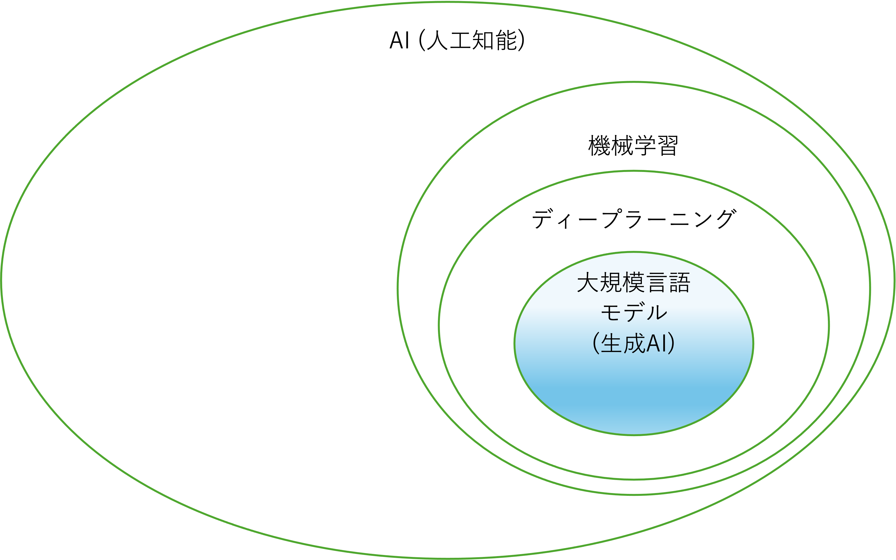

# AI基礎
### 目次
[TOC]

---

## １限目: AI基礎

## 1. イントロダクション (10分)

### 1-1. 自己紹介

- 名前：
- 背景：
- 専門分野：

- 名前：
- 背景：
- 専門分野：

### 1-2. 目標と概要

#### コース概要

このコースは人工知能（AI）の基本的な理論とその活用についての理解を提供することを目的とします。 具体的には、AIの基礎概念、倫理的考慮事項、そしてAI技術を使用して調査やドキュメント、アプリケーションを作成する実践的な方法を学びます。 このコースを通じて、AI技術の効果的かつ倫理的な使用に必要な知識とスキルを習得し、将来のキャリアや創作活動への適用につなげることができます。

#### 学習目標

学生は、AIの原理を深く理解し、主要な概念を簡明に説明できる。 また、AIの倫理的、社会的側面についての知識を有し、技術使用のリスクと利益を論理的に評価する能力を持つ。 さらに、AI技術を使いこなし、調査やドキュメント作成、アプリケーション開発に応用できる。 

#### 到達目標

学生は、AIの基本原理に関して基本的な理解を有し、簡単な概念を説明できる。 また、AIの倫理的、社会的側面について基礎知識を持ち、簡潔な事例を用いて意見を述べることができる。 さらに、AI技術を利用した基本的な調査やドキュメント作成の初歩を理解し、基礎的なアプリケーション開発に適用できる 

#### 注意事項

- 講義中には、実際のAIアプリケーションのデモンストレーションや、簡単な演習を取り入れる予定です。ノートPCやスマートフォンの準備をお願いします。

## 2. アイスブレーク (15分)

### AIってなんでしょう? AIでどんなことができるでしょうか? ☆Let's Activity!!

早速ですが、みなさんが知っているAIについて教えてください。
自分の考えていることをslackのチャネルに書いてみましょう。

自分が想像するAIをイメージでき、slackへの投稿が終わった人は以下のリンクにアクセスしてみてください。
私が学生時代にAIと聞いて、想像したであろうAIと、AIに尋ねてみたAIについて以下のページに書いてみました。

[想像するAI](./imagine_ai.md)

## 3. AIの定義と歴史 (30分)

AIは発展途上であり、歴史とともに人が想像するAIと現実のAIは変わってきています。
AIの定義とAIがどのような歴史をたどってきたのかみてみましょう。
現在、最も注目を浴びている大規模言語モデルを用いたAI(通称: 生成AI)は目まぐるしい勢いで進化しています。
まさに歴史が変わっている瞬間です。

### 3-1. AIの定義 (10分)

人工知能（Artificial Intelligence, AI）は、人間の知的行動をコンピューターで模倣する技術、またはその研究分野を指します。
この定義には、学習、推論、問題解決、知覚、言語理解など、人間の認知能力を再現しようとする試みが含まれます。
AIの定義は様々な文献で異なる場合がありますが、一般にはこのように広範な知的活動をコンピュータ上で実現しようとする試みとされます。

この定義は、ジョン・マッカーシーらが1956年に提唱したものが基礎となっています。マッカーシーは、“AIは機械に知性を実装する科学および工学である”と記述しました。これは、ダートマス会議（1956年）の提案書で初めて用いられ、AI研究の出発点とされています。

### 3-2. AIの歴史 (10分) ※後ほど改善

```mermaid
journey
    title AIの歴史
    section 1950年代初頭
      アラン・チューリングが「機械は考えることができるか？」という問いを提起: 5: 1950
      チューリングテストの提案: 4: 1950
    section 1956年
      ダートマス会議「Artificial Intelligence」という用語が初めて使用される: 5: 1956
    section 1960-1970年代
      初期の成功と冬の時代: 3: 1960-1970
    section 1980年代
      エキスパートシステムの商業的成功: 5: 1980
    section 1990年代
      インターネットの普及と大量データ: 4: 1990
    section 2000年代
      機械学習とデータ駆動型アプローチが主流: 5: 2000
    section 2012年
      ディープラーニングの成功、イメージネットコンペティション: 5: 2012
    section 現在
      AI技術の急速な発展と応用分野の拡大: 5: 現在
```

AIの歴史は、1950年代の初頭にまで遡ります。英国の数学者アラン・チューリングは、「機械は考えることができるか？」という問いを提起し、チューリングテストとして知られる考え方を提案しました。これは、人間が機械との対話からその相手が機械か人間かを判別できない場合、その機械は「知的」と見なすことができるというものです。

1956年のダートマス会議では、ジョン・マッカーシー、マービン・ミンスキー、アレン・ニューウェル、ハーバート・サイモンらが集まり、“Artificial Intelligence”という用語を初めて公式に使用しました。これは、人間の知能を模倣することにより、機械がどのように学習し、問題を解決し、自己改善するかを探求する研究の始まりを意味します。

その後、AI研究は「冬の時代」を経験するも、1980年代にエキスパートシステムが商業的に成功し、再び注目を集めます。1990年代にはインターネットの普及と共に大量のデータが利用可能となり、2000年代に入ると、データ駆動型アプローチである機械学習が主流となりました。特に、2012年のイメージネットコンペティションでのディープラーニングの成功は、AI研究における大きな転換点となり、以降、AIは急速に発展してきました。

AIの歴史は、技術の進化、社会のニーズ、そして計算機科学の理論の発展と密接に関連しています。今日、AIは医療、金融、自動運転車、エンターテイメントなど、あらゆる分野に影響を与え、人類の生活を根本的に変えるポテンシャルを持っています。

### 3-3. AIの発展と現在における重要性 (10分)

#### AIの発展の概要
AI（人工知能）の発展は、初期の理論研究から現代の高度な応用まで、複数の段階を経てきました。初めはシンプルなアルゴリズムと基本的な計算モデルに焦点を当てていましたが、時間が経過するにつれ、以下の要素により大幅な進化を遂げました。

- **機械学習とディープラーニングの進化：** 大量のデータから自動で学習し、高度な予測や認識を行う能力が開発されました。
- **計算能力の飛躍的向上：** クラウドコンピューティングと高性能プロセッサの登場により、複雑なAIモデルの訓練が実現可能になりました。
- **ビッグデータの利用：** デジタルデータの爆発的増加がAIの訓練と精度向上に寄与しています。

#### 現在におけるAIの重要性
AIは、現代社会の様々な面で中心的な役割を担っています。これは以下のような幅広い応用と、それに伴う経済的および社会的影響によります。

- **自動化と生産性の向上：** AIは労働集約的な作業の自動化を可能にし、産業全体での生産性向上に貢献しています。
- **意思決定支援：** データドリブンなアプローチにより、企業や組織はより精度の高い予測と効率的な意思決定が可能になりました。
- **イノベーションと新サービス：** AIは新しいビジネスモデルの創出やパーソナライズされたサービス提供を加速しています。
- **社会課題への取り組み：** 環境保護、医療、教育など、多くの分野でAIは解決策の開発に貢献しており、持続可能な未来に向けた重要な鍵となっています。

AIの技術は日々進化を続けており、その発展と現在における重要性は、未来の社会構造や産業の形を大きく変える可能性を秘めています。技術的な挑戦と倫理的な課題の両面において、その進化を適切に管理し、活用することが求められています。

## 4. AIの基礎概念 (50分)

#### 導入：大規模言語モデルとAI技術の関連性 (10分)

- **大規模言語モデルとは：** 大量のテキストデータから学習し、人間のように自然言語を理解し生成するAI技術。GPTやBERTなどが有名。

- **技術の基盤：** これらのモデルはディープラーニング、特にディープラーニングの一種であるトランスフォーマーモデルに基づいています。これは、機械学習（ML）とディープラーニング（DL）の進化の最前線を示すものです。

  

#### 1. 機械学習（ML）とは？ (20分)

- **機械学習の基本：** コンピュータがデータから学習し、タスクを改善する技術。大規模言語モデルの学習プロセスにも応用される。
- **学習方法の紹介：** 教師あり学習、教師なし学習、強化学習。これらの概念は、大規模言語モデルを理解するための基礎となる。

#### 2. ディープラーニング（DL）とその他のAI技術 (10分)

- **ディープラーニングの概要：** 多層ニューラルネットワークを使用した学習方法。大規模言語モデルの背後にある主要な技術。
- **トランスフォーマーモデル：** 自己注意機構を利用して、文脈を理解する能力を持つ。言語モデルの進化において重要な役割を果たす。
- **その他のAI技術との関連性：** 自然言語処理（NLP）やコンピュータビジョンなど、ディープラーニングは幅広いAI応用分野の基盤技術となっている。

#### 3. ルールベースのシステムとその限界 (10分)

- **ルールベースシステムとは：** 明確なルールや手続きに基づいて意思決定を行うシステムです。伝統的なプログラミングの一形態で、特定の入力に対して予定された出力を提供します。
- **利点と限界：** ルールベースシステムはその透明性と解釈可能性で知られていますが、複雑な問題や未知の状況に適応する能力には限界があります。このため、機械学習やディープラーニングのようなデータ駆動型アプローチが注目されるようになりました。
- **応用例と進化：** 初期のエキスパートシステムや決定支援システムはルールベースのアプローチを採用していましたが、現在ではより複雑でダイナミックな問題を解決するために、機械学習やディープラーニングが組み込まれることが増えています。

---

2限目: AIワークショップとまとめ

## 7. AIワークショップ (80分)

AIに対する期待と不安
コミュニケーション活性化させ、質問しやすくする。

## 8. まとめと次回予告 (20分)

- 本日の講義の要点の復習
- 次回講義のテーマと準備についての案内

## 参考サービス

- ChatGPT4
- Gemini

## 参考文献

- [imidas: ダートマス会議](https://imidas.jp/genre/detail/K-102-0113.html)
- 
