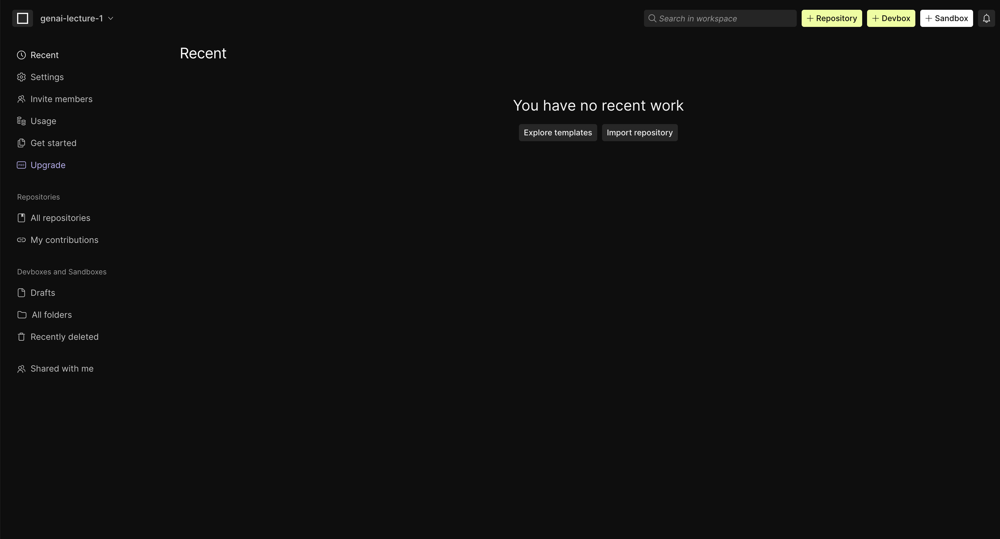
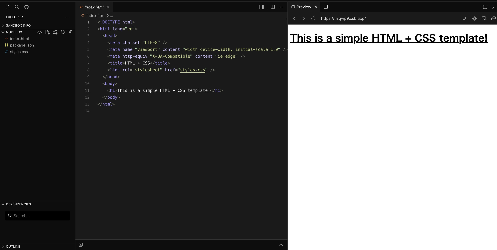

[TOC]

# プロンプトエンジニアリング ~アプリケーション開発①~

## 3限前半 (45分)

### 1.1 導入 (10分)

#### 4限出席コード

出席コードをslackに投稿します。

#### 講義の目的 

この講義の主な目的は、人工知能（AI）技術の現在の応用と、それに伴う倫理的課題について深い理解を促すことです。　　
AI が社会に与える影響は計り知れず、これには多くの利益と同時に様々なリスクや倫理的問題が伴います。
AI 技術使用に関連する倫理的考慮を教育することで、未来の技術者、研究者、ポリシーメーカーが責任ある判断を下すための基盤を築くことを目指します。

| 回数     |     1      |        2        |              **3**              |                      4                      |                    5                    |                    6                    |     7      |             8-14             |
| -------- | :--------: | :-------------: | :-----------------------------: | :-----------------------------------------: | :-------------------------------------: | :-------------------------------------: | :--------: | :--------------------------: |
| テーマ   |  AI 基礎   | AI の活用と倫理 | プロンプトエンジニアリング:概要 | **プロンプトエンジニアリング:アプリ生成 ①** | プロンプトエンジニアリング:アプリ生成 ② | プロンプトエンジニアリング:アプリ生成 ③ |  総合演習  | フィジカルコンピューティング |
| 担当講師 | 小島、伊藤 |      小島       |              伊藤               |                  **小島**                   |                  伊藤                   |                  小島                   | 伊藤、小島 |           白石先生           |

### アイスブレイク 

> [!NOte]
>
> 今日の朝何時に起きた?

```
今日の朝何時に起きた?
:one: 5:00AM~7:00AM
:two: 8:00AM~10:00AM
:three: 10:00AM~12:00AM
:four: 上記以外
```

> [!Note]
>
> 今日のお昼はどこで食べた?

```
今日のお昼はどこで食べた?
:one: 自宅
:two: 大学の構内
:Three: お店
:four: バイト先
:five: 上記以外
```

> [!Note]
>
> 今日のお昼は何を食べた?

```
今日のお昼は何を食べた?
```


### 1.2 開発環境のセットアップ (15分)

1. **公式サイトにアクセス**

   - Webブラウザで[CodeSandbox](https://codesandbox.io/)の公式サイトにアクセスします。

2. **Sign Upボタンをクリック**

   - 画面右上にある「Sign In」ボタンをクリックしても新規アカウントの作成します。

3. **Googleアカウントでのサインアップ**

   - 表示されたサインアップページで「Continue with Google」を選択します。
   - Googleアカウントにサインインするよう求められるため、Googleのログイン情報を入力します。

4. **アカウント作成**

   - Username等を設定します。

     

   - NameSpaceは本講義とわかるように`genak-lecture`を設定します。

     

   - Freeプランを選択します。

     


1. **新規アカウントの作成完了**

   - 許可後、CodeSandboxのダッシュボード画面にリダイレクトされます。

     

2. **プロジェクトの作成**

   - 画面右上の「+Sandbox」ボタンをクリックし、新しいプロジェクトを作成します。

   - プロジェクト名は`HelloWorld`としてください。

   - テンプレートから`HTML+CSS`を選択します。

   - 以下のように表示できれば正常にプロジェクトを作成できています。

     

#### 1.2 Webアプリを作りながら動作確認してみよう (15分)

> [!NOTE]
>
> Hello Worldを表示してみよう。

以下のプロンプトを参考にHelloWorldを表示するためのhtmlとcssを作成してください。
作成したhtmlとcssをcodesandboxに貼り付け、正常動作を確認してください。
正常動作を確認できたら、slackにスクリーンショットをはりましょう。

```
オシャレなHelloWorldを表示するWebページのhtmlとcssを作成してください。
また、以下の要件も満たしてください。
- 全てのファイルはルートフォルダに配置
- htmlのファイル名はindex.html
- cssのファイル名はstyles.css
```

> [!Note]
>
> 生成AIにSandBoxとDevBoxの違いを聞いてみよう。
>
> - [ChatGPT](https://chatgpt.com/?oai-dm=1)
> - [Copilot](https://copilot.microsoft.com/)
> - [Gemini](https://gemini.google.com/?hl=ja) (Gemeniを利用するには個人のGmailアカウントでログインする必要があります。)


> [!note]
>
> ポートフォリサイトをを作成してみよう ([前講義「創作活動」のユースケース」から](../3_prompt_engineering/readme.md))

codesandboxで新しいフォルダ(portfolio)を作成したあとで、ポートフォリオサイトを作成してみてください。

```
モダンでクールなフラットデザインのポートフォーリオサイトを、HTMLとcssで作成してください。
また、以下の要件も満たしてください。
- 全てのファイルはルートフォルダに配置
- htmlのファイル名はindex.html
- cssのファイル名はstyles.css
```


### 休憩(10分)

1. **ChatGPTを利用したコード生成の基本 (30分)**
   - ChatGPTを使用してコードを生成する方法の紹介
   - 実際の仕様を定義してChatGPTにコードを生成させるデモンストレーション
   - コード生成のための効果的なプロンプトの書き方
2. **アプリケーションの構築開始 (50分)**
   - 静的なWebページの作成
     - HTMLとCSSを使用して基本的なWebページの構造とスタイルを設計。
   - 静的なWebページへの画像の埋め込み
     - HTMLを使ってWebページに画像を挿入する方法を学ぶ。
   - 画像アップロード機能の追加
     - ファイル入力を使用して画像をアップロードし、サーバーに保存するプロセスを実装。
   - フォーム入力とバリデーション
     - ユーザー入力を受け取るフォームの作成と、JavaScriptやサーバーサイドでの入力検証を行う。
   - 動的なコンテンツの生成
     - JavaScriptやサーバーサイドスクリプトを利用して、ユーザーのリクエストに基づきコンテンツを動的に生成。
   - ユーザーの操作に応じてページ内容を動的に変更
     - JavaScriptやAJAXを使用して、ページの再読み込みなしにコンテンツを更新する方法を学ぶ。
   - ユーザー登録・ログイン機能
     - ユーザー認証のためのシステムを設計し、セキュリティの基本についても触れる。
3. **デバッグと問題解決 (40分)**
   - 生成されたコードのデバッグ方法
   - コンソールを使用したエラー解析と修正
   - ブラウザの開発者ツールを使ったテストと調整
4. **演習とフィードバックセッション (40分)**
   - 生徒が独立してアプリケーションを完成させる時間
   - 各生徒のアプリケーションの発表とフィードバック
   - 疑問点や問題の解決策の共有
5. **まとめと次回へのつなぎ (10分)**
   - 本日の講義の要点の復習
   - 追加リソースの提供と自習の奨励
   - 次回講義の予告と生徒からのフィードバックの収集


