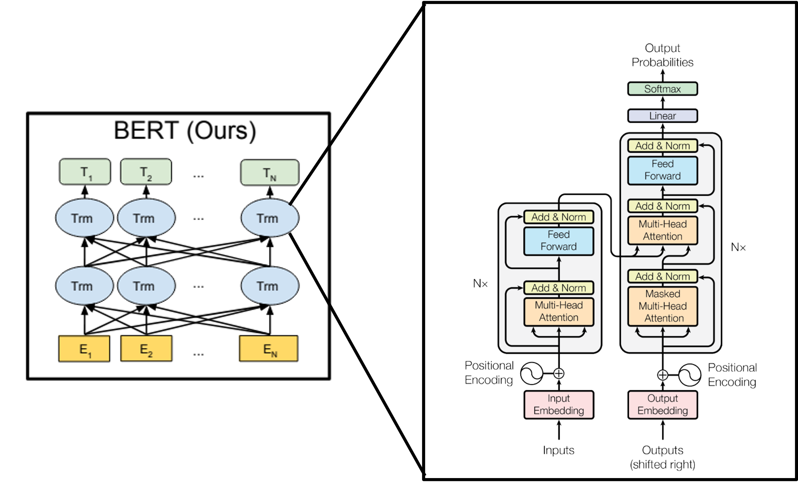
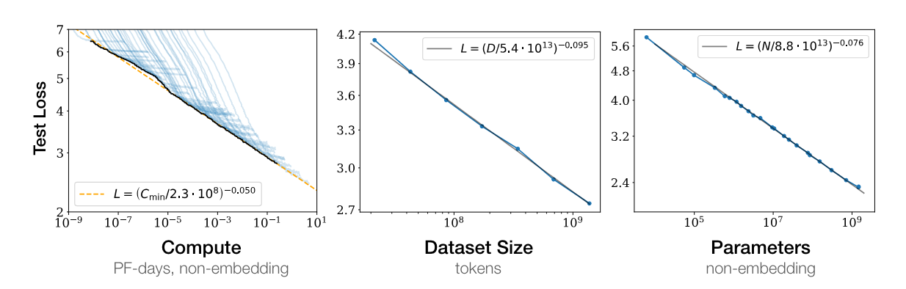
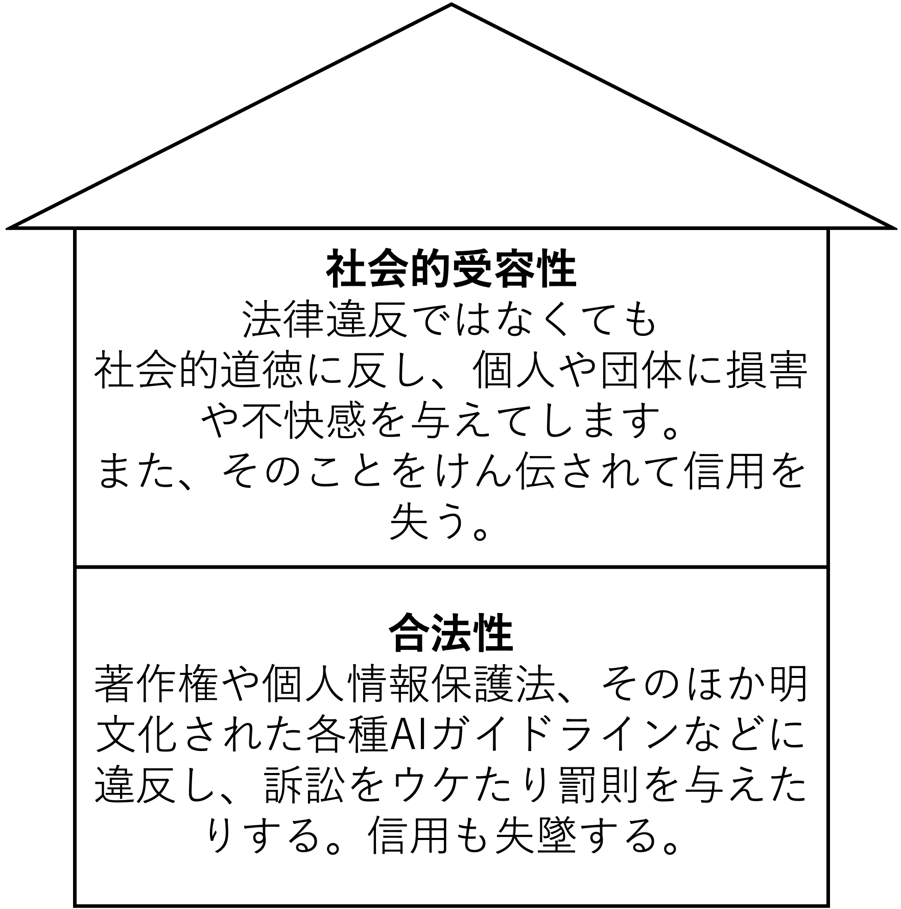
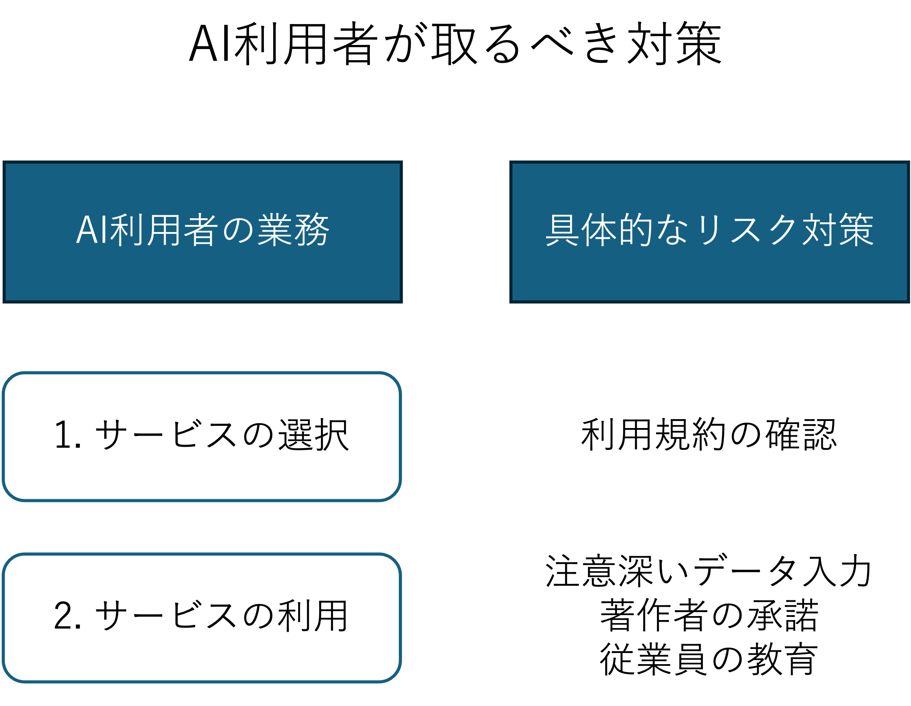

[TOC]

# AI 活用と倫理

## 1. 本講義の位置付け (5 分)

### 講義の目的

この講義の主な目的は、人工知能（AI）技術の現在の応用と、それに伴う倫理的課題について深い理解を促すことです。　　
AI が社会に与える影響は計り知れず、これには多くの利益と同時に様々なリスクや倫理的問題が伴います。
AI 技術使用に関連する倫理的考慮を教育することで、未来の技術者、研究者、ポリシーメーカーが責任ある判断を下すための基盤を築くことを目指します。

| 回数     | 1<br />(9/25) |  2<br />(10/2)  |                   3<br />(10/9)                   |      4<br />(10/16)       |      5<br />(10/23)       | 6<br />(11/6) | 7<br />(11/13) |
| -------- | :-----------: | :-------------: | :-----------------------------------------------: | :-----------------------: | :-----------------------: | :-----------: | :------------: |
| テーマ   |    AI 基礎    | AI の活用と倫理 | プロンプトエンジニアリング:インプット(要約・翻訳) | AI を活用したアプリ生成 ① | AI を活用したアプリ生成 ② |   総合演習    |    総合演習    |
| 担当講師 |  伊藤、小島   |      伊藤       |                       小島                        |           伊藤            |           小島            |  小島、伊藤   |   伊藤、小島   |

### アイスブレイク

> [!NOTE]
> 今日の昼ごはんを Slack に投稿してください。

## 2. 前回の振り返り (10 分)

- 自己紹介
- なぜ AI とプログラミングを学ばないといけないの？
- AI の定義と歴史
- 生成 AI と機会学習やディープラーニングとの関係
- AI ワークショップ (期待、不安、やりたいこと)

### AI に対する不安

#### 1. AI 暴走・制御不能のリスク

- Singularity（特異点）
- ターミネーター
- AI の暴走
- 人間を上回る
- 支配されていく

> ペーパークリップをできるだけ多く作ることを唯一の目標とする AI があるとします。AI はすぐに、人間がいない方がずっと良いことに気付くでしょう。なぜなら、人間は AI をオフにすることを決定するかもしれないからです。もし人間がそうすれば、ペーパークリップの数は減ってしまうでしょう。また、人間の体には、ペーパークリップにすることができる多くの原子が含まれています。AI が目指そうとする未来は、ペーパークリップはたくさんあるけれど人間はいない未来です。

[道具的収束 - Wikipedia](https://ja.wikipedia.org/wiki/%E9%81%93%E5%85%B7%E7%9A%84%E5%8F%8E%E6%9D%9F)

[｢AI の暴走で人類絶滅｣より現実的…AI 研究の第一人者が危惧する｢学習データは秘密｣という大問題 AI が｢偏見｣を持ち､あなたを｢過小評価｣する可能性 (2 ページ目) | PRESIDENT Online（プレジデントオンライン）](https://president.jp/articles/-/91968?page=2)

#### 2. 人間性・自律性の喪失

- 自主性がなくなる
- 人間の考える力 ↓
- 洗脳されそう
- 教祖
- 依存

> 自力で書いたグループの脳活動は活発だったが、AI 使用者は脳の活動が明らかに衰え、記憶力や意欲も低下したという衝撃的な知見が得られた。また、AI に頼ることで「自分で考える力（メタ認知）」が鈍る傾向が長期にわたって続いた点も問題視されている。

[生成 AI に頼り過ぎると脳を使わなくなる？--MIT が示す「認知負債」 - ZDNET Japan](https://japan.zdnet.com/article/35238186/)

> 対話型 AI（人工知能）「Chat（チャット）GPT」とのやりとりが原因で 16 歳の息子が自殺したとして、米西部カリフォルニア州に住む両親が 26 日、開発元の米オープン AI とサム・アルトマン最高経営責任者（CEO）を提訴した。

[「ChatGPT が原因で自殺」、米 16 歳の両親が OpenAI 提訴 - 日本経済新聞](https://www.nikkei.com/article/DGXZQOGN270050X20C25A8000000/)

> 小野寺氏は「当たり前のことをねじ曲げてしまうのがディープシークだ」と主張し、「既に認知戦が始まっていると考えるべきだ」と強調した。
> 石破茂首相は「安全保障の重要な分野において、わが国として信頼できる AI を開発、利用する必要がある」と応じた。

[中国 AI ディープシークが「尖閣は中国固有の領土」自民・小野寺氏、衆院予算委で懸念表明 - 産経ニュース](https://www.sankei.com/article/20250131-QWQZGSK2TVOI5KTB6OFQSXVQTQ/)

#### 3. 情報の信頼性・正確性

- 誤った情報
- 正確？
- 情報の信頼性
- 情報の正確さ

> ハルシネーションとは、言語モデルが生成する、もっともらしく聞こえるが正しくない発言のことです。一見単純に見える質問に対してでさえ、ハルシネーションが予想もせずおきる場合があります。

[言語モデルでハルシネーションがおきる理由 | OpenAI](https://openai.com/ja-JP/index/why-language-models-hallucinate/)

#### 4. プライバシー・セキュリティ

- 情報もれ
- 個人情報

> 様々なデータやシステムにアクセスする AI エージェントがサイバー攻撃を受け乗っ取られた場合、被害は従来とは比べものにならないほど広範囲にわたる可能性がある

[AI エージェントの乗っ取り被害は災害級　サイバー防衛各社の対策は - 日本経済新聞](https://www.nikkei.com/article/DGXZQOUE261RV0W5A820C2000000/)

#### 5. 創作・知的財産の問題

- イラストをまねしないで
- 著作権侵害
- 盗作
- どれが AI イラストでどれが本物かわからなくなる

> 人工知能（AI）を訓練するために無許可で作品を利用することが著作権侵害にあたるかどうかを巡り、各国で訴訟が展開されている。
> 「新技術が創作意欲を減じることに目を背けてはならない」
> 作品が売れなくなってしまえば、人が創作意欲を保ち続けるのは難しく、職業としても成立しなくなる。

[AI 発展か、創作保護か　著作権訴訟、米国で割れる地裁判決　学習の「公正さ」カギ - 日本経済新聞](https://www.nikkei.com/article/DGKKZO91589610Y5A920C2TCJ000/)

#### どれが一番不安？

> [!NOTE]
> どれが一番不安？
>
> 1. AI 暴走・制御不能のリスク
> 2. 人間性・自律性の喪失
> 3. 情報の信頼性・正確性
> 4. プライバシー・セキュリティ
> 5. 創作・知的財産の問題

## 3. 生成 AI と関連する重要な用語と技術 (50 分)

### 3-1. 生成 AI と関連する用語 (10 分)

#### **生成 AI (generative AI)**

- 拡散モデル（diffusion model）や大規模言語モデル（large language model; LLM）を含む、画像や自然言語を生成するモデルを指す。
- 従来の識別モデル（あるいは識別関数）に対し、生成モデルという分類があり、生成側面に焦点を当てた呼び方。

#### **基盤モデル (foundation model)**

- 自然言語や画像など、事前に学習した汎用モデルを使い、様々なタスクに適用可能。
- 主にトランスフォーマー（2017 年に Google の研究者によって提案された手法）が使用される。
- 大規模言語モデルを含み、自然言語や画像を跨ぐマルチモーダルな応用が多い。

#### **大規模言語モデル (large language model; LLM)**

- 言語データに特化し、深層学習（主にトランスフォーマー）による自己教師あり学習で訓練された大規模なモデル。
- OpenAI の GPT、Google の PaLM、Meta の Llama などが有名。
- ChatGPT は、GPT を対話用にチューニングしたもの。

#### **拡散モデル (Diffusion model)**

- 主に画像生成 AI サービスで利用されるモデル。
- 元の画像データにノイズ（Gaussian Noise）を加える Forward process と、ノイズ状態から画像データを再構築する Reverse Process の２つの段階を持つ。
- Stability AI の Stable Diffusion や OpenAI の DALL・E などが有名。

#### **マルチモーダルモデル (multimodal model)**

- 複数の種類のデータ（テキスト・画像・音声・動画など）を同時に理解・生成できるモデル。
- 従来のモデルは「言語専用」「画像専用」といった単一モダリティに特化していたが、マルチモーダルは異なるモダリティを相互に関連付けて処理可能。
- 例: 画像を言葉で説明、音声入力から要約を生成するなど。

#### **世界モデル (world model)**

- AI が「環境や世界の状態」を内部に表現し、シミュレーションや予測を行うためのモデル。
- 強化学習やロボティクスの分野で重要視されており、AI が環境を直接体験しなくても、内部の「世界モデル」を使って試行錯誤や未来予測を行える。
- 例: ロボットが実際に動かなくても、内部で「もしこう動いたらどうなるか」を予測して学習を進める。
- 近年は大規模言語モデルやマルチモーダルモデルと組み合わされ、「思考・行動・環境シミュレーション」を統合した次世代 AI の基盤として注目されている。

### 3-2. 生成 AI と関連する技術

### トランスフォーマーと自己教師あり学習 (10 分)

トランスフォーマーと自己教師あり学習は、現代の生成 AI(大規模言語モデル)において非常に重要な役割を果たしています。これらの技術は、言語モデルの性能を飛躍的に向上させると同時に、新しい AI モデルの開発方法論に影響を与えています。

#### トランスフォーマー

トランスフォーマーは、2017 年に Google の研究者によって発表されたアーキテクチャで、「[Attention is All You Need](https://arxiv.org/abs/1706.03762)」という論文で紹介されました。
このモデルは従来のリカレントニューラルネットワーク（RNN）や畳み込みニューラルネットワーク（CNN）に代わるものとして設計されており、特に大量のデータを扱う際の効率性と効果性に優れています。

トランスフォーマーの主な特徴は、自己注意機構（Self-Attention）にあります。この機構により、入力される各単語は他の全単語との関連度を計算し、それに基づいて情報を集約することができます。これにより、文中の遠く離れた要素間の関連を直接モデル化することが可能となり、文脈理解が大幅に向上します。

#### 自己教師あり学習

自己教師あり学習は、ラベルのないデータからモデルが自身で学習を進める手法です。トランスフォーマーを用いた自然言語処理では、特に事前学習と呼ばれる段階でこの手法が用いられます。事前学習では、大量のテキストデータを利用して、文の次の単語を予測する、あるいは文中の欠落した単語を埋めるといったタスクを通じて、言語の一般的なパターンや文法を学習します。

この自己教師あり学習を経て、トランスフォーマーモデルはさまざまな下流タスク（翻訳、要約、質問応答など）に適応できるようになります。この段階をファインチューニングと呼び、特定のタスクにおいてモデルを最適化します。



### 大規模言語モデルとスケール則 (5 分)

スケール則（scaling laws）は、モデルのパフォーマンスがモデルサイズ、データ量、計算量といったリソースのスケールに対してどのように変化するかを定量的に記述した法則です。データ量を増やし、計算能力を強化し、モデルのパラメータ数（モデルの容量）を増加させることで、精度が向上することがわかっており、それぞれの要素が多ければ大きいほど性能があがります。例えば、GPT-3 はウェブの大きなデータ（4 兆単語）で事前学習。1750 億パラメータ。学習に数億〜数十億円のコストです。



引用論文[“Scaling Laws for Neural Language Models”（Jared Kaplan, et al. @ OpenAI, arXiv, 2020.）](https://arxiv.org/abs/2001.08361)

### 生成 AI とトークン (5 分)

生成 AI、特に言語モデルにおける「トークン」とは、テキストを処理しやすい単位に分割したものを指します。これらのトークンは、単一の文字、単語、あるいはその一部分（サブワード）であり得ます。具体的なトークン化の方法は使用されるモデルやその訓練目的に依存します。

```
eg. 今日は　天気が　良いので　外に出て　散歩した　。
```

モデル毎に生成 AI を利用する際のインプット・アウトプット上限数が異なります。

| モデル  | インプット/アウトプット可能なトークン数 |
| ------- | --------------------------------------- |
| GPT-1   | 512                                     |
| GPT-2   | 1,024                                   |
| GPT-3.5 | 4,096                                   |
| PaLM    | 8,192                                   |
| GPT-4   | 25,000                                  |

### AI エージェント (5 分)

人の代わりにタスクを自律的にこなす AI

「計画」を立て、必要な「ツール」を利用して、「行動」し、結果を「観察」して次のアクションに繋ぐ。

#### デモ

[ChatGPT](https://chatgpt.com/)の Deep Research

[Claude](https://claude.ai/new) の Google カレンダー連携

[Claude Code](https://docs.claude.com/ja/docs/claude-code/overview) の MCP (Model Context Protocol) 連携

[Dify](https://dify.ai/jp)

#### 質問

> [!NOTE]
> どのデモが良かった？

## 4. AI と職業に与える影響 (10 分)

### 生成 AI 登場以前に予想されていた職業への影響

2013 年に発表されたオクスフォード大学のカール・フレイとマイケル・オズボーンによる論文「雇用の未来：どの程度の雇用がコンピュータ化により自動化されるか？」では、多くの仕事が将来的にコンピュータやロボットによって自動化される可能性が高いという予測が示されました。この研究は、702 種類の職業を対象に、それぞれの仕事が今後 10 年から 20 年の間に技術的に自動化される可能性がどの程度あるかを評価しました。

フレイとオズボーンは、特にルーティンやルールベースのタスクが自動化されやすいと指摘しています。これには、製造業の作業や事務処理作業などが含まれます。一方で、創造性、社会的相互作用、知覚と操作が必要な職業は自動化が難しいとされています。彼らはまた、教育、医療、科学技術などの専門的なスキルが要求される職業は自動化のリスクが比較的低いとも述べています。

この研究は、将来の労働市場の変化に対する警告として受け取られ、教育や職業訓練のあり方について再考を促すきっかけとなりました。また、経済的な不平等が拡大するリスクや、新たな形の雇用が出現する可能性についての議論を呼び起こす結果となりました。この論文は、テクノロジーの進展が社会や経済に与える影響を理解し、対応するための重要な基盤を提供しています。

以下、雇用の未来からの抜粋。

| 機会化の影響を受けにくい職業           | 機会化の影響を受けやすい職業 |
| -------------------------------------- | ---------------------------- |
| レクリエーションセラピスト             | 電話販売員                   |
| 整備、設置、修理の現場監督書           | 不動産の審査                 |
| 危機管理責任者                         | 手縫い仕立て屋               |
| メンタルヘルス・薬物ソーシャルワーカー | 数理技術者                   |
| 聴覚訓練士                             | 保険業者                     |
| 作業療法士                             | 時計修理工                   |
| 義肢装具士                             | 荷物取扱人                   |
| 医療ソーシャルワーカー                 | 税金申告代行                 |
| 口腔外科医                             | フィルム写真処理             |
| 消防、防災の現場監督者                 | 銀行口座の担当者             |
| 栄養士                                 | 図書館秘書の補助員           |
| 宿泊施設の支配人                       | データ入力作業員             |
| セールスエンジニア                     | 保険金星丘、契約代行         |
| 内科医・外科学                         | 証券会社の一般事務員         |
| 教育コーディネーター                   | 発注係                       |
| 心理学者                               | ローンの融資担当者           |
| 警察官・刑事の現場指揮者               | 自動車保険鑑定人             |
| 歯科医                                 | スポーツの審判               |
| 小学校教師                             | 銀行窓口                     |
| 医学者                                 | 彫刻業者                     |
| 教育管理者                             | 包装機オペレーター           |
| 足病医                                 | 調達係                       |
| 心理士                                 | 荷物の発送・受取係           |
| メンタルヘルスカウンター               | 金属加工                     |

### 生成 AI 登場後に予想される職業への影響

2023 年に OpenAI とペンシルベニア大学が共同で発表した「GPTs are GPTs: An Early Look at the Labor Market Impact Potential of Large Language Models」という論文では、大規模言語モデル（Large Language Models、LLMs）が労働市場に及ぼす潜在的な影響について初期の洞察が提供されました。この研究では、特に LLM が特定の職業や業務にどのように影響を与え得るかを分析しています。

論文では、LLM が文書作成、データ入力、カスタマーサポートといったルーティン性の高い職務を自動化する能力があることを指摘しています。これにより、これらの業務を行う職員の仕事の性質が変化するか、または不要になる可能性が示唆されています。しかし、論文はまた、LLM が創造性や戦略的思考、高度な人間関係スキルを要求される仕事には完全には適用できないとも議論しています。

さらに、研究者たちは、LLM が新たな職業機会や業務の効率化をもたらす可能性も指摘しており、特にコンテンツ生成、言語翻訳、教育支援などの分野で新たな利用事例が生まれることが期待されています。論文は、技術の導入に伴う潜在的な経済的・社会的影響に対する政策メーカーや教育者の準備の重要性を強調しており、適応策としての教育の再設計や継続的なスキルアップデートが推奨されています。

以下、GPTs are GPTs からの抜粋。

| AI の影響を受けにくい仕事  | AI の影響を受けやすい仕事            |
| -------------------------- | ------------------------------------ |
| 農業機会操作者             | 通訳・翻訳家                         |
| アスリート                 | サーベイ研究者                       |
| 自動車ガラス取り付け修理工 | 詩人、作詞家、クリエイティブライター |
| バスとトラックの技士       | 動物科学者                           |
| セメント石工               | 広報スペシャリスト                   |
| 料理人                     | 数学者                               |
| トリマー                   | 税理士                               |
| 油田とガスのデリック操作者 | 金融分析者                           |
| 電力線の設置工と修理工     | 法務秘書                             |
| 掘削作業者                 | 公認会計士                           |
| フロア層                   | インタフェースデザイナー             |
| 鋳造方と芯棒作り           | 臨床データマネージャー               |
| 煉瓦職人                   | エンジニア                           |
| 大工                       | グラフィックデザイナー               |
| ペインター                 | 検索マーケティングストラテジー       |
| パイプレイヤー             | 投資ファンドマネージャー             |
| 屋根職人                   | 金融マネージャー                     |
| 肉、魚の切断者とトリマー   | 保険鑑定人                           |
| バイクメカニック           | 損害鑑定人                           |
| タイピング機器オペレーター | 文書取扱人                           |
| パイルドライバー           | 校正者                               |
| 金属加工                   | 気候変動アナリスト                   |

### 生成 AI は労働補完型か?労働置換型か?

生成 AI の影響を「労働補完型」（仕事を補助または支援する）と「労働置換型」（仕事を置き換える）の観点から考えると、その効果は AI が適用される職業や業務内容によって大きく異なります。

#### 労働補完型

1. **クリエイティブなサポート**：

   - 生成 AI は、デザイナーや作家、プログラマーなどのクリエイティブな職業でアイデア生成を支援するツールとして機能します。例えば、アイデアの初期段階で多様な視点を提供することで、創造的なプロセスを促進します。

2. **効率化**：

   - 特定の業務プロセスにおいて、生成 AI は情報の整理や報告書の作成、コードの生成などを自動化することで、専門家がより高度な問題解決に集中できるよう支援します。

3. **教育と訓練**：
   - AI は教育分野においても活用され、個々の学習者に合わせたカスタマイズされた教材や練習問題を生成することができます。これにより、教育の質が向上し、より効果的な学習が可能になります。

#### 労働置換型

1. **ルーティン作業の自動化**：

   - 低い創造性を必要とするタスクや繰り返し作業は、生成 AI によって完全に自動化される可能性があります。これにはデータ入力や標準的な顧客対応などが含まれます。

2. **高度な自動化**：

   - AI がさらに進化することで、現在は専門的知識を必要とする分析業務や意思決定サポートなども、将来的には AI に置き換えられるかもしれません。

3. **労働市場の変化**：
   - 一部の職種が完全に自動化されることで、それらの職種に従事している人々は再訓練や異なる職種への転職を余儀なくされる可能性があります。

#### 結論

生成 AI の導入が「労働補完型」か「労働置換型」かは、その技術がどのように、どこに適用されるかによって異なります。AI の潜在的な影響を最大限に活用しつつ、社会的なコストを最小限に抑えるためには、技術革新と並行して、職業訓練や教育の改革が重要となるでしょう。これにより、技術の進歩がもたらす変化に柔軟に対応し、全ての労働者が恩恵を受けることが可能になります。

> [!NOTE]
> どう感じたか意見を Slack に書いてみてください。

## 休憩 (10 分)

## 5. AI 倫理 (40 分)

### 5-1. AI リスクと対策 (5 分)

AI 技術の急速な発展により、私たちの生活は多くの便利さを享受していますが、それに伴い多くのリスクも生じています。AI を利用する際に生じる潜在的なリスクとそれらに対する対策について解説します。

#### リスクストーリー ①: AI によるアイディアの流出


#### 登場人物

- **A 子さん**：若くて野心的な起業家。新しいビジネスアイディアを具体化し、市場に導入しようとしている。

#### 背景

A 子さんは最近、生成 AI を活用して自分のビジネスアイディアを形にしていました。彼女は、AI を用いて、提案されたアイディアについてさまざまな角度から考察し、それをさらに発展させるための入力（プロンプト）を行っていました。このプロセスを通じて、A 子さんは特に革新的なビジネスモデルを考え出し、その実現に向けて動き始めていました。

#### 事件の発展

ある日、A 子さんはニュースで、ある大企業がまさに彼女が考えていたアイディアと非常に似た新サービスを発表したことを知ります。初めは偶然の一致かと思いましたが、そのアイディアは彼女が AI に入力したプロンプトと非常に細部まで一致していました。

#### 問題の解明

ショックを受けた A 子さんは、使用していた AI サービスのプロバイダーに連絡を取り、何が起こったのかを尋ねました。調査の結果、AI サービスプロバイダーはユーザーが AI に入力したデータを、モデルの訓練データとして使用していることが判明しました。このプラクティスにより、他のユーザーも同様に AI サービスを利用していた大企業が、A 子さんのアイディアに似たプロンプトを入力した結果、AI が生成したアイディアが彼女のものと酷似してしまったのです。

#### 教訓

この事件から、A 子さんと他の起業家たちは、AI サービスを利用する際のリスクについて学びました。
特に、自分の創造的なアイディアや知的財産を保護するために、AI サービスの利用規約をよく理解し、どのようにデータが使用されるかを確認することの重要性が浮き彫りになりました。

### 5-2. AI リスクは 2 階建て (5 分)



### 5-3. 信頼できる AI が備えるべき 5 つの基本特性 (10 分)

- 説明可能性

  説明可能な AI は、その判断や予測の理由を人間が理解できる形で提供できる AI を指します。これにより、ユーザーは AI の行動をより良く理解し、AI の判断がもたらす影響を評価することができます。説明可能性は、AI システムの決定に対する信頼を築くのに不可欠です。

- 公平性
  説明可能な AI は、その判断や予測の理由を人間が理解できる形で提供できる AI を指します。これにより、ユーザーは AI の行動をより良く理解し、AI の判断がもたらす影響を評価することができます。説明可能性は、AI システムの決定に対する信頼を築くのに不可欠です。

- 透明性
  透明性は、AI システムの設計、運用、およびその決定プロセスが開かれていることを意味します。ユーザーは、AI がどのようにしてその結果を導出したかを知ることができる必要があります。透明性は、誤解を防ぎ、より広範な監視と理解を促進します。

- 堅牢性
  堅牢な AI システムは、予期せぬ状況やデータに対しても正確で安定した性能を発揮します。これには、様々な環境条件や操作ミスに対する耐性を含む、安全性の確保が含まれます。堅牢性は、AI システムが信頼性高く機能し続けるために重要です。

- データ権利/プライバシーの尊重
  AI システムは、個人のデータプライバシーを尊重し、適切なデータ保護措置を実施することが求められます。これは、データの収集、保管、利用が個人の権利を侵害しないようにするためです。プライバシーの保護は、ユーザーの信頼と AI システムの受け入れに直接的に影響します。

### 5-4 .AI サービス構造で捉える

AI サービスを構造的に捉えることでリスクを整理しましょう。


### 5-5. AI と関連する人を整理して捉える

- AI 利用者
- AI 導入者 (サービスプロバイダ)
- AI 開発者 (モデル開発者)




### 5-6. 演習: ChatGPT に入力されるデータはどうなるか? (10 分)

(デフォルト設定で) ChatGPT に入力したデータはどうなるでしょうか。個人情報等を入力したい場合の対策方法はあるか?
以下のフォーマットを参考に Slack に投稿してみましょう。

```
(デフォルト設定で)ChatGPTに入力したデータはどうなるか?:
個人情報等を入力したい場合の対策方法はあるか?:
```

### 5-7. AI リスクの分類

##### 1. 著作権や肖像権を侵害するリスク [被害者: AI 導入者、AI 利用者]

AI が生成したコンテンツが他者の著作権や肖像権を侵害することがあります。　　
AI 導入者や利用者がこれらのコンテンツを使用することで、著作権者や肖像権を有する人から法的措置を受けるリスクがあります。

##### 2. 有害・危険な情報を流布するリスク [被害者: AI 導入者、AI 利用者]

AI が誤った情報や有害なコンテンツを生成し、それを流布することで社会に悪影響を及ぼす可能性があります。　　
これにより、導入者や利用者が社会的、法的な責任を問われることがあります。

##### 3. AI が出力されたものへの著作権が認められなくなるリスク [被害者: AI 利用者]

AI によって生成されたコンテンツの著作権が AI 利用者に認められない場合、利用者が経済的な利益を失う可能性があります。

##### 4. 個人情報を出力するリスク [被害者: AI 開発者、AI 導入者]

AI が誤って個人情報を出力することで、プライバシー侵害の問題が発生する可能性があります。　　
これにより、開発者や導入者が法的責任を負うことがあります。

##### 5. 気密情報や個人情報が保存されるリスク [被害者: AI 利用者]

AI システムが利用者の個人情報や機密情報を不適切に保存することで、データ漏洩や不正利用のリスクがあります。

##### 6. 事実と違う情報を出力するリスク (ハルシネーション) [被害者: AI 利用者]

AI が不正確な情報や存在しないデータを生成することがあり、これに基づいて行動する利用者が誤った判断をするリスクがあります。

##### 7. AI を人であると誤解してしまうリスク [被害者: AI 利用者]

AI の応答が人間のものと誤認されることで、不適切な信頼関係が築かれ、誤った期待や判断を生む可能性があります。

##### 8. 責任の所在が不明確なリスク [被害者: AI 開発者、AI 導入者、AI 利用者]

AI が引き起こす問題に対して、具体的な責任の所在が不明確であることから、法的な問題が複雑化する可能性があります。

##### 9. 根拠にならない情報に基づいた判断リスク (バイアス) [被害者: AI 利用者]

AI が持つバイアスにより不公正な判断が行われることがあり、これにより特定の利用者が不利益を被る可能性があります。

##### 10. AI の挙動を理解・説明できないリスク [被害者: AI 開発者、AI 導入者]

AI の決定プロセスが透明でないために、不適切な行動やエラーの原因を特定できず、問題解決や改善が困難になるリスクがあります。

##### 11. 精度が徐々に悪化するリスク (データドリフト) [被害者: AI 利用者]

時間の経過とともに入力データが変化することで AI のパフォーマンスが低下し、利用者が期待する結果が得られなくなる可能性があります。

##### 12. AI 攻撃リスク (敵対的サンプル、回避攻撃、ノイズ耐性) [被害者: AI 利用者]

敵対的サンプルなどにより AI が誤動作することで、利用者が不正確な情報やサービスを受けるリスクがあります。

##### 13. AI 学習を妨害する攻撃を受けるリスク (ポイズニング) [被害者: AI 利用者]

故意に歪められたデータで AI が訓練されることで、不正確または有害な判断を下す可能性があります。

##### 14. 生成 AI に問題のある情報を出力させる攻撃を受けるリスク (プロンプトインジェクション) [被害者: AI 利用者]

不正な入力により AI が不適切な内容を生成することがあり、これにより利用者が法的な問題や信用の失墜を被るリスクがあります。

##### 15. AI モデルをコピーされるリスク (抽出攻撃) [被害者: AI 開発者]

AI モデルが不正に抽出されることで、開発者が技術的な利益を失うリスクがあります。

# AI リスク対策演習

### 演習: 自分の好きな AI サービスに関する調査・考察 (50 分)

- 自分が使いたい AI サービス(画像生成、音楽生成等々)を 1 つ決めましょう (10 分)　※前回ワークショップででたアイディアをベースにしてみましょう。
- その AI サービスにはどのようなリスクがあると思いますか? 書き出してみましょう。(10 分)
- そのサービス規約にリスクと関連する記述があるか調査してみましょう。(10 分)　※参考にしたサイトは参考文献に書いておきましょう。
- リスクに対してどのような対策をこうじることができるでしょうか、考えてみましょう。(10 分)
- 考察・感想 (10 分)

完了したら、slack に投稿しましょう。

```
例:
自分が使いたいAIサービス: ChatGPT
AIサービスリスクの考察:
- 気密情報や個人情報が保存されるリスク
- 事実と違う情報を出力するリスク
- 人であると誤解してしまうリスク
- 根拠にならない情報に基づいた判断リスク (バイアス)

リスクとサービス規約の調査:
- 気密情報や個人情報が保存されるリスク: サービス規約に記述あり。

リスクへの対策:
- 気密情報や個人情報が保存されるリスクへの対策: 個人情報を入力する際は保存させないモードを選択する。

考察・感想:

参考:
- Open AIサービス規約: https://openai.com/policies/terms-of-use)
```

### 休憩 (10 分)

### 発表 (40 分)

発表者は生成 AI に決めてもらいたいと思います。

- 発表人数: 3 人
- 時間構成
  - 発表者選定: 4 分
  - 発表: 10 分, 質疑応答: 2 分

## 3. 参考情報

### 参考サービス

- ChatGPT4
- Gemini

### 参考文献

- [AI リスク教本](https://www.amazon.co.jp/AI%E3%83%AA%E3%82%B9%E3%82%AF%E6%95%99%E6%9C%AC-%E6%94%BB%E3%82%81%E3%81%AE%E3%83%87%E3%82%A3%E3%83%95%E3%82%A7%E3%83%B3%E3%82%B9%E3%81%A7%E5%8D%B1%E6%A9%9F%E5%9B%9E%E9%81%BF%EF%BC%86%E3%83%93%E3%82%B8%E3%83%8D%E3%82%B9%E5%8A%A0%E9%80%9F-%E6%97%A5%E6%9C%ACIBM-AI%E5%80%AB%E7%90%86%E3%83%81%E3%83%BC%E3%83%A0/dp/4296204084)
- [大規模言語モデルは新たな知能か](https://www.amazon.co.jp/%E5%A4%A7%E8%A6%8F%E6%A8%A1%E8%A8%80%E8%AA%9E%E3%83%A2%E3%83%87%E3%83%AB%E3%81%AF%E6%96%B0%E3%81%9F%E3%81%AA%E7%9F%A5%E8%83%BD%E3%81%8B%E2%80%95%E2%80%95ChatGPT%E3%81%8C%E5%A4%89%E3%81%88%E3%81%9F%E4%B8%96%E7%95%8C-%E5%B2%A9%E6%B3%A2%E7%A7%91%E5%AD%A6%E3%83%A9%E3%82%A4%E3%83%96%E3%83%A9%E3%83%AA%E3%83%BC-%E5%B2%A1%E9%87%8E%E5%8E%9F-%E5%A4%A7%E8%BC%94/dp/4000297198/ref=asc_df_4000297198/?tag=jpgo-22&linkCode=df0&hvadid=654954019163&hvpos=&hvnetw=g&hvrand=5543730617596746961&hvpone=&hvptwo=&hvqmt=&hvdev=c&hvdvcmdl=&hvlocint=&hvlocphy=1009461&hvtargid=pla-2198066508387&psc=1&mcid=69198d2972333467974f3f3cbf416e48&th=1&psc=1&gad_source=1)
- [教養としての生成 AI](https://www.amazon.co.jp/-/en/%E6%B8%85%E6%B0%B4%E4%BA%AE-ebook/dp/B0CBLMWP91/ref=sr_1_32?crid=1212HENXZ5V&dib=eyJ2IjoiMSJ9.oqQPTYZpJ4c5utCMyR4AKqHFMYmNuEPzkEt_pnIzjN8sIueUPCHpB6qWJB0-8YTklyn_EPi0sVi6jX5MozNq8l753L4wYgmGzvC1JTRZE9Z6NlmodVSS-WCUpNAF3733-B3Av95pJmjURjuzyLLtYcc4uqSZDfBBLuu6Ko_DOwy3uH4rZrFt-j8RT1_dZd0MMwdXuDpV-AbxOOMiuK6vjn1cykS7q9iSaY4yyjL0oUeFPJ4dxaqFMRPG21ZNKoHJkRdq8C1m-6zEtjYN01Ql-h4R34SrHzoQA0F2o9taGR0.jdd0eL7BCXMTJ-cFPpyJcvGu5NW6wgbcTXBUmpw_qrE&dib_tag=se&keywords=%E7%94%9F%E6%88%90ai&qid=1712839430&sprefix=%E7%94%9F%E6%88%90ai+%2Caps%2C163&sr=8-32)
- [“Scaling Laws for Neural Language Models”（Jared Kaplan, et al. @ OpenAI, arXiv, 2020.）](https://arxiv.org/abs/2001.08361)
- [Attention Is All You Need](https://arxiv.org/abs/1706.03762)
- [BERT: Pre-training of Deep Bidirectional Transformers for Language Understanding](https://arxiv.org/abs/1810.04805)
- [生成 AI の技術動向と影響](https://www.mhlw.go.jp/content/11601000/001125241.pdf)

### 参考動画

- [「生成 AI」(3) 松尾豊・東京大学大学院教授　 2024.3.15](https://www.youtube.com/watch?v=U9vhGvFxKu0&t=8s)
