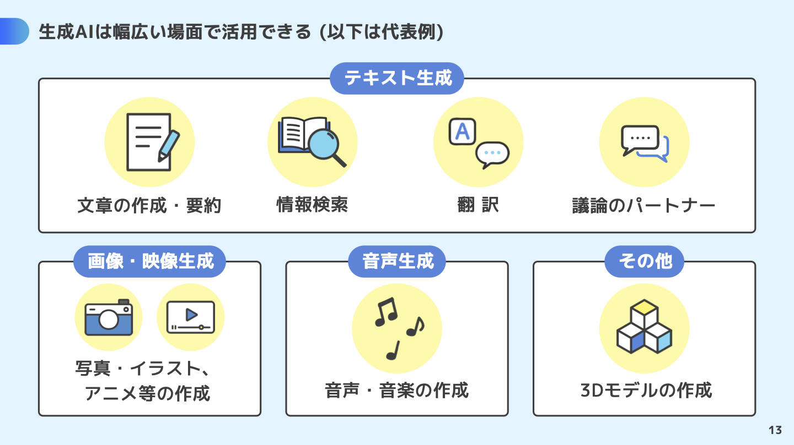
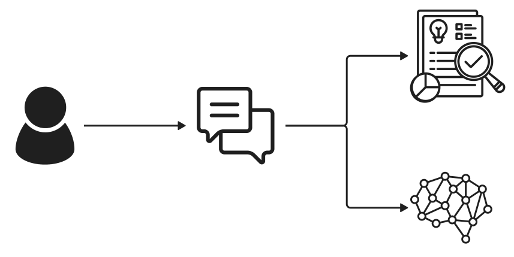

# プロンプトエンジニアリング


```
生成AIの活用方法・ユースケースについての、フラットでシンプルでモダンなイラスト
```

### 目次

[TOC]

---

## 1-1 限目：生成 AI 活用のユースケース (15:40-)

### 講義の目的

この講義の主な目的は、生成AIの代表的なユースケースを体系的に理解し、実務で再現性のある成果を生み出すプロンプトエンジニアリングの原則と方法を習得することです。
受講者は、課題の定義からユースケース選定、生成系人工知能（文章生成・画像生成・音声生成・エージェント等）の適用判断、プロンプト設計、出力の評価と改善までの一連のプロセスを体験し、明確性・制約の明示・役割付与・手順分解・例示といった原則を身につけます。学内外の実課題に対し生成AIを活用ができる基盤を築くことを目指します。

| 回数     | 1<br />(9/25) |  2<br />(10/2)  |       3<br />(10/9)        |      4<br />(10/16)       |      5<br />(10/23)       | 6<br />(11/6) | 7<br />(11/13) |
| -------- | :-----------: | :-------------: | :------------------------: | :-----------------------: | :-----------------------: | :-----------: | :------------: |
| テーマ   |    AI 基礎    | AI の活用と倫理 | プロンプトエンジニアリング | AI を活用したアプリ生成 ① | AI を活用したアプリ生成 ② |   総合演習    |    総合演習    |
| 担当講師 |  伊藤、小島   |      伊藤       |            小島            |           伊藤            |           小島            |  小島、伊藤   |   伊藤、小島   |

### 

### 生成AIサービス利用準備 (5 分)

生成AIをすぐに利用できるようにしておこう。
以下の中で利用したいサービスをクリック、Googleアカウントでログインすれば、利用できるようになります。

1. [ChatGPT](https://chat.openai.com/)
2. [Claude](https://claude.ai/)
3. [Gemini](https://gemini.google.com/app)

### アイスブレイク (10 分)

```
今週、生成AI使いましたか？
:one: ほぼ毎日
:two: 数回
:three: ほぼ使ってない
```

```
今日はどの生成AIを相棒として使う予定?
:one: ChatGPT
:two: Claude
:three: Gemini
:four: その他 (スレッドでサービス名を投稿)
```

```
Meta 社のオープンソースLLM llama3が公開されたこと知ってます？
:one: 知ってる
:two: なにそれおいしいの？
```

```
HTML/CSS触ったことある？
:one: ある
:two: ちょっとだけ
:three: なにそれおいしいの？
```

### 前回の振り返り (10 分)

- 生成 AI と関連する重要な用語と技術
- AI と職業に与える影響
- AI 倫理
- AI リスク対策演習

> [!NOTE]
> 前回のノートを要約してみよう

> この文章は、AI 技術の活用と倫理に関する講義内容を詳述しています。主に、AI の基礎と応用、倫理的課題、そして AI 技術が職業に与える影響に焦点を当てています。講義では、生成 AI や大規模言語モデルなどの技術的側面に加えて、AI が職業や社会に与える潜在的影響を探求し、AI 倫理について深く議論しています。具体的な技術解説にはトランスフォーマーや自己教師あり学習が含まれ、AI の応用が労働市場に与える効果を「労働保管型」と「労働置換型」の観点から評価しています。さらに、AI 倫理のセッションでは AI のリスクと対策について説明し、具体的な事例を通じて理解を深めるアプローチが取られています。

### 生成 AI はどのように使われている？ (5 分)

> [!NOTE]
> 生成 AI の使われ方を調べてみよう

```
生成AIを活用方法を教えて
```

```
生成AIのユースケースを教えて
```

### 生成 AI の種類と使われ方 (10 分)

#### 総務省

- [生成 AI はじめの一歩～生成 AI の入門的な使い方と注意点～ | 安心・安全なインターネット利用ガイド | 総務省](https://www.soumu.go.jp/use_the_internet_wisely/special/generativeai/)
- [生成 AI はじめの一歩](https://www.soumu.go.jp/use_the_internet_wisely/special/generativeai/data/file01.pdf)



> [!NOTE]
> 要約: 総務省サイトを要約してみよう

> [!NOTE]
> 生成AIにpdf ファイルをアップロードしてみよう

#### 文部科学省

- [生成 AI の利用について：文部科学省](https://www.mext.go.jp/a_menu/other/mext_02412.html)
- [初等中等教育段階における生成 AI の利用に関する暫定的なガイドライン](https://www.mext.go.jp/content/20230710-mxt_shuukyo02-000030823_003.pdf)
- [大学・高専における生成 AI の教学面の取扱いについて：文部科学省](https://www.mext.go.jp/b_menu/houdou/2023/mext_01260.html)

#### デロイト

- Text

- Image

- Audio

- Video

- Code

- 3d/Specialized

  参考: [Gen AI use cases by type and industry | Deloitte US](https://www2.deloitte.com/us/en/pages/consulting/articles/gen-ai-use-cases.html)

#### IBM

- コードの生成

- カスタマー・サポートとサービス

- 教育

- 金融サービスと投資分析

- 不正アクセス検知とリスク管理

- グラフィック・デザインと動画

- 医療

- 人事 (HR)

- 保険

- 法務およびコンプライアンス支援

- 製品開発

- プロジェクト管理と運用

- 販売およびマーケティング

- サプライチェーン

- 合成データ生成

  参考: [生成AIのユースケース](https://www.ibm.com/jp-ja/think/topics/generative-ai-use-cases)

  参考: [CEO のための生成 AI 活用ガイド - 総集編 | IBM](https://www.ibm.com/thought-leadership/institute-business-value/jp-ja/report/ceo-generative-ai-jp)


### トークンの理解 (5 分)

生成 AI を効果的に使うには「トークン」の概念を押さえておくことが重要です。トークンは文章をモデルが処理しやすい単位（単語やサブワード、記号など）に分割したものです。

- **トークン数とコスト**: 多くのサービスでは、入力と出力の合計トークン数に応じて料金が決まります。長文を扱う際はコストと応答時間が増えるため、重要な情報に絞って入力するのが基本です。
- **トークン上限**: モデルには一度に扱える最大トークン数（コンテキスト長）があり、上限を超えると入力が途中で切れたり、会話の前半が忘れられたりします。利用するモデルごとに上限が異なるため、公式ドキュメントを事前に確認しましょう。
- **実務でのチェック方法**: OpenAI の `tiktoken` や Anthropic のトークンカウンターなど、各社が提供するツールで事前に文字数とトークン数を確認できます。ドキュメント作成やコードレビューなど長文を扱う際は、これらのツールで見積もりを行うと効率的です。

代表的な商用モデルのコンテキスト長は以下の通りです。最新情報は各社の公式アナウンスを参照してください。

| プラットフォーム | モデル | 最大トークン数 (目安) | 備考 |
| --- | --- | --- | --- |
| ChatGPT | GPT-5 Pro | 約 512,000 トークン | マルチモーダル高精度モデル。長編レポートや大型コードベースの解析向け。 |
| ChatGPT | GPT-4.1 Mini | 約 256,000 トークン | 高速かつ低コスト。日常業務の自動化やアプリ組み込み用途に最適。 |
| Gemini | Gemini 2.0 Pro | 約 2,000,000 トークン | 最大 2M トークンの拡張コンテキスト。動画・コード・ドキュメントを横断分析可能。 |
| Gemini | Gemini 2.0 Flash | 約 1,000,000 トークン | レイテンシ重視の推論用。2.0 Pro と互換性のある広いコンテキストを維持。 |
| Claude | Claude 4.2 Opus | 約 1,000,000 トークン | Anthropic のフラッグシップ。長編知識ベースの解析やエージェント構築に対応。 |
| Claude | Claude 4.2 Sonnet | 約 500,000 トークン | コストと性能のバランスが良い汎用モデル。業務オートメーションでの利用が多い。 |

特に OpenAI が提供する [Tokenizer](https://platform.openai.com/tokenizer) では、テキストを貼り付けるだけでモデルごとのトークン分割と合計トークン数を可視化できます。生成前に想定コストを把握したり、どの語句がどのように分割されるかを観察することで、プロンプトの粒度や構造を改善できます。

> [!NOTE]
> 演習: OpenAI Tokenizer を試してみよう
> 1. 上記リンクを開き、対象モデル（例: GPT-4o）を選びます。
> 2. 自分が扱っているプロンプト案や資料の一部を貼り付け、トークン数を確認します。
> 3. トークン数が多い場合は重要な文言だけを残すなど編集し、再度貼り付けてトークン数の変化を観察しましょう。

### 生成 AI を組み込んだシステム (5 分)

#### RAG (Retrieval-Augmented Generation：検索拡張生成)

最近のAIサービスは、検索機能と生成 AI（LLM）を組み合わせて RAG (Retrieval-Augmented Generation) と呼ばれる方法で実現しています。

> 生成系 AI／LLM（大規模言語モデル）の RAG（Retrieval-Augmented Generation：検索拡張生成）とは、ChatGPT や Gemini に代表されるチャット AI に独自の情報源を付与する仕組みのことで、具体的には言語モデルによるテキスト生成に特定の知識や情報源（例えばナレッジベースなど）への検索を組み合わせることである。



- [RAG（Retrieval-Augmented Generation：検索拡張生成）とは？：AI・機械学習の用語辞典 - ＠IT](https://atmarkit.itmedia.co.jp/ait/articles/2403/13/news035.html)
- [RAG とは何ですか? - 検索拡張生成の説明 - AWS](https://aws.amazon.com/jp/what-is/retrieval-augmented-generation/)
- [Retrieval-Augmented Generation(RAG)とは？ | IBM ソリューション ブログ](https://www.ibm.com/blogs/solutions/jp-ja/retrieval-augmented-generation-rag/)

## 1-2 限目： 「授業」のユースケース (16:35-)

> [!WARNING]
> 自分の言葉で考えるトレーニングも大切です。
>
> 生成 AI の言葉を鵜呑みにするのは危険です。
>
> 生成 AI の内容をそのまま利用する行為は推奨していません。

参考：

> ○ 生成 AI と学修活動との関係性、成績評価：
> 大学・高専における学修は学生が主体的に学ぶことが本質であり、生成 AI の出力をそのまま用いるなど学生自らの手によらずにレポート等の成果物を作成することは、学生自身の学びを深めることに繋がらないため、一般に不適切と考えられること。また、生成 AI の出力に著作物の内容がそのまま含まれていた場合、これに気付かずに当該出力をレポート等に用いると、意図せずとも剽窃に当たる可能性があること。

[大学・高専における生成 AI の教学面の取扱いについて（周知）](https://www.mext.go.jp/content/20230714-mxt_senmon01-000030762_1.pdf)

### インプット

#### 英語記事の翻訳 (5 分)

> [!NOTE]
> 英語のサイトを翻訳してみよう

例：

- [KYOTO UNIVERSITY OF THE ARTS](https://www.kyoto-art.ac.jp/en/)
- [Kyoto Travel Guide - What to do in Kyoto City](https://www.japan-guide.com/e/e2158.html)
- [OpenAI](https://openai.com/)

#### 資料の要約 (5 分)

> [!NOTE]
> 資料を要約してみよう

参考：

- [青空文庫　 Aozora Bunko](https://www.aozora.gr.jp/)
- [生成的人工知能 - Wikipedia](https://ja.wikipedia.org/wiki/%E7%94%9F%E6%88%90%E7%9A%84%E4%BA%BA%E5%B7%A5%E7%9F%A5%E8%83%BD)
- [Generative artificial intelligence - Wikipedia](https://en.wikipedia.org/wiki/Generative_artificial_intelligence)

> [!NOTE]
> URL を指定して聞いてみよう

```
https://www.kyoto-art.ac.jp/
このページに書かれていることを要約して
```

> [!NOTE]
> ファイルをアップロードして聞いてみよう

#### 画像の説明 (5 分)

> [!NOTE]
> 画像を説明してもらおう

#### 深掘り (5 分)

> [!NOTE]
> 資料の内容について生成 AI と対話してみよう
>
> 疑問に思ったことや、知りたいことをもっと聞いてみよう

### アウトプット

#### レポートのアイデア出し (5 分)

> [!NOTE]
> AI 倫理についてのレポート構成を考えてもらおう

#### レポートの生成 (5 分)

> [!NOTE]
> AI 倫理についてのレポートの中身を記載してもらおう

#### レポートの推敲 (5 分)

> [!NOTE]
> 自分の感想も追加して、レポートを推敲してもらおう

#### プレゼン資料の作成 (5 分)

> [!NOTE]
> 同じようにプレゼン資料の構成を考えてもらおう

#### プレゼン資料に追加する画像の作成 (5 分)

> [!NOTE]
> 資料につけるイラストを書いてもらおう

```
「生成AIについて」というタイトルのプレゼン資料に使うイラストを作って
```

> [!WARNING]
> 著作権等の「合法性」に注意
>
> 偏見等の「社会的受容性」に注意

## 2-1 限目： 「創作活動」のユースケース (17:30-)

### プロンプトエンジニアリング 4 原則

創作活動のアイデアを磨く際にも、以下の 4 原則を意識すると AI から得られる提案の質が高まります。

1. **明確性 (Clarity)**: 目的や期待する出力を曖昧にせず、具体的に伝えることでモデルが誤解する余地を減らします。例えば、「卒業制作のアイデアを考えて」よりも「インタラクティブアート作品の卒業制作アイデアを 3 つ、200 文字以内で提案して」と依頼すると、方向性が揃いやすくなります。
2. **制約の明示 (Constraints)**: フォーマットや条件を明示すると、用途に合った出力を得やすくなります。例:「箇条書きで」「学生でも実現可能なもの」「展示会場の制約を考慮して」など。
3. **役割付与 (Role)**: モデルに役割や視点を与えることで、回答のトーンや専門性をコントロールできます。例:「あなたは現代アートに詳しいキュレーターです。作品への講評をお願いします。」
4. **手順分解と例示 (Step-by-step & Examples)**: 複雑なタスクは手順を分けて依頼し、期待する形式のサンプルを示すことで、推論の質を高められます。例:「① テーマ整理、② 作品構造の提案、③ 必要なリソースの提案の順に回答してください。以下のサンプル形式にならってください。」

これらを踏まえ、以下の演習では状況に合わせて原則を組み合わせてみましょう。

### 創作活動のアイデア出し・フィードバック

#### アイデア出し (5 分)

> [!NOTE]
> 卒業制作のアイデアを出してもらおう
> ヒント: 明確性と制約の明示を使い、作品のテーマや表現したい感情、使いたい技法などを具体的に伝えよう。

#### アイデアのフィードバック (5 分)

> [!NOTE]
> アイデアについてフィードバック（良いところ・改善が必要なところ）をもらおう
> ヒント: 役割付与でキュレーターや講師の視点を設定し、手順分解で良い点→改善点→次のアクションの順にコメントしてもらおう。

#### 深掘り (5 分)

> [!NOTE]
> よりアイデアを広げるために、疑問に思ったところや感じたことを伝えて深掘りして聞いてみよう
> ヒント: 明確性を高める質問を準備し、手順分解で「追加の問い→仮説→アイデア展開」の流れを依頼してみよう。

#### 作品へのフィードバック (5 分)

> [!NOTE]
> 作品（画像）についてアドバイスしてもらおう
> ヒント: 役割付与で批評家として評価してもらい、制約の明示で色使い・構図・改善提案など欲しい観点を指定しよう。

### ポートフォーリオサイト

#### 構成を考える (5 分)

> [!NOTE]
> ポートフォーリオサイトの構成案を出してもらおう
> ヒント: 明確性でサイトの目的やターゲットを共有し、手順分解で導入→作品一覧→プロフィールなど段階的に提案してもらおう。

#### 作品のキャプションを考える (5 分)

> [!NOTE]
> 画像について説明してもらおう
> ヒント: 役割付与でギャラリストやエディター視点を指定し、制約の明示で文字数やトーンを伝えよう。

> [!WARNING]
> 自分の言葉で考えることは大前提ですが。

#### バックグラウンドミュージックをつける (5 分)

> [!NOTE]
> 興味のある方はぜひ試してみてください
> ヒント: 明確性で欲しい雰囲気やジャンルを伝え、例となる曲のテイストを提示してみよう。

- [Suno](https://suno.com/)

#### WEB サイトを作る (10 分)

> [!NOTE]
> ポートフォーリオサイトの HTML ファイルと css ファイルを作成してみよう
> ヒント: 制約の明示で配色やレイアウト条件を指定し、手順分解でワイヤーフレーム→HTML→CSS の順で依頼してみよう。

```
モダンでクールなフラットデザインのポートフォーリオサイトを、HTMLとcssで作成して
```

## 2-2 限目： 「就職活動」のユースケース (18:25-)

### プロンプトエンジニアリング 4 原則

詳細は 2-1 のセクションで紹介した 4 原則を参照しながら、就職活動向けの各ワークにも積極的に活用してみましょう。

### 自己分析と計画

#### 自己分析 (5 分)

> [!NOTE]
> AI とロールプレイして、自己分析をしてみよう
> ヒント: 明確性と役割付与を意識し、どんな視点でフィードバックが欲しいかを具体的に伝えよう。

```
あなたは就職活動のアドバイザーです
自己分析をしたいので、質問してください
```

#### タスク化 (5 分)

> [!NOTE]
> 就職活動に必要なタスクを洗い出そう
> ヒント: 手順分解と制約の明示を行い、期限や優先度など条件を伝えて整理してもらおう。

```
あなたは就職活動のアドバイザーです
就職活動に向けて必要な準備を教えてください
```

#### キャリア相談 (5 分)

> [!NOTE]
> キャリアについて相談し、情報を整理しよう
> ヒント: 明確性と役割付与を組み合わせ、アドバイザーに知りたい観点を指定しよう。

```
あなたは就職活動のアドバイザーです
私は、芸術大学で「ビジネス（B）」「テクノロジー（T）」「クリエイティブ（C）」を学んでいます。どのようなキャリアが考えられるでしょうか。
```

#### RAGを利用して情報収集 (5 分)

> [!NOTE]
> 気になる企業や団体について情報収集しよう
> ヒント: 検索対象や比較軸を制約として伝えると調査の精度が高まる。

### 応募

#### 履歴書（志望動機）の作成 (5 分)

> [!NOTE]
> 志望動機に何を書くべきか聞いてみよう
> ヒント: 明確性と役割付与を組み合わせ、どの経験を強調したいか伝えよう。

> [!NOTE]
> 内容を箇条書きにして、文章にしてもらおう
> ヒント: 制約の明示で文字数やトーンを指定し、例示があれば共有しよう。

#### 履歴書（自分 PR）の作成 (5 分)

> [!NOTE]
> 志望動機に何を書くべきか聞いてみよう
> ヒント: 手順分解で強みの棚卸しから文章化までのプロセスを依頼しよう。

> [!NOTE]
> 内容を箇条書きにして、文章にしてもらおう
> ヒント: 制約を提示しつつ、参考にしたい自己 PR の例があれば共有しよう。

#### 面接の想定質問と回答 (5 分)

> [!NOTE]
> AI に面接官を演じてもらい、ロールプレイしてみよう
> ヒント: 役割付与で業界や職種を指定し、手順分解で質問数やフィードバック方法を決めよう。

```
あなたは、xxの新卒面接官です。応募者である私に質問してください。
```

#### メール作成 (5 分)

> [!NOTE]
> 面接後のお礼メールを書いてみよう
> ヒント: 制約を使って敬語やメール構成を指定し、明確性のある要素を盛り込もう。

> [!NOTE]
> 面接時の印象も加えて文章を推敲しよう
> ヒント: 手順分解で下書き→推敲の流れを依頼し、必要なら例文を共有しよう。

### その他 (5 分)

#### 3D モデル生成

- [DreamGaussian](https://dreamgaussian.github.io/)

#### 動画

- [Sora](https://openai.com/sora)
- [AI による動画編集の自動化 | Adobe](https://www.adobe.com/jp/products/premiere/ai-video-editing.html?clickref=1100lyr3nuoo&mv=affiliate&mv2=pz&as_camptype=&as_channel=affiliate&as_source=partnerize&as_campaign=skimlinks_phg)

#### コード

- [GitHub Copilot · Your AI pair programmer](https://github.com/features/copilot)
- [Cursor - The AI-first Code Editor](https://cursor.sh/)

### 宿題

- Google AI Studio のセットアップを完了させよう。生成 AI と対話しながら手順を確認し、アカウント作成からプロジェクト準備までを実施すること。

## 参考

各パート参照
