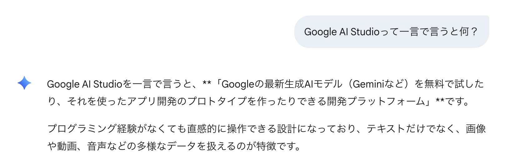

[TOC]

# プロンプトエンジニアリング ~ アプリケーション開発 ① ~


## 3 限前半 (45 分)

### 1.1 導入 (10 分)

#### 3 限出席コード

出席コードを slack に投稿します。

#### 講義の目的

この講義では、生成 AI（人工知能）活用方法の基本を学び、AI を用いた創作活動の可能性に焦点を当てます。学生には、AI 技術がクリエイティブな分野でどのように利用され、どのような影響を与えるかを理解してもらうことが目的です。この講義を通じて、学生は AI を活用した Web アプリケーション開発手法を身につけることができるようになります。最終的には、技術の進歩を活かして個人の創造性をさらに伸ばすための知識と技術を提供します。

| 回数     | 1<br />(9/25) |  2<br />(10/2)  |       3<br />(10/9)        |      4<br />(10/16)       |      5<br />(10/23)       | 6<br />(11/6) | 7<br />(11/13) |
| -------- | :-----------: | :-------------: | :------------------------: | :-----------------------: | :-----------------------: | :-----------: | :------------: |
| テーマ   |    AI 基礎    | AI の活用と倫理 | プロンプトエンジニアリング | AI を活用したアプリ生成 ① | AI を活用したアプリ生成 ② |   総合演習    |    総合演習    |
| 担当講師 |  伊藤、小島   |      伊藤       |            小島            |           伊藤            |           小島            |  小島、伊藤   |   伊藤、小島   |

#### なぜ AI でアプリケーションを開発するか？

##### ⚡ Fail fast

速く失敗せよ

Silicon Valley startup culture

##### ✅ Done is better than perfect

完璧を目指すよりまず終わらせろ

Mark Elliot Zuckerberg

##### 🚀 Deploy or Die

デプロイ（世の中への展開）か死か

Joi Ito

[Joi Ito: Want to innovate? Become a "now-ist" | TED Talk](https://www.ted.com/talks/joi_ito_want_to_innovate_become_a_now_ist)

#### アイスブレイク

> [!Note]
>
> 好きなお菓子は？

> [!Note]
>
> 京都のおすすめの観光地は？

> [!Note]
>
> よく使う絵文字は？

### 1.2 Web アプリケーション開発環境 セットアップ (15 分)

[Google AI Studio](https://aistudio.google.com/)とは？



1. Google アカウントでログイン
2. Google Drive と連携
   
3. Build 画面でテキストで指示
   
4. 生成結果
   
   

### 1.3 動作確認してみよう (15 分)

> [!NOTE]
>
> Hello World の Web サイトを作ってみよう

以下のプロンプトを参考に HelloWorld を表示する Web サイトを作成してください。
slack にスクリーンショットをはってください。

```
オシャレなHelloWorldを表示するWebページを作成してください。
```

> [!NOTE]
>
> チャットを使って修正してみよう

slack にスクリーンショットをはってください。


> [!NOTE]
>
> Showcase から気になるアプリを選んで修正してみよう

slack にスクリーンショットをはってください。


## 休憩(10 分)

## 3 限後半 (45 分)

### 2.1 Web アプリケーション (10 分)

#### Web アプリケーションとは

1. **Web アプリケーションの概要**

   - Web アプリケーションは、インターネットを介してユーザーがアクセスできるアプリケーションソフトウェアのことです。
   - ユーザーは Web ブラウザを使ってアクセスし、検索、閲覧、データの入力や管理などの操作を行えます。
   - 例として、SNS、オンラインショッピングサイト、ブログプラットフォーム、ビデオストリーミングサービスなどがあります。

2. **Web アプリケーションの構造**

   - Web アプリケーションは、一般的に 3 つの主要な構成要素から成り立っています。

   **2.1 クライアント側 (フロントエンド)**

   - クライアント側は、ユーザーが直接操作するインターフェースを担当します。
   - HTML（コンテンツの構造）、CSS（デザイン）、JavaScript（動的機能）などの技術が使われ、見た目や操作性を提供します。

   **2.2 サーバー側 (バックエンド)**

   - サーバー側は、リクエストを処理し、データの読み取りや書き込み、ビジネスロジックを実行します。
   - 一般的なプログラミング言語（JavaScript、Python、Java、Ruby など）を使って書かれ、API（アプリケーションプログラミングインターフェース）を介してクライアントにサービスを提供します。

   **2.3 データベース**

   - データベースは、アプリケーションのデータ（ユーザー情報、投稿、商品など）を保存、管理します。
   - リレーショナルデータベース（SQL を使用する MySQL、PostgreSQL など）や、非リレーショナルデータベース（NoSQL の MongoDB など）があります。


> [!Note]
>
> 生成 AI を活用して、Web アプリケーションの理解を深めよう。
> 自分の疑問点を生成 AI に質問してみましょう。

```
(例)
- フロントエンドを小学生にもわかるように教えて
- Webアプリにおけるクライアント側でブラウザ以外を利用するケースはありますか?
- Webアプリケーションとクラウドサービスの違いはなんですか?
- Webアプリとスマホアプリの違いは？
```

> [!Note]
>
> 2025 年時点では、Googel AI Studio や他のアプリ開発プラットフォームはフロントエンドの生成がメインです。

### 2.2 Web アプリケーションを作ってみよう。(20 分)

#### ポートフォリオサイト

> [!Note]
> ポートフォリサイトをを作成してみよう ([前講義「創作活動」のユースケース」から](../3_prompt_engineering/readme.md))

ポートフォリオサイトを作成してみてください。

```
モダンでクールなフラットデザインのポートフォーリオサイトを作成してください。
```

#### タイマーアプリ

> [!Note]
>
> タイマーアプリを作成してみよう

```
タイマーアプリを作成してください。
```

#### ゲーム

> [!Note]
>
> ゲームを作成してみよう

### 2.3 [参考] Web アプリケーションの共有(15 分)

#### Google AI Studio でアプリケーションを共有する方法

1. Google Cloud を準備（クレジットカードを登録）
2. Google AI Studio からデプロイ

#### ファイルダウンロードによる共有方法

1. ダウンロード
2. Node.js 環境を設定
3. `npm install`、`npm run dev`で実行

### 2.4 React？(5 分)

React（リアクト）は、ウェブサイトやアプリの見た目（UI）を作るための JavaScript ライブラリです。

ボタン・フォーム・カードなどの UI を「部品（コンポーネント）」として作り、同じ見た目や動きの部品を使い回すことで、開発の効率が上がります。

普通の Web ページのように「HTML を直接書く」のではなく、
JavaScript の中に HTML のような記法（JSX）を書いて画面を作ります。

この JSX という書き方はブラウザではそのまま動きません。
なので、Node.js というツールを使って「ビルド（変換）」する必要があります。

## 休憩(10 分)

## 4 限前半(45 分)

### 4 限出席コード

### 3.1 Web アプリケーションの開発プロセスと生成 AI の活用 (15 分)

Web アプリケーションの開発プロセスは、プロジェクトの要件や規模に応じて変化しますが、一般的なプロセスの流れは次のようになります。本講義では要件定義及び開発に着目して、講義を進めます。


#### 1. 要件定義

- **要件定義**：クライアントやプロジェクトの関係者からニーズを聞き、機能や仕様を明確にする。

> [!Note]
>
> Web アプリケーションを実現するために必要な機能一覧を出してみよう

```
(例)
私は家族でキャンプする予定があります。
そのキャンプで家族とのコミュニケーションを盛り上げるためWebアプリケーションのゲームを作りたいと考えています。
キャンプで見かけた植物や昆虫を調査し、調査したものを日付とともに記録できるWebアプリケーションを作りたいです。

そのWebアプリケーションを実現するための機能一覧を書いてもらえませんか。
```

> [!Note]
>
> 要件を伝えて、必要な機能を絞ってみよう

```
(例1)
私はWebアプリケーション初心者のため、できるかぎり簡単に実現したいです。上記の中で必要な機能はどれでしょうか。
```

#### 2. 設計

- **アーキテクチャ設計**：システムの全体像（クライアント、サーバー、データベースなどの連携）を決定。
- **UI/UX 設計**：ユーザーインターフェースやユーザー体験をデザインし、ユーザーフローやワイヤーフレームを作成。
- **データベース設計**：データの構造やリレーションシップを計画し、効率的なデータ処理を可能にする。

> [!Tip]
>
> Meramid 形式でフローチャートを書ける

```
上記のアプリを実現するアーキテクチャをmermaidで書いてもらえますか。
```

> [!Tip]
>
> データベースを設計してみよう

```
上記のデータベースを設計してもらえますか。
RDBでお願いします。
```

> [!Tip]
>
> ER 図を作成してみよう

```
上記のデータベース設計をmermaidで書いてもらえますか。
```

#### 3. 開発

- **フロントエンド開発**：ユーザーインターフェース部分を作成し、アニメーションやフォームなどの動的な機能も実装。
- **バックエンド開発**：サーバー側のビジネスロジック、データ処理、API、認証システムなどを実装。
- **データベース構築**：事前に設計したデータベーススキーマに基づいて、データベースを作成し接続する。

> [!Tip]
>
> データベース構築用の SQL を作成してみよう

```
データベースを作成するためのSQL文を作成してください。
```

#### 4. テスト

- **ユニットテスト**：個々のモジュールやコンポーネントの機能を確認。
- **統合テスト**：複数のモジュールが連携して機能するかを確認。
- **ユーザビリティテスト**：ユーザーの観点から使いやすさや UI の改善点を探る。
- **パフォーマンステスト**：システム全体の負荷、応答速度、スケーラビリティをテストする。

> [!Tip]
>
> テストコードを生成してみよう

```
今日が何曜日か判定する関数を生成してください。
JavaScriptでお願いします。
```

```
上記をテストするためのコードを生成してください。
```

#### 5. デプロイ

- **デプロイ**：テストが完了したアプリケーションを本番環境にリリース。

> [!TIp]
>
> デプロイするためのコマンドを生成してみよう

```
上記のコードをkubernetesにデプロイするためのコマンドを生成してください。
```

#### 6. 運用・保守

- **監視**：アプリケーションの稼働状況やパフォーマンスの監視。
- **メンテナンス**：セキュリティやパフォーマンスの向上、不具合の修正。
- **機能改善**：ユーザーからのフィードバックに基づいた機能の追加や改善。

> [!Note]
>
> 監視設定手順を教えてもらう

```
Kubernetes Dashboardで監視を設定するための手順を教えてください。
```

### 3.2 より複雑な Web アプリケーションを作ってみよう。(30 分)

簡易な Web アプリケーションであれば、生成 AI が 1 回のリクエストでほしいコードを生成してくれますが、
複雑なアプリケーションを作ろうとすると、うまく動作しなかったりします。
以下のプロセスを参考にしながら、生成 AI を活用して、バグ修正やコードや Web アプリケーションの仕組みを理解してみましょう。


#### 画像共有サイト (20 分)

> [!note]
>
> 画像共有サイトを生成してみよう

```
画像共有サイトを作成してください。
```

> [!Note]
>
> サイトの色を変更してみよう

```
(例)ポートフォリオをブルートーンにしてください。
```

> [!Note]
>
> 画像が共有できないバグを修正してみよう

> [!Note]
>
> コードを理解してみよう

#### 認証つき Quiz サイト (10 分)

> [!Note]
>
> クイズアプリを生成しよう。

```
クイズアプリを作成してください。
```

<strong><span style="color: red;">※このやり方は脆弱な認証であり、機密/個人情報等は入れないこと</span></strong>

> [!Note]
>
> クイズサイトを合言葉がないと使えないようにしてみましょう。

```
合言葉を入れた場合のみクイズを開始できるようにしてください。
```

## 休憩(10 分)

## 4 限後半(45 分)

### 演習: 自分が好きな Web サイト/アプリを真似て作ってみよう。(30 分)

##### Web アプリ作成 (25 分)

自分が好きな Web サイト/アプリを真似て作ってみよう。

##### 投稿 (5 分)

Web アプリを作成したら、以下の情報を投稿しよう。

```
参考にしたWebサイト/アプリ名:
作成したWebサイト/アプリ: キャプチャ
生成AIとの会話履歴: http://example.com/xxx
感想/考察:
(簡単/難しいと感じたこと、工夫したところ、気付いたこと等々)
```

### 発表 (10 分)

何人かの方ににご発表いただきたいと思います！

### まとめと次回の講義について (5 分)
