# プロンプトエンジニアリング ~ アプリケーション開発 ② ~


```
下記タイトルの授業のモダンでフラットでシンプルなトップ画像を横長で書いて
HTML と CSS と JavaScript 〜動きのあるサイトを作ろう〜
```

### 目次

[TOC]

---

## 3-1 限目：振り返りとWeb アプリの基礎① (13:40-)

### 3 限出席コード

出席コードをディスプレイに表示します。

### 講義の目的

この講義では、生成 AI（人工知能）活用方法の基本を学び、AI を用いた創作活動の可能性に焦点を当てます。学生には、AI 技術がクリエイティブな分野でどのように利用され、どのような影響を与えるかを理解してもらうことが目的です。この講義を通じて、学生は AI を活用した Web アプリケーション開発手法を身につけることができるようになります。最終的には、技術の進歩を活かして個人の創造性をさらに伸ばすための知識と技術を提供します。

| 回数     | 1<br />(9/25) |  2<br />(10/2)  |       3<br />(10/9)        |      4<br />(10/16)       |      5<br />(10/23)       | 6<br />(11/6) | 7<br />(11/13) |
| -------- | :-----------: | :-------------: | :------------------------: | :-----------------------: | :-----------------------: | :-----------: | :------------: |
| テーマ   |    AI 基礎    | AI の活用と倫理 | プロンプトエンジニアリング | AI を活用したアプリ生成 ① | AI を活用したアプリ生成 ② |   総合演習    |    総合演習    |
| 担当講師 |  伊藤、小島   |      伊藤       |            小島            |           伊藤            |           小島            |  小島、伊藤   |   伊藤、小島   |

### アイスブレイク (5 分)

> [!Note]
>
> 昨日何時に寝た？

```
昨日何時に寝た？
:one: 20:00-22:00
:two: 22:00-24:00
:three: 0:00-2:00
:four: 2:00-6:00
:five: 上記以外
```


> [!Note]
>
> ChatGPT Atlasがリリースされたけど、知ってる?

```
:one: 知ってる
:two: 何それ?
```


> [!Note]
>
> 前回の授業で、期待どおりのサイトを作れた？

```
前回の授業で、期待どおりのサイトを作れた？
:one いい感じ
:two: まあまあ
:three: ふつう
:four: 微妙
:five: 全然
```

```
動かなかった・微妙だった・もっとこうだったらいいのに
:one: 機能（画像アップロード・検索等）が実装できなかった
:two: 見た目が微妙だった
:three: もっと動きが欲しい
:four: その他
```

> [!Note]
>
> Webアプリケーションの構造(特にフロントエンドとバックエンドの違い)理解できた?

```
1. そこそこ
2. なんとなく
3. 全然
```

### 前回の振り返り - 理解できていない箇所の質問と深堀り (10 分)

> [!Tip]
>
> Web アプリケーションの構造を教えて
> 中学生でもわかるように説明して

> [!Tip]
>
> HTML、CSS、JavaScript って何？
> 必要に応じて、深掘りして聞いてみよう


### 前回の振り返り  (15 分)

生成AIを使って、実際にWebアプリケーションを作る方法を学びました。

### 覚えておきたい3つの言葉 - AIでアプリケーションを開発する理由

| 言葉                              | 意味                           | 提唱者             |
| --------------------------------- | ------------------------------ | ------------------ |
| ⚡ **Fail fast**                   | 速く失敗せよ                   | Silicon Valley文化 |
| ✅ **Done is better than perfect** | 完璧を目指すよりまず終わらせろ | Mark Zuckerberg    |
| 🚀 **Deploy or Die**               | デプロイ（公開）か死か         | Joi Ito            |

> 💡 **ポイント**: 完璧を目指して何もできないより、まず作って試してみることが大事！

####  使ったツール: Google AI Studio

- Googleアカウントでログインするだけで使える
- テキストで指示を出すとWebアプリが作れる
- React（リアクト）という技術でアプリが生成される

##### できること:

1. プロンプト（指示文）を書く
2. AIがコードを生成してくれる
3. その場でアプリを試せる
4. 修正したい部分をチャットで伝えられる

#### 前回学んだこと

##### Webアプリケーションの基本構造

Webアプリは3つの部分でできています：

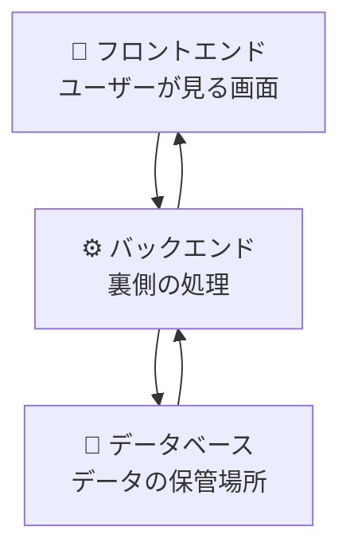

| 部分               | 役割                             | 使う技術                      |
| ------------------ | -------------------------------- | ----------------------------- |
| **フロントエンド** | ユーザーが見る画面・操作する部分 | HTML, CSS, JavaScript         |
| **バックエンド**   | 裏側でデータを処理する部分       | Python, JavaScript, Java など |
| **データベース**   | 情報を保存・管理する部分         | MySQL, MongoDB など           |

> 💡 **例え話**: レストランで考えると...
>
> - フロントエンド = お客さんが見るメニューと店内
> - バックエンド = 厨房での調理
> - データベース = 食材の倉庫


##### アプリ開発の流れ

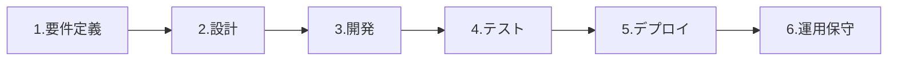

| 段階              | 説明             | AIの活用例                                                   |
| ----------------- | ---------------- | ------------------------------------------------------------ |
| **1. 要件定義**   | 何を作るか決める | 「キャンプで使えるアプリを作りたい」→ 必要な機能リストを提案 |
| **2. 設計**       | どう作るか考える | データベース設計、フローチャート（Mermaid図）の作成          |
| **3. 開発**       | 実際に作る       | コードの生成、SQL文の作成                                    |
| **4. テスト**     | 動作確認         | テストコードの生成                                           |
| **5. デプロイ**   | 公開する         | デプロイ用のコマンド生成                                     |
| **6. 運用・保守** | 改善し続ける     | 監視設定の手順説明                                           |


##### 複雑なアプリを作るコツ

一度で完璧なアプリは作れません。以下のサイクルを繰り返します：

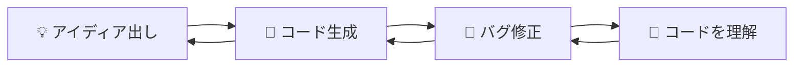

**大切なポイント:**

- 最初から完璧を目指さない
- エラーが出たら、エラーメッセージをAIに見せて修正依頼
- 生成されたコードを読んで理解する努力をする
- 「ここを青色にして」「もっとシンプルにして」など、具体的に指示

------

##### 💡 プロンプト（指示の出し方）のコツ

###### ❌ 良くない例

```
アプリを作って
```

→ 何を作りたいか不明確

###### ✅ 良い例

```
モダンでクールなフラットデザインのポートフォリオサイトを作成してください。
以下の情報を表示できるようにしてください：
- 名前
- スキル一覧
- プロジェクト実績
- お問い合わせフォーム
```

→ 具体的で明確

> [!Note]
>
> 振り返り: Webサイトを作ってみよう
>
> 友人に頼まれて、友人の会社（or お店 or コミニティ）の Web サイトを作ることになりました。
>
> 1. どんな会社か決めよう
> 2. 誰に何を伝えるサイトか決めよう
> 3. どんなコンテンツが必要か決めよう
> 4. トップページを作ってみよう
> 5. 共有してみよう

例 コーポレートサイト

```
下記説明を元に、HTML、CSS、JavaScriptでコーポレートサイトを書いて

# 会社
ビールの醸造所とバー。小さいけれど、こだわってる。おしゃれ。

# 誰向けのサイト？
ビールは大好きってほどじゃないけど、変わったビールは飲んでみたい
20代から30代
洒落た雰囲気を楽しみたい
久しぶりに会う友人と飲むために店を選んでいて、google map経由で気になってのぞいてみた

# 要件
- バックエンドは利用しない
- JavaScriptはreactを使わず、Vanilla JSだけを利用してください。
- htmlのファイル名はindex.html
- cssのファイル名はstyles.css
```


###  Web サイト・Web アプリケーションの基礎 (15 分)

あらためて、Web サイトや Web アプリケーションが動く仕組みについて整理してみましょう

参考：
[co-creation-with-genai/2025/4_webapp_dev_with_ai/readme.md at main · Creative-Cucumbers/co-creation-with-genai](https://github.com/Creative-Cucumbers/co-creation-with-genai/blob/main/2025/4_webapp_dev_with_ai/readme.md#21-web-%E3%82%A2%E3%83%97%E3%83%AA%E3%82%B1%E3%83%BC%E3%82%B7%E3%83%A7%E3%83%B3-10-%E5%88%86)

#### Web アプリケーションについて改めて理解しようとしてみよう

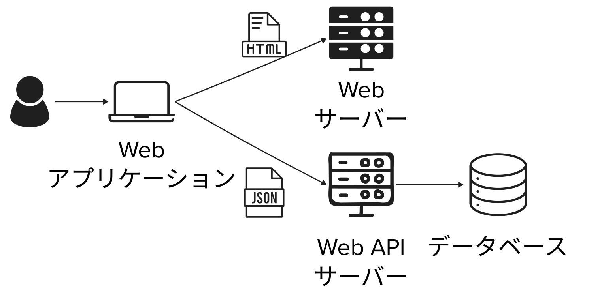

> [!Tip]
>
> Web アプリケーションについて改めて調べてみよう

```
APIとWeb APIの違いは?
```

```
Web APIってどんなものがある？
```

```
Web アプリにおけるフロントエンドとバックエンドの違いはなに?
```


#### HTML, CSS, JavaScript/TypeScriptについて (10分)

> [!Tip]
>
> HTML, CSS, JavaScriptの役割の違いは？

> [!Tip]
>
> HTML にはどんなタグがある？

> [!Tip]
>
> CSS にはどんなプロパティがある？

> [!Tip]
>
> JavaScript はどんな構文がある？

> [!Tip]
>
> JavaScriptとTypeScriptの違いは? 

### (フロントエンドを理解するために) ローカルPCでWebアプリを動作させてみよう(10分)

① (ChatからGemini Proで) フロントエンドを構成するファイル郡の生成

```
下記説明を元に、HTML、CSS、JavaScriptでコーポレートサイトを書いて

# 会社
ビールの醸造所とバー。小さいけれど、こだわってる。おしゃれ。

# 誰向けのサイト？
ビールは大好きってほどじゃないけど、変わったビールは飲んでみたい
20代から30代
洒落た雰囲気を楽しみたい
久しぶりに会う友人と飲むために店を選んでいて、google map経由で気になってのぞいてみた

# 要件
- バックエンドは利用しない
- JavaScriptのファイル名はscripts.js
- htmlのファイル名はindex.html
- cssのファイル名はstyles.css
```

② 各ファイルのダウンロード(index.html, styles.css, scripts.js)し、フォルダに配置

③ファイル名をindex.html, styles.css, scripts.jsに変更する

③index.htmlをダブルクリックし、ブラウザで開く


## 3-2 限目：Web アプリの基礎② (14:30-)

### (バックエンドを理解するために) 天気アプリの作成してみよう (20 分)

> [!Note]
>
> Web APIの仕様を理解しよう

```
以下のAPIの仕様を教えてください。
https://api.open-meteo.com/v1/forecast?latitude=35.0211&longitude=135.7538&hourly=temperature_2m
```

> [!Note]
>
> Web APIを実行してみよう

①ブラウザでAPIを実行
ブラウザのURLにhttps://api.open-meteo.com/v1/forecast?latitude=35.0211&longitude=135.7538&hourly=temperature_2mをいれて、エンターキーを押下

②CLIでAPIを実行
Windowsの場合 (PowerShellを開いて以下のコマンドを実行):

```powershell
Invoke-RestMethod -Uri "https://api.open-meteo.com/v1/forecast?latitude=35.0211&longitude=135.7538&hourly=temperature_2m"
```

Mac (Terminalを開いて以下コマンドを実行):

```shell
curl "https://api.open-meteo.com/v1/forecast?latitude=35.0211&longitude=135.7538&hourly=temperature_2m"
```

③生成AIを活用してAPIを実行

```
以下のAPIを実行し、実行結果を見せてくれませんか?
https://api.open-meteo.com/v1/forecast?latitude=35.0211&longitude=135.7538&hourly=temperature_2m
```


> [!Note]
>
> 天気アプリを作ってみよう

````
下記APIを使って、京都の気温をグラフ表示する簡単なwebサイトをHTMLで作ってください。

URL:
https://api.open-meteo.com/v1/forecast?latitude=35.0211&longitude=135.7538&hourly=temperature_2m
````

[🌦️ Docs | Open-Meteo.com](https://open-meteo.com/en/docs)

> [!Note]
>
> コードを理解しよう

```
どこでAPIを実行しているのですか?
```


### リッチなWebアプリケーション開発を支援するツール郡 (10分)

リッチなWebアプリケーションを作成するために下記のようなライブラリ（事前に作成された機能を提供するプログラムの塊）やフレームワーク（ルールに従ってファイル配置すると楽にアプリを開発できるライブラリの塊）やUIコンポーネントを使うこともあります。

- ライブラリ (例) [React](https://ja.react.dev/)
- Webアプリケーションフレームワーク (例) [Next.js by Vercel - The React Framework](https://nextjs.org/)
- UIコンポーネント (例) [MUI Core: Ready-to-use React components, free forever](https://mui.com/core/)

> [!Tip]
>
> 上記の中で気になるツールについて生成AIに聞いてみよう。


### ラフなデザインからWebアプリケーション生成 (15 分)

①手書きで[ラフなデザイン](./images/sample_image.png)を描いたあと、生成AIにプロトタイプデザインを作成してもらおう。

```
添付の画像をベースにプロトタイプデザインの画像を作成してください。
このポートフォリオサイトでは他の会社の人に自分の作品を見てもらい仕事を受けれるようになりたいと思っています。
```

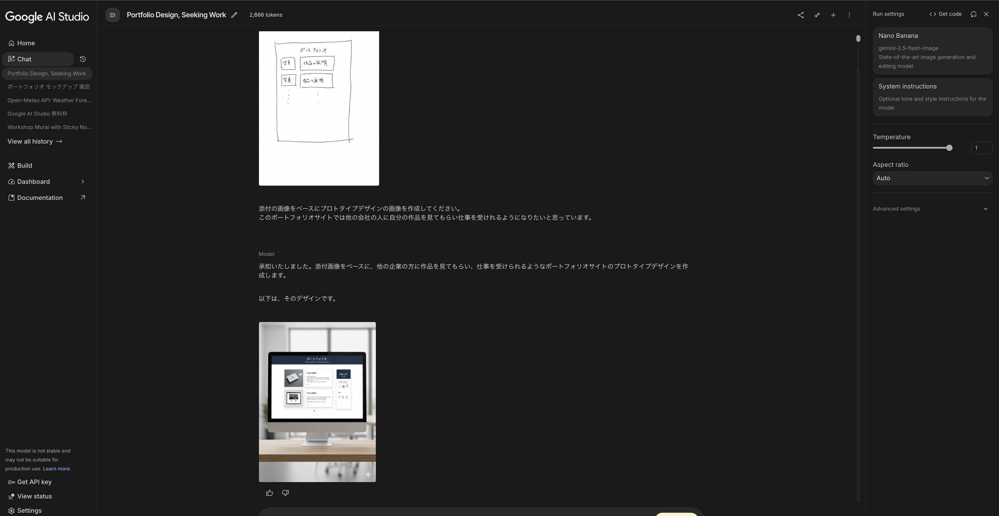

②プロトタイプデザインをベースにWebアプリケーションを作成する

```
添付画像のWebサイトを作成してください。
```

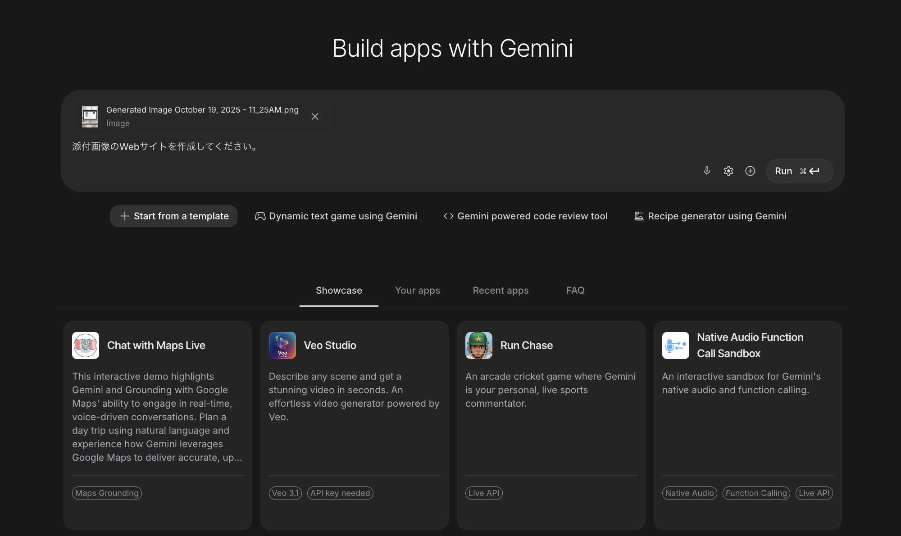

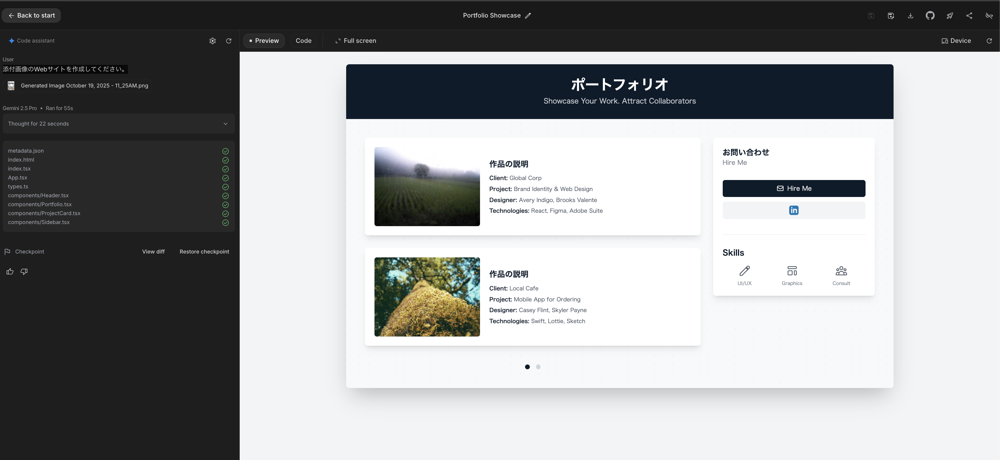


### [オプション] ポケモンずかんを作ろう (20 分)

> [!Tip]
>
> PokeAPIの仕様を理解したあと、そのAPIを使ってポケモンずかんを作ってみよう

[トップページ｜ポケモンずかん](https://zukan.pokemon.co.jp/)
https://www.pokemon.co.jp/rules/

[PokéAPI](https://pokeapi.co/)

参考：
[ご利用について｜ポケットモンスターオフィシャルサイト](https://www.pokemon.co.jp/rules/)


## 4-1 限目： 様々なユーザー入力 〜センサー入力をもっと試してみよう〜 (15:40-)

### 4 限出席コード

出席コードをディスプレイに表示します。

### PC/スマホのセンサー機能を調べてみよう (10分)

> [!Note]
>
> PC/スマートフォンの Web ブラウザから利用できるスマートフォンのセンサーについて教えて

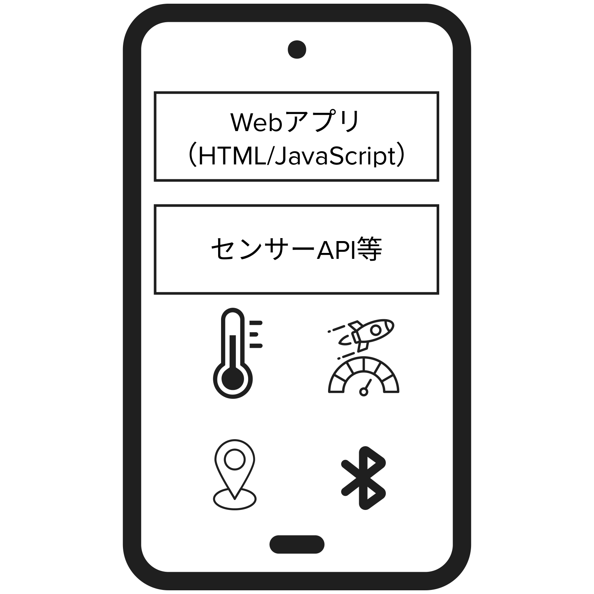

| センサー/機能                               | スマートフォン搭載 | PC搭載        | Webブラウザから利用                                          | ネイティブのみ/備考                                   |
| ------------------------------------------- | ------------------ | ------------- | ------------------------------------------------------------ | ----------------------------------------------------- |
| 位置情報（GPS/GNSS/ネットワーク測位）       | ✓                  | △             | **✓**（Geolocation API、要許可/HTTPS。PCはWi-Fi/IP推定が多い） | —                                                     |
| 加速度                                      | ✓                  | △             | **✓/△**（DeviceMotionEvent は広く、Generic Sensor API は主にChromium/Android） | バックグラウンドや高頻度連続取得はネイティブ有利      |
| ジャイロ                                    | ✓                  | △             | **✓/△**（DeviceOrientationEvent、Gyroscope/OrientationSensor はChromium系中心） | iOSはユーザ操作後の許可が必要                         |
| 地磁気・コンパス                            | ✓                  | ✕             | **△**（Magnetometerは限定的/実験的）                         | 正確な方位はネイティブ優位                            |
| カメラ                                      | ✓                  | ✓             | **✓**（getUserMedia）                                        | 露出/焦点/RAW等の細かい制御はネイティブが強い         |
| マイク                                      | ✓                  | ✓             | **✓**（getUserMedia）                                        | 低遅延/高精度処理はネイティブ有利                     |
| スピーカー/振動（ハプティクス）             | ✓                  | ✓             | **△**（Vibration APIは主にAndroidのみ。ハプティクス制御は限定） | 高度な触覚/システム振動はネイティブ                   |
| 近接センサー                                | ✓                  | ✕             | **✕**（Proximity APIは事実上未提供）                         | 通話時の画面消灯等はネイティブ                        |
| 照度センサー                                | △                  | △             | **△/✕**（AmbientLightSensorはプライバシー理由で多くが無効）  | 必要ならネイティブ                                    |
| 気圧（気圧計）                              | △                  | ✕             | **✕**（Barometerは実質未提供）                               | ネイティブなら取得可（対応端末のみ）                  |
| 温度（環境/端末）、湿度                     | △                  | ✕             | **✕**                                                        | 産業/特殊端末や外部センサーでネイティブ/BLE経由       |
| 心拍/SpO2/体温/ECG                          | △                  | ✕             | **△**（外部**BLE**機器なら Web Bluetooth で一部取得可）      | 本体内蔵センサー値はネイティブのみ                    |
| 歩数/活動量（Pedometer/Motion Coprocessor） | ✓                  | ✕             | **✕**（推定は可能だが公式APIなし）                           | HealthKit/Health Connect等でネイティブ                |
| UWB（超広帯域）                             | △（上位機種）      | ✕             | **✕**                                                        | 近接/測距はネイティブSDK（例：iOS NearbyInteraction） |
| NFC                                         | ✓                  | △（ごく一部） | **△**（**Web NFC**はChromium on Androidのみ）                | 決済/カードエミュ等はネイティブ限定                   |
| Bluetooth（外部センサー接続）               | ✓                  | ✓             | **△**（**Web Bluetooth**はChromium系中心。iOS/Safariは不可/限定） | ネイティブは全般に強力                                |
| USB/シリアル/HID 機器                       | △                  | ✓             | **△**（**WebUSB/WebSerial/WebHID**：主にChromium/権限必要）  | ドライバ必要な機器はネイティブ                        |
| Wi-Fi/セルラー情報（SSID/RSSI等）           | ✓                  | ✓             | **✕**（プライバシーで提供なし）                              | ネットワーク情報はネイティブも厳しく制限              |
| バッテリー状態                              | ✓                  | ✓             | **△**（Battery Status APIは実質非推奨/制限多い）             | ネイティブは取得可                                    |
| 生体認証（指紋/顔）                         | ✓                  | ✓             | **△**（**WebAuthn**で“認証”は可。生体データの生値は不可）    | 生体データはネイティブ管理のみ                        |
| Gamepad/コントローラ                        | ✓                  | ✓             | **✓**（Gamepad API）                                         | 高度機能はネイティブ                                  |
| スタイラス（筆圧/傾き/方位）                | ✓                  | △             | **✓**（Pointer Events Level 2：pressure/tilt等）             | 4KHz等の高サンプリングはネイティブ                    |
| ディスプレイ向き/フォールディング状態       | ✓                  | △             | **△**（一部は Screen Orientation / DeviceOrientation）       | 折りたたみ角度等はネイティブ依存                      |
| LiDAR/ToF（深度）                           | △（一部端末）      | ✕             | **△/✕**（直接APIほぼなし。**WebXR**のARで推定は可）          | ネイティブARフレームワークが主流                      |


### Web アプリでデバイスの機能を呼び出せる仕組み (10 分)

HTML/JavaScript から、ブラウザに組み込まれている API を経由してセンサー情報にアクセスできます。

> [!Tip]
>
> どうやって Web ブラウザからスマホのセンサーにアクセスしているの？

> [!Tip]
>
> PC/スマホ向けの Web アプリとネイティブアプリの違いを教えて？

> [!Warning]
>
> Sensor API と Web API は違う!?

```
sensor apisとweb apiとは違う？
```

参考：
[Sensor APIs - Web API | MDN](https://developer.mozilla.org/ja/docs/Web/API/Sensor_APIs)

### 音声入力 (10 分)

> [!Note]
>
> 音声を入力して、グラフを表示しよう

```
音声の周波数をグラフとして表示するWebアプリを作成してください。HTML、CSS、JavaScriptで作成してください。
また、以下の要件も満たしてください。
- 全てのファイルはルートフォルダに配置
- htmlのファイル名はindex.html
- CSSのファイル名はstyles.css
- JavaScriptのファイル名はscript.js
```

### カメラ (10 分)

> [!Note]
>
> カメラから画像を入力して表示してみよう

```
カメラ画像を表示するWebアプリを作成してください。HTML、CSS、JavaScriptで作成してください。
また、以下の要件も満たしてください。
- 全てのファイルはルートフォルダに配置
- htmlのファイル名はindex.html
- CSSのファイル名はstyles.css
- JavaScriptのファイル名はscript.js
```

### 位置情報 (10 分)

> [!Note]
>
> 位置情報を取得して表示してみよう。

```
位置情報を取得し、地図にピンを配置うするWebアプリを作成してください。HTML、CSS、JavaScriptで作成してください。
また、以下の要件も満たしてください。
- 全てのファイルはルートフォルダに配置
- htmlのファイル名はindex.html
- CSSのファイル名はstyles.css
- JavaScriptのファイル名はscript.js
```


### その他 (5 分)

> [!Tip]
>
> ローカルストレージはどういう用途で使われる？

> [!Tip]
>
> Web アプリの HTML や JavaScript で、スマホのバイブレーションを操作する方法を教えて

## 4-2 限目： 動きのあるサイト 〜シューティングゲームを作ろう〜 (16:30-)

### シューティングゲームを作ってみよう (20 分)

> [!Note]
>
> シンプルなところから始めよう

```
シューティングゲームを作成してください。HTML、CSS、JavaScriptで作成してください。
また、以下の要件も満たしてください。
- バックエンドは利用しない
- 初心者でもわかりやすいファイル構造
- 全てのファイルはルートフォルダに配置
- htmlのファイル名はindex.html
- CSSのファイル名はstyles.css
- JavaScriptのファイル名はscript.js
- グラフィックにはcanvasを使う
- 矢印キーで移動
```

> [!Tip]
>
> コードを理解しよう

```
index.htmlの内容をわかりやすく解説してください。
```

> [!Tip]
>
> ルールを AI と相談しながら仕様を決めてアップデートしていこう

```
さらに機能を追加したいですが、追加機能のイメージが湧きません。追加機能候補を10個教えてください。
```

> [!Tip]
>
> 対話的に機能を追加しても OK

```
パワーアップアイテムの追加して
```

> [!Tip]
>
> 一部しか書いてくれなくて、どこを修正したらいいかわからない時は全部書き直してもらおう

```
省略せずにscript.jsを書き直して
```

> [!Note]
>
> さらにアップデートしていこう

```
以下の要件を追加してください。
- 弾が的に当たったら10点
- 敵にぶつかったらゲームオーバー
- 制限時間は15秒
```

### スマホで使えるようにしてみよう (30 分)

#### デプロイ環境の準備と動作確認

1. **公式サイトにアクセス**

   - Webブラウザで[CodeSandbox](https://codesandbox.io/)の公式サイトにアクセスします。

2. **Sign Upボタンをクリック**

   - 画面右上にある「Sign In」ボタンをクリックしても新規アカウントの作成します。

3. **Googleアカウントでのサインアップ**

   - 表示されたサインアップページで「Continue with Google」を選択します。
   - Googleアカウントにサインインするよう求められるため、Googleのログイン情報を入力します。

4. **アカウント作成**

   - Username等を設定します。
     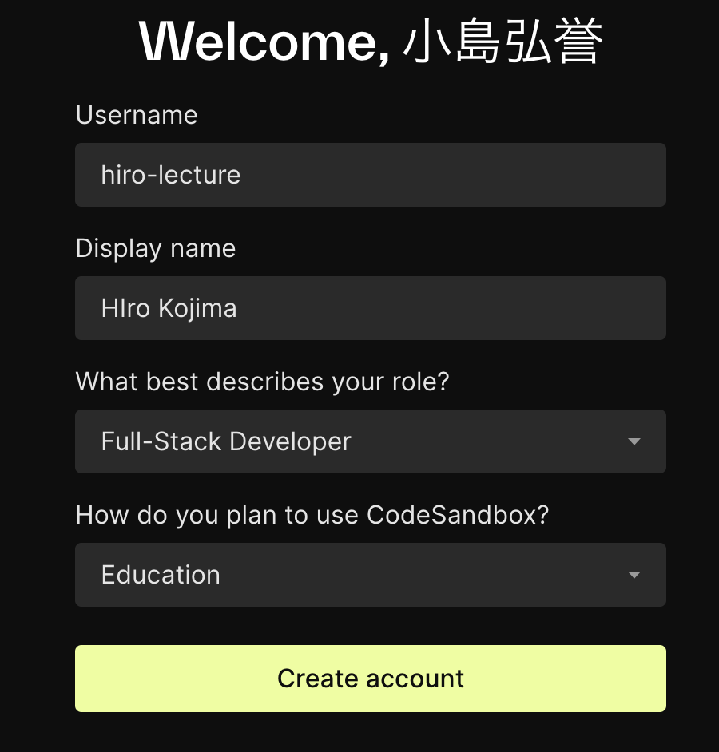

   - NameSpaceは本講義とわかるように`genai-lecture`を設定します。
     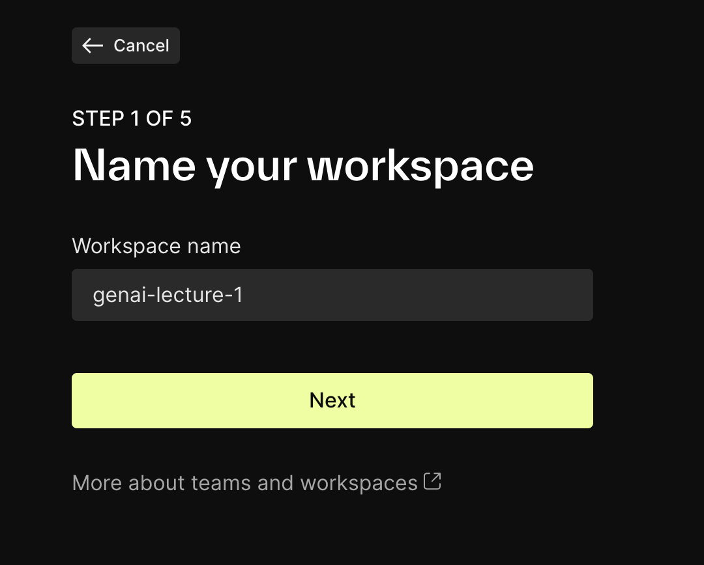

   - 新規アカウントの作成完了

     許可後、CodeSandboxのダッシュボード画面にリダイレクトされます。

     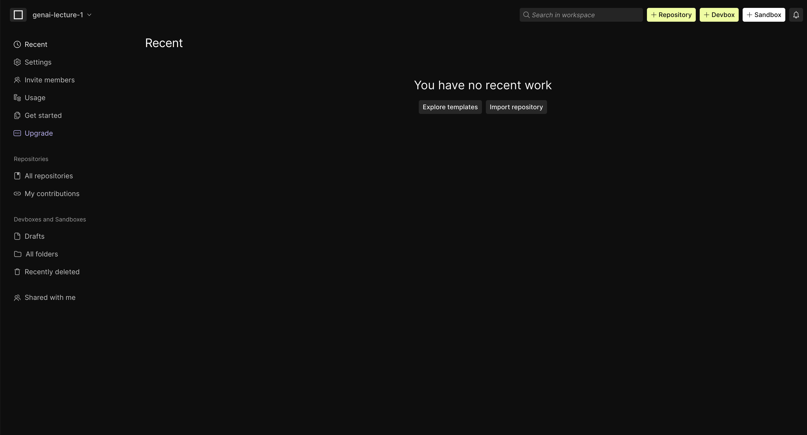

5. **プロジェクトの作成**

   - 画面右上の「+Create」ボタンをクリックし、新しいプロジェクトを作成します。
   - プロジェクト名は`HelloWorld`としてください。

   - テンプレートから`HTML+CSS`を選択します。

   - 以下のように表示できれば正常にプロジェクトを作成できています。

   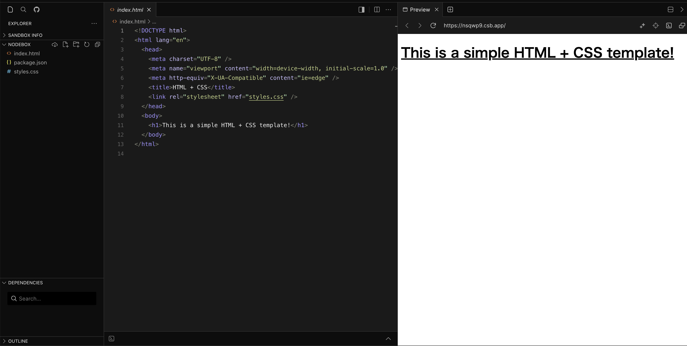

> [!Note]
>
> 加速度センサーを使ってみよう

Google AI Studioの`Chat`でHTML, CSS, JavaScriptのファイルを生成しよう。

```
シューティングゲームを作成してください。HTML、CSS、JavaScriptで作成してください。
また、以下の制約と要件も満たしてください。
## 開発制約
- htmlのファイル名はindex.html
- CSSのファイル名はstyles.css
- JavaScriptのファイル名はscript.js
- グラフィックにはcanvasを使う
## 機能要件
- 矢印キーで移動
- スペースキーで弾を発射
- 定期的に敵が出現
- 弾が的に当たったら10点
- 敵にぶつかったらゲームオーバー
- 制限時間は15秒
- スマホでも操作可能
- タップしたら弾を発射
- スマホを傾けたら移動
```

> [!Caution]
>
> Build機能を使わないことに注意


> [!Note]
>
> スマホでアクセスしてみよう

#### ライブURLの共有方法

1. **プロジェクトを開く**:
   - CodeSandboxにログインし、既存のサンドボックスを開きます。
2. **プロジェクトを設定する**:
   - サンドボックス画面の上部にある「Share」アイコン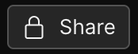をクリックします。
   - 「Change Permission」セクションを見つけて、「Private」から「Unlisted」に変更します。これにより、サンドボックスは検索結果に表示されず、URLを知っている人のみがアクセスできるようになります。
3. **URLを共有する**:
   - Perviewタブに記載されているURLをコピーし、Slackに投稿し、スマホからそのURLアクセスにアクセス。
   - もしくわ、Perviewタブに記載されているURLを別タブで開き、ブラウザでQRコードを発行し、アクセス。
4. **確認**:
   - URLを共有した人がサンドボックスにアクセスできるかどうかを確認します。共有したURLを使って、異なるブラウザやプライベートモードでアクセスしてみると良いでしょう。
5. **注意点**:
   - 「Unlisted」設定は、完全なプライバシーを提供するものではありません。URLを知っている人は誰でもアクセスできます。
   - 必要に応じて、追加の認証やアクセス制限をアプリケーション内で実装することを検討してください。

### まとめ (10 分)
