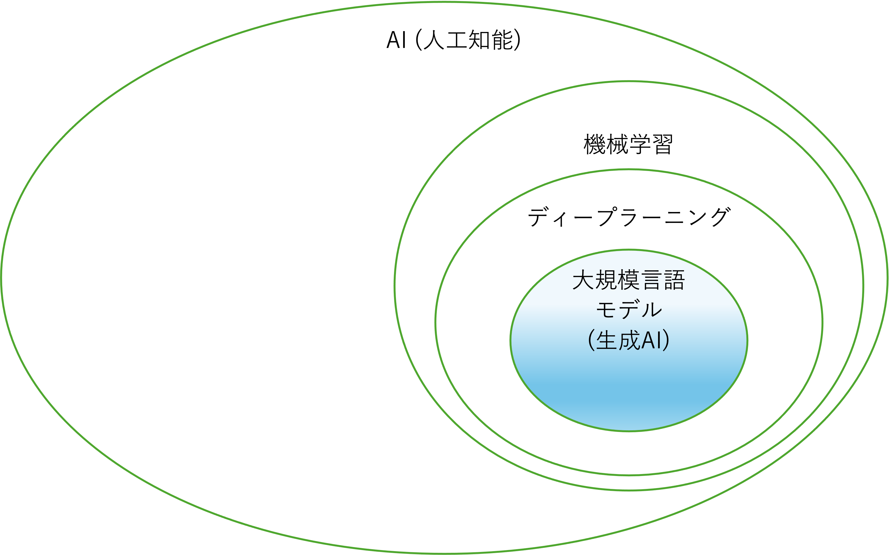

# 総合演習 ①


### 目次

[TOC]

---

## 3 限目

### 出席コード

### 講義の目的

この講義では、生成 AI（人工知能）活用方法の基本を再確認し、AI を用いた創作活動の可能性に改めて焦点を当てます。これまで学んだ AI 技術がクリエイティブな分野でどのように利用され、どのような影響を与えるかを再度理解し、実践的なスキルを再確認します。この講義を通じて、学生は AI を活用した Web アプリケーション開発手法を復習し、さらに実践力を強化します。最終的には、技術の進歩を活かして個人の創造性をさらに伸ばすための知識と技術を統合し、より深い理解と応用力を身につけます。

| 回数     | 1<br />(9/25) |  2<br />(10/2)  |       3<br />(10/9)        |      4<br />(10/16)       |      5<br />(10/23)       | 6<br />(11/6) | 7<br />(11/13) |
| -------- | :-----------: | :-------------: | :------------------------: | :-----------------------: | :-----------------------: | :-----------: | :------------: |
| テーマ   |    AI 基礎    | AI の活用と倫理 | プロンプトエンジニアリング | AI を活用したアプリ生成 ① | AI を活用したアプリ生成 ② |   総合演習    |    総合演習    |
| 担当講師 |  伊藤、小島   |      伊藤       |            小島            |           伊藤            |           小島            |  小島、伊藤   |   伊藤、小島   |

### アイスブレイク (10 分)

> [!Note]
>
> 大学周辺のおすすめのごはん屋さん

> [!note]
>
> 行ってみたい国

> [!Note]
>
> 最近、欲しいもの

### 総合演習の進め方について (5 分)

#### Day1 (今回の講義)

| 時間   | アクティビティ                                                                     |
| ------ | ---------------------------------------------------------------------------------- |
| 3 限目 | ・総復習<br />・補足(アイディエーションと計画づくり、Web アプリケーション開発方法) |
| 4 限目 | ・総合課題: アイディエーションと計画づくり<br />・中間発表                         |

#### Day2 (次回の講義)

| 時間   | アクティビティ                                       |
| ------ | ---------------------------------------------------- |
| 3 限目 | ・総合課題: Web アプリケーション開発<br />           |
| 4 限目 | ・最終発表: "Demo Day" **※全員発表＆課題提出**<br /> |

### 総復習: AI 基礎 (15 分)

#### AI (人工知能)とは

- AI は人間の知的行動をコンピューターで模倣する技術、またはその研究分野を指す。(参照: 第 1 回)
- AI は発展途上であり、歴史とともに人が想像する AI と現実の AI は変わってきている。(参照: 第 1 回)
- 歴史とともに AI を理解することが重要 (参照: 第 1 回)

#### 生成 AI はどのように作られているか

- 機械学習はコンピューターとデータを使って規則性をみつける手法 (参照: 第 1 回)
- ニューラルネットワークは人間の脳神経系にヒントを得て、設計された計算モデル。その規模を大きくしたものがディープラーニング。(参照: 第 1 回)
- トランスフォーマーと自己教師学習により、現代の生成 AI が実現できている。(参照: 第 2 回)



#### AI にはどのようなリスクがあるか

- AI が職業に与える影響の研究結果が報告されている。労働補完型と労働置換型があることを認識する。 (参照: 第 2 回)
- AI リスクは 2 階建て(1 階: 合法性、2 階: 社会受容性)　(参照: 第 2 回)
- AI にリスク(情報流出、著作権侵害、ハルシネーション等々)があることを理解して、臨機応変に使いこなそう　(参照: 第 2 回)

#### 生成 AI の使い方


#### 生成 AI 活用のユースケース

##### ・「授業」のユースケース (参照: 第 3 回)

インプット: 英語の翻訳、資料の要約、画像の説明、深堀り
アウトプット: レポートのアイディア出し、レポートの生成、レポートの推敲、プレゼン資料の作成、プレゼン用画像の生成

##### ・「創作活動」のユースケース (参照: 第 3 回)

アイディア出し: 案だし、フィードバック、深堀り、アドバイス
ポートフォリオサイトの作成

##### ・「就職活動」のユースケース (参照: 第 3 回)

自己分析と計画: 自己分析、タスク化、キャリア相談

### 復習してみよう (15 分)

> [!Note]
>
> **テーマ: 卒業制作のアイディアを出してみよう**
>
> 例:
>
> - アイディア出し: アイディアだしてもらおう
> - フィードバック: アイディアの良いところ、改善が必要なところをもらおう
> - 深堀り: 疑問に感じたことを質問し、理解することでアイディアを広げよう

> [!tip]
>
> 生成 AI に役割を与えてみよう。
>
> (例) あなたは笑いで世界を幸せにするコメディアンです。
>
> 〇〇に関するアイディアを 10 個出してください。

> [!Tip]
>
> アイディアを広げるように指示してみよう
> ・そのアイディアを拡大したらどうなるか?
> ・そのアイディアを代用したらどうか?
> (参考:[オズボーンのチェックリスト](https://www.sbbit.jp/article/cont1/29988))

## 4-2 限目: (16:35-17:20)

### 総復習: 生成 AI を活用した Web アプリケーション開発 (10 分)

#### Web アプリケーションとは?

- Web アプリケーションは、インターネットを介してユーザーがアクセスできるアプリケーションソフトウェアのこと
- Web アプリケーションは一般的に 3 つの要素で構成される。クライアント（フロントエンド）、サーバー（バックエンド）、データベース
- フロントエンドは HTML, CSS, JavaScript バックエンドは JavaScript、Python 等を使って実装される
- 本講義では主にフロントエンドを対象とし、AI を活用して創作活動を行う


#### CodeSandbox を活用した Web アプリケーション開発

- [CodeSandbox](https://codesandbox.io/) で Web アプリケーションを開発できる
- 開発したアプリは即座に公開できる
- 様々な共有方法 (URL リンク、ZIP ファイルでの共有)

#### 様々な Web アプリケーション

- ポートフォリオサイト
- タイマーアプリ
- クイズアプリ
- 画像共有サイト
- シューティングゲーム

#### 一般的なソフトウェア開発プロセス

- **要件定義**：クライアントやプロジェクトの関係者からニーズを聞き、機能や仕様を明確にする
- **設計**: システムの全体像等（クライアント、サーバー、データベースなどの連携）を整理し、決定する
- **開発**: Web アプリケーション(フロントエンド、バックエンド、データベース)を実装する
- **テスト**: アプリケーションが正しく動作することを検証する
- **デプロイ**: サーバにアプリケーションを配置する。
- **運用・保守**: アプリケーションが安定して稼働するように監視、修正、改善を行う


#### より複雑な Web アプリケーション開発

- (想像する)これらのソフトウェア開発


- 生成 AI を活用した試行錯誤
  - デザイン変更
  - デバッグ
  - (認証)機能追加

#### スマートホンのセンサーを活用した Web アプリケーション開発

- センサー
  - 加速度計
  - ジャイロスコープ
  - 方位磁石
  - 位置情報
  - ライトセンサー
  - マイク
  - 近接センサー
  - カメラ
- 通信機能
  - Wi-Fi
  - Bluetooth
  - セルラーネットワーク
  - NFC

#### ブラウザを活用した Web アプリケーション開発

- ローカルストレージ
- セッションストレージ
- クッキー
- 等々

### 復習してみよう (15 分)

> [!note]
>
> センサーを使った Web アプリケーション開発を復習してみよう。
>
> 1. カメラ表示できる Web ページを作ってみよう (15 分)
> 2. マイクから音を入力し、波形を出力する Web アプリケーションを作ってみよう (15 分)

### 補足: 計画の重要性 (15 分)

アイディアを創出した後、そのアイディアを実際の Web アプリケーションとして具現化するためには、計画的なアプローチが重要です。アイディアの魅力を最大限に活かすためには、以下のステップを踏むとよいです。

1. **アイディアの詳細化**：まず、アイディアを具体的な機能や要件に分解します。どのような機能が必要か、ユーザーはどのようにアプリを利用するかを明確にしましょう。
2. **優先順位の整理**：全ての機能を一度に開発するのは現実的ではありません。重要かつ実装が容易な機能から順にリストアップし、開発の優先順位をつけます。これにより、リソースを効率的に配分し、プロジェクトの進捗をスムーズに管理できます。
3. **リスクの洗い出し**：開発において直面する可能性のある問題や障害を予測し、それに対する対策を立てます。技術的な難易度、時間的制約、予算の問題など、プロジェクトに影響を与える要因を早期に特定することが重要です。

このプロセスを通じて、アイディアを効果的に実装し、成功に導くための計画を立てることができます。計画的に進めることで、想定外の問題に対処しやすくなり、プロジェクトのリスクを低減できるため、最終的にはより高品質な製品を創出することが可能となります。

> [!note]
>
> 卒業制作のアイディアの計画を練ってみよう
> AI を活用しながら、以下のフォーマットを埋めてみよう。

```
# アイディア名:
## 機能一覧:
※重要かつ実装が容易な機能から順にリスト
1. A
2. B
...
## 実現が難しそうな機能とその理由

## その他

```

## 4 限目

### 出席コード

### 総合演習課題: 自由な発想で Web アプリケーション開発

生成 AI を活用して、アイディアを練り、計画をたて Web アプリケーションを開発してください。
今日中にアイディアと計画とバージョン 1 作成まで終わらせてください。次回、そのアイディアの深掘りや詳細の実装をしてもらいます。

#### テーマ選定:

以下のテーマの中で好きなものを選んでください。

**テーマ 1: 推し紹介 Web サイト**

**テーマ 2: リアル連携ゲーム**

**テーマ 3: その他**

#### 中間成果物 ※今回:

- [アイディアと計画ドキュメント](./NAME_GENAI_REPORT.md)

#### 最終提出物 ※次回:

- ドキュメント
  - アイディアと計画
  - Web アプリリケーションのキャプチャ動画
- 作成した Web アプリのコード ※ZIP ファイル形式
- [オプション] CodeSandbox 共有リンク

### 中間発表 (5 人\*7 分)

### まとめ
