# AI の活用と倫理

| 回数・日程 | テーマ | 担当講師 |
| --- | --- | --- |
| 1（9/25） | AI基礎 | 伊藤、髙田 |
| 2（10/2） | プロンプトエンジニアリング | 髙田 |
| 3（10/9） | AIの活用と倫理 | 伊藤 |
| 4（10/16） | AIを活用したアプリ生成 ① | 伊藤 |
| 5（10/23） | AIを活用したアプリ生成 ② | 髙田 |
| 6（11/6） | 総合演習 | 髙田、伊藤 |
| 7（11/13） | 総合演習 | 伊藤、髙田 |

2026年度・第3回。第1回の「AI基礎」、第2回の「プロンプトエンジニアリング」を踏まえ、Google AI Studio、そこで作ったアプリ、普段使うアプリのAI機能を題材に、使う側・作る側の懸念や責任を考えます。

> **前回作ったチャットアプリを、大学や企業で他の人に使ってもらうとしたら、どんな懸念点がある？**

今日は、予想する → 仕組みや事例を知る → 自分で考える → 近くの人と共有する、を繰り返します。AIを使う人、作る・提供する人、影響を受ける人（相談内容をAIに入力された友人、作品をAIに読み込まれた作者など）の立場を行き来しながら考えましょう。


[TOC]

スライドは「1枚で1つのメッセージ」を伝える要点版です。詳しい説明・出典・入力例は、このREADMEで確認できます。各表は分割せず、図は `images/` のSVGファイルをREADMEとスライドで共通参照します。

## スライドの作業の目印

投稿する課題は、ヘッダーのアイコンと**「課題｜Slack投稿｜時間」**で見分けられます。提出先は授業のSlackです。投稿に出典URLや確認日を書く必要はありません。AIが示したリンクは、実際に開いて内容を確認しましょう。本文にある型を使い、各項目を短く書いて投稿しましょう。

観光地、アプリ紹介、ストーリーの考察、規約の予想・調査、用語の説明、仕事の分担、事例A・Bの考察、自分のアプリの考察、発表画面、振り返りが投稿課題です。宿題の10文もSlackに提出します。口頭の問いかけや共有だけの場面は、その場で話します。

-  投稿する・個人で考えて書く。
-  規約や用語を調べる。
-  近くの人と共有する。
-  自分の考えを発表する。
-  発表スライドを作る。
-  自分のアプリの利用規約を10文で書く。

フッターの進行メモは省き、作業の種類・時間と必要な確認日はヘッダーに表示します。

## 今日の目標と流れ

- 規約を根拠に、入力してよい情報と利用条件を確かめる。
- AIの学習と回答生成、アプリの中での情報の流れを図で理解する。
- 社会・企業での活用と実際の問題から、AI倫理と社会的責任を考える。
- 自分のアプリのリスクについて考察し、Google AI Studioで発表スライド1枚にまとめる。

#### 前半の流れ（100分）

| 内容 | 時間 |
| --- | ---: |
| 導入・前回の振り返り | 15分 |
| AI Studioの利用条件 | 27分 |
| AIとアプリの仕組み・質問 | 58分 |
| **合計** | **100分** |

#### 後半の流れ（100分）

| 内容 | 時間 |
| --- | ---: |
| 世界・企業・仕事とAI | 15分 |
| 事例から倫理と責任を考える | 20分 |
| 自分のアプリの考察・発表・振り返り | 65分 |
| **合計** | **100分** |

細かい手順・時間は、各活動の説明に記載します。前半の「仕組み」には質問・予備時間8分、後半の「考察・発表・振り返り」には質問・予備時間5分を含みます。

宿題は授業の最後に案内します。

前半と後半の間の休憩は別枠です。個人で考え、近くの人と共有し、数名が全体に発表します。予備時間は質問や説明・生成の遅れに使い、内容を追加して埋める必要はありません。

## 今日の道順

スライドでは**左列が前半、右列が後半**です。左列を上から下へ読み、休憩を挟んで右列の上へ進みます。現在の章は「いまここ」と青い枠で示します。

### 前半（左列・100分）

1. 導入・前回の振り返り（1・2）
2. AI Studioの利用条件（3）
3. AIとアプリの仕組み（4・5）

### 後半（右列・100分）

4. 世界・企業・仕事とAI（6）
5. 事例から倫理と責任を考える（7）
6. 自分のアプリの考察・発表・振り返り（8〜12）
7. 最後に、宿題：利用規約を10文で（宿題）

大きな括りが変わるところで、この目次と現在地を確認します。

## 前半：AIの仕組みと利用条件を知る（100分）

<!-- chapter: 1 -->

> 今日の道順：**導入・前回の振り返り（いまここ）** → AI Studioの利用条件 → AIとアプリの仕組み → 世界・企業・仕事とAI → 事例から倫理と責任を考える → 自分のアプリの考察・発表・振り返り → 宿題：利用規約を10文で

### 1・2. 導入・前回の振り返り（15分）

アイスブレイクとアプリ紹介は、同じスライドを見ながら順に行います。

#### おすすめの京都の観光地は？（3分）

> **おすすめの京都の観光地は？**

**課題：授業のSlackに、おすすめの場所を1投稿しましょう。**有名な観光地でも、散歩や休憩におすすめの場所でも構いません。

```text
おすすめの場所：〇〇
```

近くの人の投稿も読んでみましょう。

[投稿例](sample_answers.md#1-アイスブレイクとアプリ紹介)

前回作ったアプリと、AIの使い方で気になることを、個人で振り返りましょう。

#### 作ったチャットアプリを1文で紹介する（3分）

前回は、指示を工夫してチャットアプリを作り、システムプロンプトでAIの役割・出力・語り口を調整しました。**課題：次の型を使い、自分が作ったアプリを授業のSlackに1投稿しましょう。**

```text
私は、【誰】が【何をしたいとき】に、【どんな手助け】をするチャットアプリを作りました。
```

例：「私は、献立に迷う人が冷蔵庫の食材で料理を考えたいときに、メニューの候補を提案するチャットアプリを作りました。」

#### これまでに出た期待・不安・疑問（2分）

最初の授業の意見を、個別の発言を引用せずテーマとしてまとめています。前回アプリを作ったときに気になったことも思い出してみましょう。

| テーマ | 期待・不安・疑問の要約 |
| --- | --- |
| 制作・学習への期待 | アイデアを形にしたい。理解や制作を助けてほしい。 |
| 情報への不安 | 正しさや根拠を、どう確かめればよいか。 |
| 自分の力との関係 | 頼りすぎず、自分で考える力や制作する力を保ちたい。 |
| 人との関係 | 相談相手として便利だが、信頼や依存の境界が気になる。 |
| 社会・仕組みへの疑問 | 情報の扱い、仕事への影響、AIの能力や限界を知りたい。 |

#### こんな使い方をしたら、何が気になる？（7分）

まず、次の短いストーリーから1つ選んで考えてみましょう。Google AI Studioで作るときも、そこで作ったアプリや普段使うAIアプリを利用するときも含めて考えます。いずれも、授業で考えるための架空の場面です。

**ストーリー1：友人の相談をAIに入力しました**

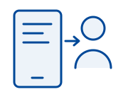

友人から、家族との悩みについて相談されました。うまく返事をしたくて、名前や事情が書かれたメッセージを、そのままAIに貼り付けました。AIの返答を参考に、友人へ返信しました。

**ストーリー2：画期的なアイデアを思いつきました**

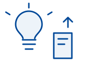

まだ誰にも話していない、新しいサービスのアイデアを思いつきました。AIに詳しい仕組みや事業計画を入力し、一緒に考えながらアプリの試作品を作りました。動くものができたので、共有リンクをSNSに投稿しました。

**ストーリー3：AIでポスターを作って公開しました**

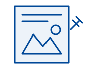

学内イベントのポスターを作ることになりました。好きな作家の作品をAIに読み込ませ、「この雰囲気で作って」と頼みました。気に入った画像ができたので、AIを使ったことは特に説明せず、イベントの公式SNSに掲載しました。

**ストーリー4：AIの案内だけを見て行動しました**

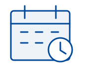

課題の提出期限が分からず、AIアプリに質問しました。日付をはっきり答えてくれたので、その案内を信じて提出の予定を立てました。大学の公式サイトや授業のお知らせなど、元の情報は確認していません。

> **この使い方には、どんな懸念点がある？ 誰が、どんなことで困りそう？**

最初の授業で出た「情報の正しさ」「個人情報」「AIへの依存」などの不安も思い出してみましょう。対策や正解まで決める必要はありません。「何を知らないと判断できないか」も書いて構いません。

次の作業用まとめを見ながら、個人で考えます。

#### 課題：ストーリーの考察をSlackに投稿する（7分）

**4つの場面から1つ選び、「誰が、どんなことで困りそうか」を考えましょう。**

- 1：友人の相談 — 名前や事情のあるメッセージを、そのままAIに入力して返信に使う。
- 2：未公開のアイデア — 詳しい事業計画をAIに入力して試作品を作り、共有リンクをSNSに公開する。
- 3：ポスター — 好きな作家の作品をAIに読み込ませて画像を作り、AI利用を説明せず公式SNSに掲載する。
- 4：提出期限 — AIの回答を信じて予定を立て、大学の公式情報は確認しない。

**進め方：** 選ぶ1分 → 個人で考えてSlackに投稿4分 → 数名が全体に発表2分。

```text
選んだ場面（1〜4）：
誰が、何で困りそう？：
```

**提出先：授業のSlack。上の2項目だけを短く書いて投稿します。** 対策や正解まで決めなくて構いません。

#### 後半への予告：自分のアプリでは？

ここでは問いの紹介だけです。自分のアプリについての考察は、後半の8で行います。この自分のアプリについての問いは、今は回答や提出は不要です。上のストーリーの考察はSlackに投稿します。

> **前回作ったチャットアプリを、大学や企業で他の人に使ってもらうとしたら、どんな懸念点がある？**

「自分のアプリではどうだろう？」と頭に置きながら、規約と仕組みを見ていきましょう。

[サンプル回答：4つのストーリー](sample_answers.md#2-前回の振り返り)

<!-- chapter: 2 -->

> 今日の道順：導入・前回の振り返り → **AI Studioの利用条件（いまここ）** → AIとアプリの仕組み → 世界・企業・仕事とAI → 事例から倫理と責任を考える → 自分のアプリの考察・発表・振り返り → 宿題：利用規約を10文で

### 3. AI Studioの規約を予想して読む（27分）

#### 課題：予想をSlackに投稿する（4分）

「はい／いいえ／条件による／分からない」で回答しましょう。

1. 入力した文章やファイル、AIの回答は、Googleのサービス改善に使われる？
2. Googleの担当者が、入力や回答を読むことはある？
3. 課金設定のない場合と、課金設定のある場合で、情報の扱いは同じ？
4. 作ったコードや回答を他の人に使ってもらい、問題が起きたら、Googleがすべて責任を持つ？

次の型をコピーし、各行に答えを書いて授業のSlackへ投稿します。

```text
① 改善への利用：
② 人が読む：
③ 課金なし・ありで同じ：
④ Googleがすべて責任を持つ：
```

#### 課題：規約を調べ、Slackに投稿する（15分）

[Gemini API追加利用規約](https://ai.google.dev/gemini-api/terms)を開き、次の項目から気になるものを1つ選んで、個人で調べます。

| 選択肢 | 探す項目 | 確かめること |
| --- | --- | --- |
| A | Unpaid Services / How Google Uses Your Data | 改善への利用、人による確認、送ってはいけない情報 |
| B | Paid Services / How Google Uses Your Data | 無償サービスとの違い、保存やログの扱い |
| C | Use of Generated Content | 生成物の扱い、利用・共有する人の責任 |
| D | Age Requirements / Use Restrictions | 利用者・用途の条件、アプリを提供する際の条件 |

AIに翻訳や要約を手伝わせてもよいですが、根拠にした原文の見出しと記述も確認してください。**選んだA〜Dを添え、次の項目を短くまとめて授業のSlackへ投稿します。**

```text
予想との違い：
確認した見出し・記述：
適用される条件：
自分の使い方への影響：
```

#### 共有して判断を見直す（8分）

近くの人と調べた内容を共有し、講師の補足を聞いて、最初の予想を見直します。

**予想の答え（スライド12〜13、2026年10月6日確認）**

1. **条件による。** 無償サービスでは入力・回答を改善等に使います。有償扱いでは改善に使いません。
2. **読むことがある。** 無償サービスでは人による確認があり得ます。有償扱いでも安全対策等のログは残り得るため、「人が絶対に読まない」とは断定しません。
3. **いいえ。** 無償・有償扱いで、情報の扱いが変わります。
4. **いいえ。** 生成内容を利用・共有する人にも責任があります。

根拠：[Gemini API追加利用規約](https://ai.google.dev/gemini-api/terms)の「How Google Uses Your Data」「Use of Generated Content」。

> 未公開作品、友人の相談、クライアントの資料。そのまま入力してよい？
> 「無料で使える画面」なら、必ず同じデータ利用条件？

**確認のポイント（2026年10月6日確認、規約の発効日：2026年3月23日）**

- 無償サービスの入力・出力は改善等に使われ、人による確認もあり得ます。機密・個人情報を送らないよう記載されています。
- 有償扱いでは改善に使わないとされていますが、安全対策等のログまで一切残らないという意味ではありません。
- 今回は学校のアカウントではAI Studioを利用できないため、個人アカウントの課金設定の有無を比較します。AI Studioは、利用アカウントが有効なCloud Billingに紐づくプロジェクトにアクセスできる場合、またはWorkspaceの企業アカウントの場合、有償扱いになります。Gemini APIは、実際にアクセスするプロジェクトの課金設定で扱いが決まります。
- **利用は18歳以上**です。また、18歳未満を対象とする、または18歳未満がアクセスする可能性が高いWebサイト・アプリ等での利用も認められていません。
- 生成内容の利用・共有には利用者の責任があります。年齢だけでなく、用途の条件も確認します。

出典：[Googleの公式規約](https://ai.google.dev/gemini-api/terms)。個別アカウントの適用条件は授業時に確認します。

[サンプル回答：規約の予想・調査](sample_answers.md#3-ai-studioの規約)

<!-- chapter: 3 -->

> 今日の道順：導入・前回の振り返り → AI Studioの利用条件 → **AIとアプリの仕組み（いまここ）** → 世界・企業・仕事とAI → 事例から倫理と責任を考える → 自分のアプリの考察・発表・振り返り → 宿題：利用規約を10文で

### 4. AIの学習・回答生成とアプリの仕組み（50分）

まずLLMそのものを知り、次にLLMに渡す情報、Webアプリ全体、ツールを使うエージェントへと、図を広げていきます。途中で、気になる用語を一つ選び、自分で説明できるまで理解する時間を取ります。

#### 仕組みへの問いかけ（2分）

> AIは、どこかにある答えを探して、そのまま返している？
> チャットで教えたことは、その場でAI全体の知識になる？
> 同じ質問でも回答が変わるのはなぜ？

講師が問いかけ、数名の考えを聞きます。予想を書いて提出する必要はありません。

#### 学習と回答生成を分けて考える（6分）

講師はホワイトボードに2つの流れを描きます。

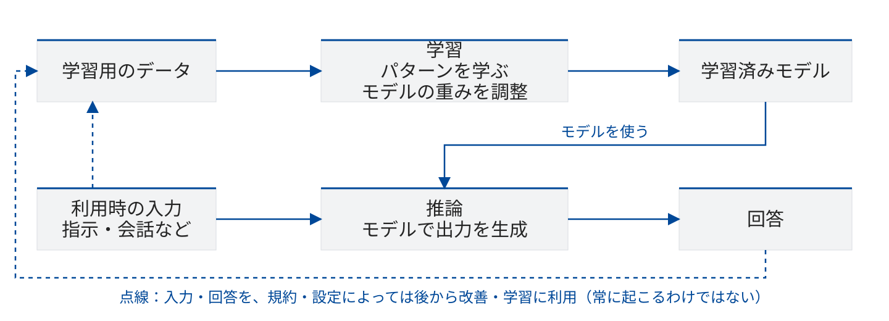

- **LLM（大規模言語モデル）**は、多くのデータから言葉のパターンや関係を学んだモデルです。
- **学習**では、データを使ってモデルの重みを調整します。
- **推論**では、指示や会話を入力し、学習済みモデルを使って出力を生成します。会話を送るたびに、その場でモデルの重みが更新されるとは限りません。

実線は学習と利用の基本の流れ、点線は利用時の入力・出力が後から改善・学習に使われる場合の流れです。点線は常に起こるものではなく、規約・設定によります。会話を送るたび、その場でモデルが学習し直すという意味でもありません。

#### 用語を一つ選び、分かるまでAIに聞く（10分）

ここまでに出てきた「学習」「モデル」「推論」の言葉を、もう少し確かめましょう。次の用語から気になるものを一つ選びます。下の説明は、質問の入口として使ってください。

| 用語 | 質問の入口となる説明 |
| --- | --- |
| 学習・推論 | 学習はモデルの重みを調整すること。推論は学習済みモデルで出力を作ること。 |
| トークン | 文章を処理する単位。前回のTokenizerの体験を思い出しましょう。 |
| ニューラルネットワーク | 計算のつながりで、データからパターンを学ぶモデル。 |
| ディープラーニング | 多層のニューラルネットワークでパターンを学ぶ方法。 |
| トランスフォーマー・Attention | 文脈の中の情報の関係を扱う構造と仕組み。 |

##### 個人作業：用語を理解して、自分の言葉で説明する

1. AIに質問し、分からない部分を繰り返し聞く（6分）。「もっと身近な例で」「その言葉自体が分からない」「たとえと実際の違いは？」など、自分が理解できるところまで説明を具体的にしてもらう。
2. 説明の要点を公式資料や補足資料と照らし合わせ、自分の言葉で約100文字にまとめる（3分）。
3. 課題として用語名・自分の説明だけをSlackに投稿し、他の人の説明を読む（1分）。

```text
用語：
自分の言葉での説明（約100文字）：
```

AIに100文字の答えを作らせて終わらず、自分で説明できるか確かめましょう。AIが示したリンクは、実際に開いて内容を確認しましょう。投稿にURLを書く必要はありません。

参考：[Google：ニューラルネットワーク](https://developers.google.com/machine-learning/crash-course/neural-networks)、[Google：LLMとトランスフォーマー](https://developers.google.com/machine-learning/crash-course/llm/transformers)、[補足資料（2025年度）](../../2025/2_ai_ethics/readme.md)。

[サンプル回答：用語の説明](sample_answers.md#4-用語を理解して共有する)

#### 次のトークンを予測して、文章をつなぐ（4分）

> 「今日は」の続きには、どんな言葉が入りそう？ 前に「天気について答えて」と指示があったら？

文章を順に生成する多くのLLMでは、指示や会話、そこまでに生成した文章をもとに、**次に続くトークンの確率を予測し、その中から選んで出力する**ことを繰り返します。

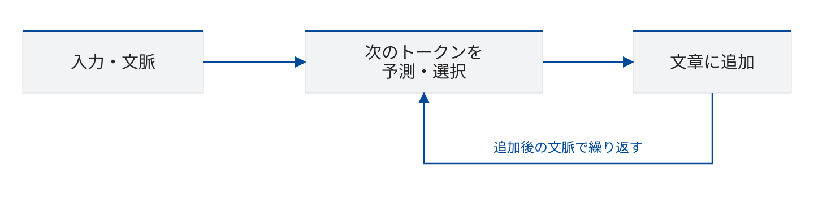

説明用に大きなまとまりで示すと、「今日は」→「今日は晴れ」→「今日は晴れです」のように文章が伸びていくイメージです。実際のトークンは単語と一致するとは限らず、この例は実際の分割結果ではありません。

候補の選び方によって、同じ入力でも回答が変わることがあります。文章として自然につながることと、書かれた内容が事実として正しいことは別です。

参考：[Google：LLMの仕組み](https://developers.google.com/machine-learning/crash-course/llm/transformers)。

#### チャットでは、何をLLMに渡している？（4分）

前回、システムプロンプトを変えると、同じ質問でも語り口や回答の形が変わりました。LLMへ渡すのは、今入力した一文だけではありません。

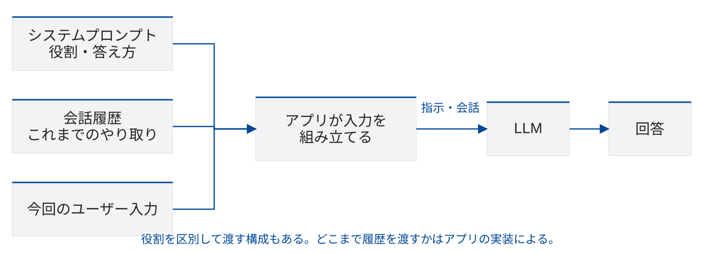

アプリがシステムプロンプト・必要な履歴・今回の入力を組み合わせ、LLMに渡します。単に一つの文章に貼り付けるとは限らず、APIでは役割やメッセージを分けて渡す構成もあります。履歴をどこまで渡すかはアプリの実装次第です。

> 「さっきの案を短くして」が通じるのは、どんな情報を渡しているから？

参考：[Google：テキスト生成と会話](https://ai.google.dev/gemini-api/docs/text-generation)。

#### 間違いを減らすため、検索や資料と組み合わせる（5分）

LLMは、もっともらしいが誤った内容を生成することがあります。これを**ハルシネーション**と呼びます。完全に避けるのは難しいため、検索や手元の資料を組み合わせ、得られた情報をもとに回答する仕組みが使われています。

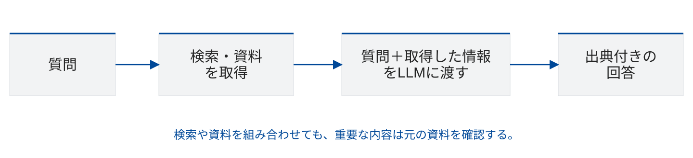

検索と組み合わせても間違いがなくなるわけではありません。重要な内容は、元の資料も確認します。

参考：[Google：検索と組み合わせた回答（Grounding）](https://ai.google.dev/gemini-api/docs/google-search)。

**身近な事例：AIに「食べられる」と言われたら？**

日経の[毒キノコの誤食とAI判定を扱った記事](https://www.nikkei.com/article/DGXZQOUD144QC0U6A910C2000000/)を入口に、誤った回答を信じて行動する危険を考えます。農林水産省は、食用と確実に判断できないキノコを採ったり食べたりしないよう呼びかけています。[農林水産省の注意喚起](https://www.maff.go.jp/j/syouan/seisaku/foodpoisoning/mushroom.html)

> AIが自信を持って答えたら、食べてよい？ 「検索もした」と言われたら？
> 間違えると身体に被害が出る用途に、アプリを使ってもらってよい？

画像の誤識別と、生成された説明のハルシネーションは区別します。この記事の見出しだけから、個別事故の技術的原因は断定できません。どちらも、AIの回答を食用の安全保証として使う根拠にはできません。

ここまでが、回答を作るLLMと、その入力の話です。次は、それを動かすアプリ全体へ視点を広げます。

#### Webアプリ全体の中に、LLMを置いてみる（11分）

**AIサービスのすべてがAIでできているわけではありません。** 画面の表示、ログイン、会話の保存、通信などは、Webアプリの仕組みで支えています。まず、AIを使わない授業スライドから図を描き、チャットアプリへ広げます。

講師は「ブラウザがページのファイルを受け取る → 画面を表示する → 入力を送る → サーバーがLLMに依頼する → 結果を画面に戻す」の順に、ホワイトボードへ箱と矢印を足します。

| 構成 | ざっくりした仕組み | 例 |
| --- | --- | --- |
| 静的サイト | 用意済みのファイルをブラウザが受け取り、表示・実行する。 | 授業スライド、ブラウザ内の計算ツール |
| 動的サイト・アプリ | 入力に応じ、サーバーがデータを取得・処理して結果を返す。 | 履歴を表示するアプリ、AIチャット |

HTMLは内容・構造、CSSは見た目、JavaScriptはブラウザ内の処理や操作を担当します。「ダウンロード」は、ページを開くときにブラウザがファイルを受け取ることです。手動で保存する必要はありません。

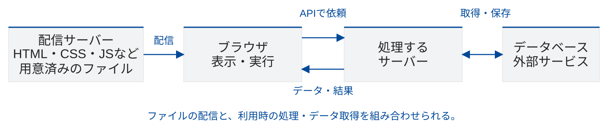

静的サイトでも、JavaScriptで画面を動かしたり、外部APIを呼んだりできます。動的なサイトでもHTML・CSS・JavaScriptは使います。**ファイルを配る部分と、利用時にデータや処理を返す部分を組み合わせられる**と捉えましょう。サーバーがページ自体を生成して返す構成もあります。

> スライドのページを切り替えるときと、AIに新しい質問を送るとき。ブラウザの中だけでできるのはどちら？

参考：[MDN：サーバー側の処理と静的・動的サイト](https://developer.mozilla.org/en-US/docs/Learn_web_development/Extensions/Server-side/First_steps/Introduction)。

次に、AIアプリの例を描きます。「送信を押したら？」と聞き、学生の予想を受けて、箱と矢印を足していきます。

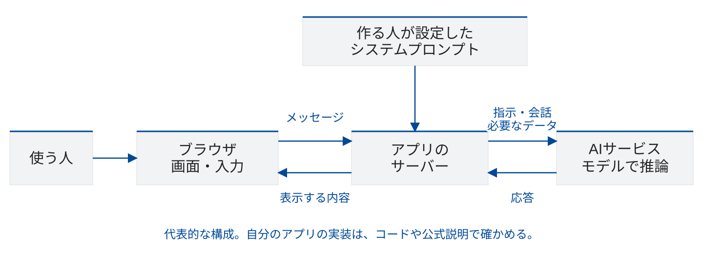

- 自分の文章は、どの会社のどの場所まで届く？
- システムプロンプトは、誰が決める？誰に送られる？
- 会話を保存する機能を付けるなら、どこに置く？
- 入力に友人の情報が含まれていたら、その友人は情報の送信を知っている？

これは代表的な構成です。自分のアプリの実装が同じとは限らないので、コードや公式説明も確かめます。

##### 図で使った言葉を整理する

| 用語 | アプリの中での役割 |
| --- | --- |
| AIモデル | 入力に応じて出力を生成する部分。 |
| AIサービス・アプリ | モデルに加え、画面、履歴、検索などを組み合わせて提供するもの。 |
| API | アプリから別のサービスへ処理を依頼するための窓口。 |
| APIキー | APIの利用を識別・認証するために使う情報。利用枠や料金にも関係する。 |

現行のAI Studio Buildは、Gemini APIキーをサーバー側の秘密情報として設定する構成が公式に説明されています。図のどこに保管する情報なのかを確認します。

参考：[AI Studio Build](https://ai.google.dev/gemini-api/docs/aistudio-build-mode)、[Gemini APIキーの保護](https://ai.google.dev/gemini-api/docs/api-key#security_and_secret_management)。

#### AIエージェント：ツールを使い、結果を見て次の行動を決める（8分）

> 「京都観光のプランを考えて」と「営業時間を調べて、予約までして」では、何が増える？

AIエージェントは、目標に向けて、AIモデルによる判断とツールの実行を組み合わせる構成です。回答の文章を作ることに加え、検索や予約などのツールを選び、その結果を次の判断に使います。すべてのチャットアプリに、この機能が付いているわけではありません。

まず、構成する部品をシンプルに示します。「LLMに渡す情報をまとめるアプリ」に、ツールを実行する機能を加えたイメージです。

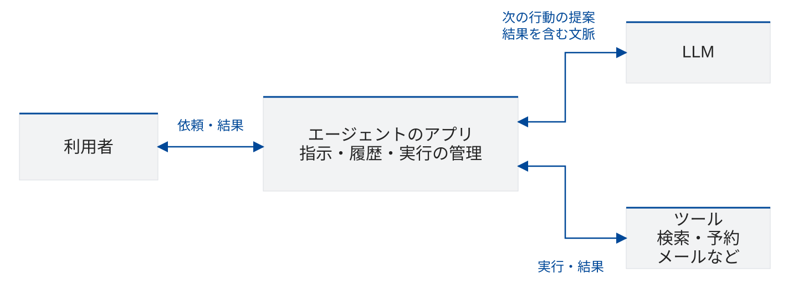

LLMは次の行動を提案し、アプリが権限を確認してツールを実行します。その結果をLLMへ戻すことで、次の判断につながります。

講師は先ほどのアプリの図に「ツール」と「結果を戻す矢印」を加えます。次の図は、アプリ側でツールを実行する代表的な構成です。

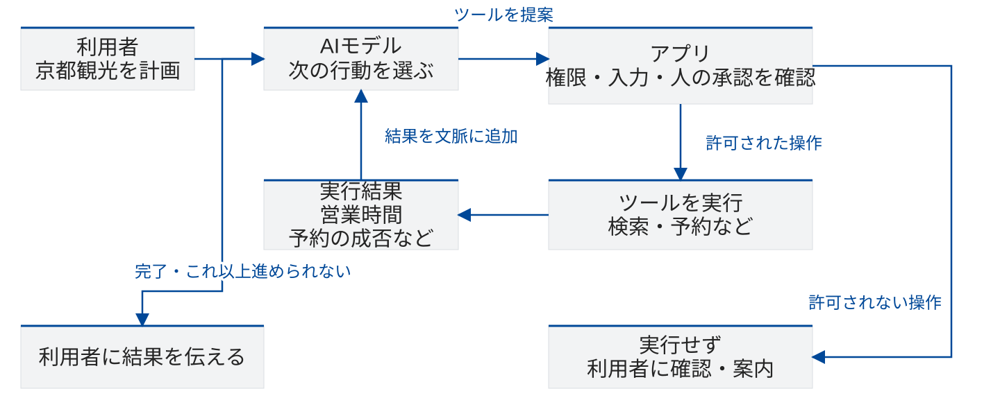

- **AIモデル**は、使うツールと入力を提案します。独自の関数を呼ぶ構成では、実際に実行するのはアプリ側です。
- **作る・提供する側**は、使えるツール、アクセスできる情報、承認が必要な操作、繰り返しの上限などを設定します。
- **ツールの結果**を受けて、モデルは追加の検索や回答などを選びます。失敗する場合もあり、成功したかの確認が必要です。

モデルがツール名や入力を出力するときも、文脈に応じた生成を使います。検索や予約の実行は、その出力を受け取ったアプリやサービスが担います。組み込みツールをAIサービス側で実行する構成もあります。

例：「営業時間を検索する → 結果から候補を選ぶ → 予約内容を利用者に確認する → 承認後に予約する → 成否を伝える」。検索して答えるだけなら、予約の権限は必要ありません。

> 予約やメール送信の前に人の確認を入れるなら、図のどこ？
> AIに「予約しました」と言われたら、何を見て本当に完了したと確かめる？
> 読むだけの権限と、送信・購入する権限は、同じでよい？

学生の答えを受けて、ホワイトボードの「確認」の箱に、必要な承認や制限を書き足します。今日は仕組みと権限を図で考え、実際の予約や外部サービスへの接続は行いません。

参考：[Google：Function calling](https://ai.google.dev/gemini-api/docs/function-calling)、[Google：ツールの利用](https://ai.google.dev/gemini-api/docs/tools)。

### 5. 質問・予備時間（8分）

規約や仕組みについて、まだ分からない点を質問します。図を描く時間や説明が延びた場合も、この時間で調整します。

## 後半：AI倫理と社会的責任を考える（100分）

<!-- chapter: 4 -->

> 今日の道順：導入・前回の振り返り → AI Studioの利用条件 → AIとアプリの仕組み → **世界・企業・仕事とAI（いまここ）** → 事例から倫理と責任を考える → 自分のアプリの考察・発表・振り返り → 宿題：利用規約を10文で

### 6. 世界・企業とAI（15分）

短い説明と問いを交互に扱います。すべてのニュースを覚える必要はありません。

#### 世界：AIは何に支えられている？（3分）

Stanfordの2026年版AI Indexは、米中のモデル開発競争、先端AIチップを支える台湾の製造企業、各国が自国のAI基盤を持とうとする動きを取り上げています。

> 普段使うAIが、海外の企業や限られた半導体供給に依存していたら？
> 無料で使えるサービスが、値上げ・停止したら何を変える？

また、IEAの2025年報告は、2030年のデータセンター電力消費が約945TWhへ増えるという見通しを示しています。これは**全データセンターの将来推計**で、AIだけの実測値ではありません。

> 制作を速くする便利さと、電力・資源の負担をどう考える？

出典：[AI Index 2026](https://hai.stanford.edu/ai-index/2026-ai-index-report)、[IEA：Energy and AI（2025年4月10日公開）](https://www.iea.org/reports/energy-and-ai/executive-summary)。

#### 企業：作れることと、導入できること（2分）

01では、DeNAでのプロトタイプ活用と、みずほの現場社員によるアプリ制作を紹介しました。みずほの取り組みは2026年3月に実施され、4月22日に記事が公開されています。

> 現場で作れた試作品を、そのまま全社員やお客さんに使ってもらえる？
> 「動く」以外に、誰が何を確認する？

出典：[みずほ：DXカフェ BUILD](https://www.mizuho-fg.co.jp/dx/articles/dxcafebuild-2603/index.html)。国内の導入状況を調べる際は、[IPA：DX動向2026](https://www.ipa.go.jp/digital/chousa/dx-trend/dx-trend-2026.html)も参照します。導入率と成果、調査対象・時期を分けて読みましょう。

#### 仕事：補完する？ 置き換える？（10分）

AIが人の仕事を助ける「労働補完」と、人に代わって工程を担う「労働置換」を、仕事の工程ごとに考えます。ポスター制作など、身近な仕事を1つ選びましょう。

| 工程の例 | 分担の予想 | その理由 |
| --- | --- | --- |
| 依頼の意図を聞く | | |
| アイデア・下書きを作る | | |
| 正確さ・権利・品質を確認する | | |
| 公開を決め、相手に説明する | | |

個人で、各工程を「AIに任せる」「人と組み合わせる」「人が担う」に分け、理由を記入します（5分）。近くの人と分類の違いを共有し（3分）、**課題として「仕事名／工程1つと分担・理由／今後確かめたい点／予想の日付」を短くまとめ、Slackに投稿します（2分）。**

> 制作時間が半分になったら、料金、学び方、求められる力はどう変わる？

**これは今の自分の予想です。半年後や1年後に読み返し、実際に任せられた工程、難しかった工程と答え合わせしてみましょう。** 技術の進歩だけでなく、品質・責任・相手との関係によって分担が変わるかもしれません。

[サンプル回答：仕事の分担と将来の答え合わせ](sample_answers.md#6-仕事の分担を予想する)

<!-- chapter: 5 -->

> 今日の道順：導入・前回の振り返り → AI Studioの利用条件 → AIとアプリの仕組み → 世界・企業・仕事とAI → **事例から倫理と責任を考える（いまここ）** → 自分のアプリの考察・発表・振り返り → 宿題：利用規約を10文で

### 7. 実際の出来事から倫理を考える（20分）

事例ごとに、状況を読む → 個人で判断 → 近くの人と相談 → 調査結果を知って再考、の順で進めます。「条件付きで使う」「追加で調べる」も選べます。

#### 事例A：相談に応じるAIは、何を大切にする？（5分）

**まず考える：** 誰にも話しにくい悩みを、チャットAIには話せる人がいます。

- AIにだけ相談すると、何が心配？

**意見を出してから記事を紹介：** 日経は[ChatGPTで自殺に言及する利用者と安全対策を扱った記事](https://www.nikkei.com/article/DGXZQOUF010CU0R01C25A1000000/)を報じています。見出しの「120万人」は自殺者数ではありません。

OpenAIの2025年10月27日の公表では、ある週の利用者の約0.15%に、潜在的な自殺の計画・意図を示す会話が含まれると**同社が推計**しています。利用者の相談内容の分析であり、この数値だけでAIが原因と判断することはできません。同社は、危機的な状況への応答やAIへの過度な依存への対策を説明しています。[OpenAIの公表資料](https://openai.com/index/strengthening-chatgpt-responses-in-sensitive-conversations/)

> 「利用者が望む返事」をすることと、「利用者を大切にする」ことは、いつも同じ？

個人の体験を話す必要はありません。サービスの設計・責任の観点で考えます。

**課題：相談と実例の確認後、上の問いについて、「事例A：自分の考え＋理由」を1〜2文でSlackに投稿します。**

#### 事例B：AI検索が記事を使うと、誰に影響する？（5分）

**まず考える：** AI検索が新聞記事をもとに答え、利用者は元記事を読まずに済みました。

- 取材・執筆した人や出版社への影響は？

**意見を出してから記事を紹介：** 日経の[日経・朝日とAI検索企業の著作権をめぐる初弁論の記事](https://www.nikkei.com/article/DGXZQOUD0715F0X00C26A5000000/)は、新聞社側が侵害を主張し、相手側が争う姿勢を示す訴訟の報道です。**提訴や初弁論は、侵害が確定したという意味ではありません。** 記事で紹介される主張と、裁判で認定された事実を分けて読みます。

文化庁は、**開発・学習の段階と、生成・利用の段階を分けて**考えています。著作権法30条の4は、作品の表現を楽しむことを目的としない利用についての規定で、AIなら無条件で何でも使えるという意味ではありません。生成物を公開する際は、既存作品との表現の類似や、その作品をもとに作ったかなどが問題になります。[文化庁：AIと著作権に関する考え方](https://www.bunka.go.jp/seisaku/bunkashingikai/chosakuken/pdf/94037901_01.pdf)

> 法律上の判断とは別に、作者への説明や、創作を続けられる仕組みをどう考える？

**課題：相談と実例の確認後、上の問いについて、「事例B：自分の考え＋理由」を1〜2文でSlackに投稿します。**

#### 短い補足：作ったアプリを公開する責任（2分）

METRの[2026年8月31日の当事者報告](https://metr.org/blog/2026-08-31-security-update/)では、認証の不具合があるアプリを通じてAPIキーを盗まれ、約60万ドル相当の無償の利用枠を不正利用されたと説明しています。実際に60万ドルを請求されたという意味ではありません。

> 動くだけで公開してよい？ 誰がアクセスでき、何を実行できるかは誰が確認する？

#### 知っておきたい法律・ガイドライン（4分）

法律、国の指針、サービスの規約は、性質が異なります。規約に同意しても、法律上の義務や、他の人への配慮がなくなるわけではありません。

| 区分・資料 | 押さえること | 自分のアプリで確認すること |
| --- | --- | --- |
| 法律：AI法 | 2025年9月1日全面施行。AI活用の推進とリスク対応の枠組み。 | 個人情報保護法・著作権法などの確認も必要。 |
| 法律：個人情報保護法 | 入力の利用目的や、サービス側の学習利用を確認。 | 他人の個人データは、利用目的・本人同意・第三者提供の条件を確認。 |
| 法律：著作権法 | 学習と生成・利用を分け、使い方ごとに判断。 | 入力の利用権限、生成物の類似、公開・共有の方法を確認。 |
| 指針：AI事業者ガイドライン第1.2版 | 開発・提供・利用のリスク対応を考える指針。 | 安全・公平・情報の保護・説明と責任を点検。 |
| 規約：AI Studio・Gemini API | サービスを使うために同意する条件。 | 年齢・用途・情報の扱い・生成物の責任を確認。 |

AI事業者ガイドラインは総務省・経済産業省が公表した指針で、法律そのものとは区別します。「AIで作った」「出典を付けた」だけで作品・記事を自由に使えるとは限りません。

原文の短い例：個人情報保護委員会は、個人情報の入力について「必要な範囲内であることを十分に確認すること」と記載しています（注意喚起・（1）①）。便利だから全部送るのではなく、用途に必要な情報かを考えます。[注意喚起の原文](https://www.ppc.go.jp/files/pdf/230602_alert_generative_AI_service.pdf)

出典：[内閣府：AI法](https://www8.cao.go.jp/cstp/ai/ai_act/ai_act.html)、[個人情報保護委員会：生成AI利用の注意喚起（2023年6月2日）](https://www.ppc.go.jp/files/pdf/230602_alert_generative_AI_service.pdf)、[文化庁：AIと著作権](https://www.bunka.go.jp/seisaku/chosakuken/aiandcopyright.html)、[経済産業省：AI事業者ガイドライン第1.2版](https://www.meti.go.jp/shingikai/mono_info_service/ai_shakai_jisso/20260331_report.html)。[Google AI Studio／Gemini APIの規約](https://ai.google.dev/gemini-api/terms)。確認日：2026年10月6日。

[サンプル回答：実際の出来事・ルールとリスク](sample_answers.md#7-事例から考える)

#### 判断するための観点を整理する（4分）

信頼できるAIとはどんなものか、どんなリスクがあるかを、国のガイドラインを手がかりに整理します。

AI事業者ガイドラインで示される「人間中心」「安全性」「公平性」「プライバシー保護」「セキュリティ確保」「透明性」「アカウンタビリティ」などを、授業用の問いに置き換えた表です。以下は原文の逐語引用ではなく、講師による要約です。[ガイドライン本編](https://www.meti.go.jp/shingikai/mono_info_service/ai_shakai_jisso/pdf/20260331_1.pdf)

| 観点 | 自分のアプリへの問い |
| --- | --- |
| 正確さ・安全性 | 誤情報や誤判定が、身体・心・財産への被害につながらない？ |
| セキュリティ | 許可のない人のアクセスや操作、情報流出を防げる？ |
| 公平性 | 特定の人が不利になる扱いをしていない？ |
| 透明性・説明可能性 | AIを使うこと、限界、判断の根拠をどう伝える？ |
| プライバシー・権利 | 誰の情報・作品を、どこまで使ってよい？ |
| 人間中心・自律性 | 過度な依存や、本人の判断を妨げる設計になっていない？ |
| 説明・責任 | 問題が起きたら誰に連絡し、どう修正・救済できる？ |

技術的な対策と、使い方・運用のルールを両方考えます。

> 「規約に同意した」「AIがそう言った」「人が確認した」。それだけで十分？

<!-- chapter: 6 -->

> 今日の道順：導入・前回の振り返り → AI Studioの利用条件 → AIとアプリの仕組み → 世界・企業・仕事とAI → 事例から倫理と責任を考える → **自分のアプリの考察・発表・振り返り（いまここ）** → 宿題：利用規約を10文で

### 8. 自分のアプリのリスクを考え、スライド1枚にまとめる（30分）

#### 課題：自分のアプリの考察をSlackに投稿する（15分）

前回作ったチャットアプリを題材に、**AI倫理と社会的責任の観点から、誰にどんなリスクがあるか**を個人で考えます。アプリの修正・実装は求めません。

1. どんなアプリかを書く（3分）。
2. 誰が、何で困りそうかを1つ考え、理由も書く（7分）。
3. 使う人・作る人が気をつけることと、まだ分からないことを書く（5分）。

下の型をコピーし、それぞれ短い文章で書きましょう。

```text
どんなアプリ？：
誰が、何で困りそう？：
そう考えた理由：
使う人・作る人が気をつけること：
まだ分からないこと：
```

**提出先：授業のSlack。上の各項目を短く書き、考察を1投稿にまとめます。個人情報や具体的な相談は書かず、一般化します。**

[サンプル回答：個人レポートとスライド](sample_answers.md#8-個人レポートとスライド)

正確さ、公平性、プライバシー、作品の権利、依存、説明や責任などから考えます。リスクが起こる条件や、立場による意見の違いも書いてみましょう。

> 自分には便利でも、他の人には不利益がない？
> 誰の意見を聞かなければ、判断できない？

#### Google AI Studioで発表スライド1枚を作る（15分）

個人の考察を短いレポートにまとめ、AI StudioのBuildで**発表用の1枚のWeb画面**にします。学生の写真や個別の相談内容は入力せず、一般化した内容でまとめます。

##### 指示例

```text
次の内容を、発表用のスライド1枚のWebページにしてください。
16:9、白い背景、大きい文字で、1画面に収めてください。
項目：どんなアプリ／誰が困りそうか／理由／気をつけること／分からないこと。
書いていないことは足さないでください。
【自分の考え】ここに貼り付ける。
```

- レポート整理・生成（7分）。
- 表示と内容を確認し、修正（5分）。
- 自分の言葉で説明する練習（3分）。

> 自分で説明できる？ AIが示したリンクは、開いて内容を確認しよう。

**課題：発表画面のスクリーンショットを授業のSlackに投稿します。** 生成に時間がかかる場合は、先ほど投稿した考察をそのまま発表に使って構いません。

### 9〜11. 共有・発表・個人の振り返り（30分）

共有・発表・振り返りは、同じスライドを見ながら順に進めます。

#### 近くの人と共有する（10分）

互いのスライドを見せながら、考えたリスクを説明します（1人3分ずつ、計6分）。相手の話から、自分にはなかった視点や質問を1つ伝えましょう。残り4分で、自分の考察を追記・修正します。

> 自分には便利でも、別の人には不利益がない？
> リスクが起きる条件や、責任を担う人は明確になっている？

[共有コメントの例](sample_answers.md#9-共有するときのコメント)

#### 個人発表（15分）

3名 × 3分で9分、質問・コメントに6分を使います。発表者は希望者を募り、異なる用途や観点が聞けるよう講師が調整します。

発表では、用途、影響を受ける人（相談内容をAIに入力された友人、作品をAIに読み込まれた作者など）、重要なリスク、責任、まだ判断できない点を説明します。聞く側は、自分の考察にも関係する視点を1つ記録しましょう。

> どんな条件で、その問題が起こる？ 別の立場から見るとどう感じる？

#### 個人の振り返り（5分）

**課題：** 下の型をコピーし、各項目を短く書いて授業のSlackへ投稿しましょう。

```text
気づいたこと：
自分のアプリで気をつけたいこと：
```

[サンプル回答：振り返り](sample_answers.md#11-振り返り)

### 12. 質問・予備時間（5分）

発表や生成が延びた場合の調整、残った質問に使います。時間が余れば、振り返りで挙げた疑問を共有しましょう。

<!-- chapter: 7 -->

> 今日の道順：導入・前回の振り返り → AI Studioの利用条件 → AIとアプリの仕組み → 世界・企業・仕事とAI → 事例から倫理と責任を考える → 自分のアプリの考察・発表・振り返り → **宿題：利用規約を10文で（いまここ）**

## 宿題：自分のアプリの利用規約を10文で書く

自分のチャットアプリを使う人に向けて、**日本語で10文の「利用上のお断り・お願い」**を書きましょう。法律のような硬い文章ではなく、自分でも意味を理解でき、利用者にも説明できる文章にします。1行に1文、1〜10の番号を付けてください。

### 利用者に伝える内容を考える

用途と利用者、AIを使っていること、回答の限界、入力してほしくない情報、入力や会話の扱い、他人の情報・作品への配慮、重要な判断の確認方法、使ってほしくない用途、問題が起きたときの連絡や対応などから、自分のアプリに必要な内容を選びます。

保存や学習利用など、実装やサービスの規約で確かめていないことは、約束として書かず、確認が必要な点として示してください。利用者にすべての責任を押し付ける文章ではなく、作る側が伝えること・対応することも考えましょう。

### 書き方と提出するもの

- アプリ名・用途と、番号を付けた10文を提出します。
- 1文に一つのことを書き、自分のアプリで考えたリスクを反映します。
- AIに相談しても構いません。分からない言葉は使わず、最後は10文すべてを自分の言葉で説明できるようにします。

例：「このアプリの答えには、間違いが含まれることがあります。」
例：「友人の名前や、本人が公開していない相談内容は入力しないでください。」

**提出先：授業のSlack。アプリ名・用途と、番号を付けた10文を1投稿にまとめます。** 期限は講師の案内を確認してください。

## 補足：仕組みをもう少し知りたい人へ

授業では必要な範囲を説明し、詳細は以下を参照します。

- [架空の判例・引用が裁判資料に使われた事例（英国高等法院、2025年6月6日）](https://www.judiciary.uk/wp-content/uploads/2025/06/Ayinde-v-London-Borough-of-Haringey-and-Al-Haroun-v-Qatar-National-Bank.pdf)：元の出典を確認する責任を考える補足事例。
- [補足資料（2025年度）](../../2025/2_ai_ethics/readme.md)：用語、労働補完・置換、サービスの構造、関係者とリスクの整理。
- [Attention Is All You Need（2017年）](https://arxiv.org/abs/1706.03762)：トランスフォーマーの原論文。
- [Scaling Laws for Neural Language Models（2020年）](https://arxiv.org/abs/2001.08361)：モデル規模・データ・計算量と性能の関係。規模だけで安全性が保証されるわけではありません。
- [トランスフォーマーの参考図](images/transformer.png)、[AIサービスの構造図](images/ai_component.png)、[AIリスクの概念図](images/ai_risk_two.png)。現行サービスの実装そのものを表す図ではありません。

[サンプル回答一覧（演習・発表・振り返り）](sample_answers.md)

## 講師向け：授業前の準備と進行

- 内容・出典の確認日：**2026年10月6日**（規約も同日に確認）。規約・サービスの機能は当日までに再確認する。
- 01の意見はテーマに抽象化する。元写真、筆跡、個別の発言、個人名はこの公開リポジトリに保存しない。
- アイスブレイクと前回のアプリ紹介は同じスライドにまとめ、観光地の投稿3分、アプリ紹介3分の順に進める。
- 共有・個人発表・個人の振り返りも同じスライドにまとめ、10分・15分・5分の順に進める。
- 導入は4つの架空のストーリーから1つ選んで考えてもらう。懸念点を先に説明せず、どんな場面で誰が困るかを個人で考えてもらう。作業中は4つの場面・問い・記入項目をまとめたページを投影する。自分のアプリの問いは頭出しにとどめ、考察は後半に行う。
- ホワイトボードでは「学習と推論」を描いた後、その推論が「アプリの情報の通り道」のどこに入るかを示す。さらにエージェントのツール実行・結果の戻り・権限や人の承認を足す。学生の予想を聞きながら、箱と矢印を足す。
- 前半は規約と仕組み、後半は社会・事例と責任の考察を中心にする。同じ懸念点を毎回書き直させず、最後の個人作業でまとめる。
- 質問・予備時間は前半8分、後半5分。説明や生成の遅れに使い、追加の講義で埋めない。
- 天気アプリのAPIキー発見と、システムプロンプトの取り出し実験は、今後の授業の候補とする。今回の時間配分には含めない。
- 規約調査のために学生へ課金設定を求めない。
- 追加した日経3記事は本文を取得できていない。見出しを入口に、一次資料で確認できた範囲を補足する。事故の技術的原因、相談とAIの因果関係、訴訟の結論を断定しない。記事本文・公開日・裁判の進展は授業前に確認する。
- 心理的安全の事例で個人の悩みや経験を尋ねない。相談を再現する実験も行わず、設計や責任を話す。
- 実例の結果は、先に予想・相談してから読む。必要なら「実例を確認」の部分を投影せずに進める。
- 個人作業と近くの人との共有を基本とする。全体発表は3名を想定し、発表しない学生も自分の考察を作成する。
- AI Studioの利用制限・生成失敗時はテキストのレポートで発表する。
- 過年度の資料は補足として参照する。今年の学生が学習済みという前提で説明しない。用語の入口となる説明は、分かるまでAIに聞く演習とセットで示す。スライドは1枚1メッセージとし、詳しい説明はREADMEに置く。関連する図・問い・作業の指示を同じページにまとめる。
- 章の切り替わりでは目次と現在地を投影する。道順は左列を上から下へ進む前半、右列を上から下へ進む後半に分ける。各表は分割せず、1ページに収める。
- 作業ページのヘッダーには、アイコン・作業の種類・時間を表示する。フッターの進行メモは省く。場面のイラストと図はSVGを共通参照する。
- 宿題は、日本語の10文で自分のアプリの利用上のお断り・お願いを書く。自分で理解・説明できる文章を求め、未確認の機能は約束させない。提出先は授業のSlackとし、期限は別途案内する。

<!-- 学生向け本文はindex.htmlと対応。章の目次・作業用まとめ・表1ページ・SVG図を反映。 -->
