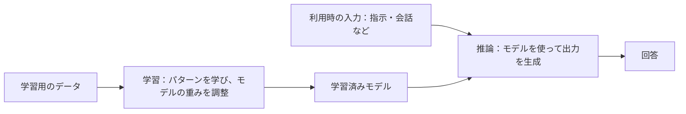
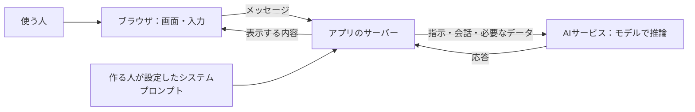

# AI の活用と倫理

| 回数     | 1<br />(9/25) |  2<br />(10/2)  |       3<br />(10/9)        |      4<br />(10/16)       |      5<br />(10/23)       | 6<br />(11/6) | 7<br />(11/13) |
| -------- | :-----------: | :-------------: | :------------------------: | :-----------------------: | :-----------------------: | :-----------: | :------------: |
| テーマ   |    AI 基礎    | プロンプトエンジニアリング | AI の活用と倫理 | AI を活用したアプリ生成 ① | AI を活用したアプリ生成 ② |   総合演習    |    総合演習    |
| 担当講師 |  伊藤、髙田   |            髙田            |      伊藤       |           伊藤            |           髙田            |  髙田、伊藤   |   伊藤、髙田   |

2026年度・第3回。第1回の「AI基礎」、第2回の「プロンプトエンジニアリング」を踏まえ、作ったAIアプリを人に使ってもらうための条件を考えます。

> **前回作ったチャットアプリを、明日から大学や企業で使ってもらうとしたら、何を確認する？**

今日は、予想する → 仕組みや事例を知る → 自分で考える → 近くの人と共有する、を繰り返します。AIを使う人、作る・提供する人、影響を受ける人（相談内容をAIに入力された友人、作品をAIに読み込まれた作者など）の立場を行き来しながら考えましょう。

[TOC]

## 今日の目標と流れ

- 規約を根拠に、入力してよい情報と利用条件を確かめる。
- AIの学習と回答生成、アプリの中での情報の流れを図で理解する。
- 社会・企業での活用と実際の問題から、AI倫理と社会的責任を考える。
- 自分のアプリのリスクについて考察し、Google AI Studioで発表スライド1枚にまとめる。

| 限 | 内容 | 時間 |
| --- | --- | ---: |
| 1限 | 1. アイスブレイクと振り返り | 15分 |
| | 2. AI Studioの規約を予想して読む | 20分 |
| | 3. AIはどう学び、どう答える？ | 25分 |
| | 4. AIとアプリの仕組みを図で理解する | 25分 |
| | 5. 仕組みから、使う側・作る側の責任を考える | 10分 |
| | 6. 1限の振り返り | 5分 |
| | **1限合計** | **100分** |
| 2限 | 7. 世界・企業とAI | 20分 |
| | 8. 実際の出来事から倫理を考える | 25分 |
| | 9. 自分のアプリのリスクを考える | 20分 |
| | 10. 発表スライド1枚を作る | 15分 |
| | 11. 個人発表・共有 | 15分 |
| | 12. 個人の振り返り | 5分 |
| | **2限合計** | **100分** |

限間の休憩は別枠です。個人で考え、近くの人と共有し、数名が全体に発表します。

## 1限：AIの仕組みと利用条件を知る（100分）

### 1. アイスブレイクと振り返り（15分）

#### アイスブレイク・前回作ったアプリを紹介する（5分）

Slackに、今日の昼ごはんと、前回作ったチャットアプリの紹介を投稿しましょう。アプリは、次の型を使って1文で説明します。

```text
今日の昼ごはん：〇〇
アプリ紹介：私は、【誰】が【何をしたいとき】に、【どんな手助け】をするチャットアプリを作りました。
```

例：「私は、献立に迷う人が冷蔵庫の食材で料理を考えたいときに、メニューの候補を提案するチャットアプリを作りました。」

近くの人の投稿を読み、どんな使い方があるか見てみましょう。

#### 最初の授業では、こんな意見がありました（3分）

個別の発言を引用せず、意見をテーマとしてまとめています。

| テーマ | 期待・不安・疑問の要約 |
| --- | --- |
| 制作・学習への期待 | アイデアを形にしたい。理解や制作を助けてほしい。 |
| 情報への不安 | 正しさや根拠を、どう確かめればよいか。 |
| 自分の力との関係 | 頼りすぎず、自分で考える力や制作する力を保ちたい。 |
| 人との関係 | 相談相手として便利だが、信頼や依存の境界が気になる。 |
| 社会・仕組みへの疑問 | 情報の扱い、仕事への影響、AIの能力や限界を知りたい。 |

前回は、指示を工夫し、チャットアプリを作り、システムプロンプトでAIの役割・出力・語り口を調整しました。今回は、そのアプリを他の人が使う場面を考えます。

#### 今日の問いを考える（7分）

> **アプリを大学や企業で使ってもらうなら、何を確認する？**

1. 個人で確認事項を3つ書く（2分）。
2. 近くの人と共有する（3分）。
3. 数名の意見を聞き、「使う側」「作る・提供する側」に整理する（2分）。

この最初の回答は、最後にもう一度見直します。

### 2. AI Studioの規約を予想して読む（20分）

#### まずは予想（4分）

「そう思う／そう思わない／条件による／分からない」で回答しましょう。

- 入力した文章やファイル、AIの回答は、Googleのサービス改善に使われる？
- Googleの担当者が、入力や回答を読むことはある？
- 無料・課金設定のある利用・学校のアカウントで、情報の扱いは同じ？
- 作ったコードや回答を他の人に使ってもらい、問題が起きたら、Googleがすべて責任を持つ？

#### 規約を調べる（8分）

[Gemini API追加利用規約](https://ai.google.dev/gemini-api/terms)を開き、次の項目から気になるものを1つ選んで、個人で調べます。

| 選択肢 | 探す項目 | 確かめること |
| --- | --- | --- |
| A | Unpaid Services / How Google Uses Your Data | 改善への利用、人による確認、送ってはいけない情報 |
| B | Paid Services / How Google Uses Your Data | 無償サービスとの違い、保存やログの扱い |
| C | Use of Generated Content | 生成物の扱い、利用・共有する人の責任 |
| D | Age Requirements / Use Restrictions | 利用者・用途の条件、アプリを提供する際の条件 |

AIに翻訳や要約を手伝わせてもよいですが、根拠にした原文の見出しと記述も確認してください。

```text
予想：
確認した見出し・記述：
適用される条件：
自分の使い方への影響：
出典URL・確認日：
```

#### 共有して判断を見直す（8分）

近くの人と調べた内容を共有し、講師の補足を聞いて、最初の予想を見直します。

> 未公開作品、友人の相談、クライアントの資料。そのまま入力してよい？
> 「無料で使える画面」なら、必ず同じデータ利用条件？

**確認のポイント（2026年10月5日確認、規約の発効日：2026年3月23日）**

- 無償サービスの入力・出力は改善等に使われ、人による確認もあり得ます。機密・個人情報を送らないよう記載されています。
- 有償扱いでは改善に使わないとされていますが、安全対策等のログまで一切残らないという意味ではありません。
- AI Studioは、利用アカウントの課金プロジェクトへのアクセスやWorkspace enterpriseアカウントなどで扱いが変わります。学校アカウントというだけでは判定できません。
- 生成内容の利用・共有には利用者の責任があります。年齢・用途の条件も確認します。

出典：[Googleの公式規約](https://ai.google.dev/gemini-api/terms)。個別アカウントの適用条件は授業時に確認します。

### 3. AIはどう学び、どう答える？（25分）

仕組みを聞く前に予想し、説明の後に自分の言葉で確かめます。昨年のLLM・学習・トークン・トランスフォーマーの内容を使います。

#### まず予想する（4分）

> AIは、どこかにある答えを探して、そのまま返している？
> チャットで教えたことは、その場でAI全体の知識になる？
> 同じ質問でも回答が変わるのはなぜ？

個人で予想を書き、近くの人と比べます。

#### 学習と回答生成を分けて考える（10分）

講師はホワイトボードに2つの流れを描きます。



- **LLM（大規模言語モデル）**は、多くのデータから言葉のパターンや関係を学んだモデルです。
- **トークン**は、文章を処理する単位です。前回のTokenizerの体験を思い出しましょう。
- **学習**では、データを使ってモデルの重みを調整します。
- **推論**では、指示や会話を入力し、学習済みモデルを使って出力を生成します。会話を送るたびに、その場でモデルの重みが更新されるとは限りません。
- **トランスフォーマー**は、文脈の中の情報の関係を扱う仕組みです。文のどの部分に着目するか、短い例を図にして説明します。

「この会話の文脈として使う」「サービスが履歴を保存する」「後で改善・学習に使う」は、分けて考えましょう。後の利用条件は、先ほど調べた規約にも関係します。

#### なぜ間違う？ 指示で何が変わる？（7分）

**ハルシネーション**は、もっともらしいが誤った内容が生成されることです。生成した説明や出典が正しいかは、別途確認が必要です。検索機能を使うサービスでも、参照先と回答が一致するかを確かめます。

前回扱った**システムプロンプト**は、AIの役割・出力形式・語り口などを調整する指示です。指示によって回答を変えられても、事実の正しさや安全性を保証できるとは限りません。

> 丁寧な語り口の回答と、正しい回答は同じ？
> 「専門家として答えて」と指示すれば、専門家の確認は不要？
> 調べ物を頼むとき、何を確認すればよい？

#### 自分の言葉で説明する（4分）

近くの人に「学習と推論の違い」「会話履歴と学習の違い」のどちらかを説明します。説明しきれない点は、疑問として残しましょう。

参考：[Google：テキスト生成](https://ai.google.dev/gemini-api/docs/text-generation)、[Attention Is All You Need](https://arxiv.org/abs/1706.03762)。

### 4. AIとアプリの仕組みを図で理解する（25分）

#### ホワイトボードで、情報の通り道を描く（10分）

講師は最初に「使う人のブラウザ」だけ描きます。「送信を押したら？」と聞き、学生の予想を受けて、箱と矢印を足していきます。



- 自分の文章は、どの会社のどの場所まで届く？
- システムプロンプトは、誰が決める？誰に送られる？
- 会話を保存する機能を付けるなら、どこに置く？
- 入力に友人の情報が含まれていたら、その友人は情報の送信を知っている？

これは代表的な構成です。自分のアプリの実装が同じとは限らないので、コードや公式説明も確かめます。

#### AIサービス・API・エージェントの違い（8分）

| 用語 | アプリの中での役割 |
| --- | --- |
| AIモデル | 入力に応じて出力を生成する部分。 |
| AIサービス・アプリ | モデルに加え、画面、履歴、検索などを組み合わせて提供するもの。 |
| API | アプリから別のサービスへ処理を依頼するための窓口。 |
| APIキー | APIの利用を識別・認証するために使う情報。利用枠や料金にも関係する。 |
| AIエージェント | AIがツールを使って行動する構成。実行できる範囲も確認する。 |

現行のAI Studio Buildは、Gemini APIキーをサーバー側の秘密情報として設定する構成が公式に説明されています。図のどこに保管する情報なのかを確認します。

> 調べて答えるAIと、メールを送信するAIでは、必要な確認は同じ？
> AIがアクセスできる情報や実行できる操作は、誰が決める？

参考：[AI Studio Build](https://ai.google.dev/gemini-api/docs/aistudio-build-mode)、[Gemini APIキーの保護](https://ai.google.dev/gemini-api/docs/api-key#security_and_secret_management)。

#### 自分のアプリに当てはめる（7分）

自分のアプリについて、情報の通り道を簡単に描き、近くの人に説明します。確認できていない部分には「？」を付けましょう。

> 使う人、作る・提供する人、モデルを開発する会社。それぞれ何を確認でき、何を担当する？

### 5. 仕組みから、使う側・作る側の責任を考える（10分）

> **便利な回答が返ってきても、その裏側で誰かが困ることはない？**

例えば、利用者が友人の相談内容を入力する場面を考えます。個人で考える（3分）→近くの人と共有する（4分）→全体で整理する（3分）の順で進めます。

| 立場 | 考えること |
| --- | --- |
| 使う人 | 入力してよい情報か。回答をそのまま信じてよいか。 |
| 作る・提供する人 | 情報の扱いと限界を説明しているか。利用者が困ったときに対応できるか。 |
| 影響を受ける人（相談内容をAIに入力された友人、作品をAIに読み込まれた作者など） | 自分の情報が使われることを知っているか。同意や訂正の機会はあるか。 |

> 利用者が規約に同意していても、友人の情報を送ってよい？
> 「自己責任で使ってください」と書けば、提供する側の責任はなくなる？

### 6. 1限の振り返り（5分）

個人で書き、近くの人と1つずつ共有します。

```text
仕組みについて分かったこと：
使う側として確認したいこと：
作る・提供する側で考えたいこと：
まだ分からないこと：
```

## 2限：AI倫理と社会的責任を考える（100分）

### 7. 世界・企業とAI（20分）

短い説明と問いを交互に扱います。すべてのニュースを覚える必要はありません。

#### 世界：AIは何に支えられている？（7分）

Stanfordの2026年版AI Indexは、米中のモデル開発競争、先端AIチップを支える台湾の製造企業、各国が自国のAI基盤を持とうとする動きを取り上げています。

> 普段使うAIが、海外の企業や限られた半導体供給に依存していたら？
> 無料で使えるサービスが、値上げ・停止したら何を変える？

また、IEAの2025年報告は、2030年のデータセンター電力消費が約945TWhへ増えるという見通しを示しています。これは**全データセンターの将来推計**で、AIだけの実測値ではありません。

> 制作を速くする便利さと、電力・資源の負担をどう考える？

出典：[AI Index 2026](https://hai.stanford.edu/ai-index/2026-ai-index-report)、[IEA：Energy and AI（2025年4月10日公開）](https://www.iea.org/reports/energy-and-ai/executive-summary)。

#### 企業：作れることと、導入できること（6分）

01では、DeNAでのプロトタイプ活用と、みずほの現場社員によるアプリ制作を紹介しました。みずほの取り組みは2026年3月に実施され、4月22日に記事が公開されています。

> 現場で作れた試作品を、そのまま全社員やお客さんに使ってもらえる？
> 「動く」以外に、誰が何を確認する？

出典：[みずほ：DXカフェ BUILD](https://www.mizuho-fg.co.jp/dx/articles/dxcafebuild-2603/index.html)。国内の導入状況を調べる際は、[IPA：DX動向2026](https://www.ipa.go.jp/digital/chousa/dx-trend/dx-trend-2026.html)も参照します。導入率と成果、調査対象・時期を分けて読みましょう。

#### 仕事：補完する？ 置き換える？（7分）

昨年の「労働補完／労働置換」の考え方を、職業名ではなく仕事の工程に当てはめます。ポスター制作など、身近な仕事を1つ選びましょう。

| 工程の例 | AIに任せる？ 人と組み合わせる？ 人が担う？ | その理由 |
| --- | --- | --- |
| 依頼の意図を聞く | | |
| アイデア・下書きを作る | | |
| 正確さ・権利・品質を確認する | | |
| 公開を決め、相手に説明する | | |

> 制作時間が半分になったら、料金、学び方、求められる力はどう変わる？

### 8. 実際の出来事から倫理を考える（25分）

事例ごとに、状況を読む → 個人で判断 → 近くの人と相談 → 調査結果を知って再考、の順で進めます。「条件付きで使う」「追加で調べる」も選べます。

#### 事例A：AIを信じて、人を疑ってしまったら？（10分）

**まず状況を読む：** 店舗の顔認識システムが「過去に問題を起こした人物に似ている」と通知しました。あなたは店員です。

- 通知だけで声をかける？ 追加で何を確認する？
- 自分が誤判定されたお客さんなら、何を求める？
- 「最後は店員が判断する」と決めれば、対策として十分？

**話し合ってから実例を確認：** 米国FTCは2023年12月19日、Rite Aidの顔認識運用について、誤判定による顧客への被害や検証・対策の不足を問題にしました。対象の運用期間は2012〜2020年です。これは生成AIではなく顔認識の事例ですが、AIの判断を人がどう扱うかという共通の問題があります。

出典：[FTCの公表資料](https://www.ftc.gov/news-events/news/press-releases/2023/12/rite-aid-banned-using-ai-facial-recognition-after-ftc-says-retailer-deployed-technology-without)。

> 自分のアプリが、利用者を不当に評価したら、どう気づき、訂正できる？

#### 事例B：動くAIアプリのAPIキーが悪用されたら？（10分）

**まず状況を読む：** AIで作った管理アプリを公開しました。認証の不具合があり、第三者がエージェントに接触できる状態になりました。

- 自分が提供する立場なら、公開前にどこを確認する？
- キーを画面から隠すだけで防げる？
- 無料の利用枠だったら、被害はないと言える？

**話し合ってから実例を確認：** METRは2026年8月31日の報告で、同年3月に認証の不具合があるアプリを通じてAPIキーを盗まれ、約3週間で約60万ドル相当の利用枠を不正利用されたと説明しました。利用枠は無償提供されたもので、60万ドルが実際に請求されたという意味ではありません。これは、認証やAIに与える権限も含めて考える必要がある事例です。

出典：[METR：Update on Security（当事者による報告）](https://metr.org/blog/2026-08-31-security-update/)。

> 作る人、組織、サービス提供者は、それぞれ何を担当すべき？

#### 判断するための観点を整理する（5分）

昨年の「信頼できるAIの特性」「リスク分類」を、事例を考える言葉として使います。

| 観点 | 自分のアプリへの問い |
| --- | --- |
| 正確さ・堅牢性 | 間違いや想定外の操作を、どう見つけて対応する？ |
| 公平性 | 特定の人が不利になる扱いをしていない？ |
| 透明性・説明可能性 | AIを使うこと、限界、判断の根拠をどう伝える？ |
| プライバシー・権利 | 誰の情報・作品を、どこまで使ってよい？ |
| 自律性・責任 | 利用者が自分で判断できる？ 問題が起きたら誰に連絡できる？ |

技術的な対策と、使い方・運用のルールを両方考えます。

> 「規約に同意した」「AIがそう言った」「人が確認した」。それだけで十分？

### 9. 自分のアプリのリスクを考える（20分）

前回作ったチャットアプリを題材に、**AI倫理と社会的責任の観点から、誰にどんなリスクがあるか**を個人で考えます。アプリの修正・実装は求めません。

1. 用途、利用者、影響を受ける人を整理する（3分）。
2. 起こり得る問題を2つ程度挙げ、根拠と影響を考える（7分）。
3. 使う側・作る側の責任と、まだ判断できない点を書く（5分）。
4. 近くの人と共有し、自分にはなかった視点を追記する（5分）。

```text
アプリの用途・利用者：
影響を受ける人（相談内容をAIに入力された友人、作品をAIに読み込まれた作者など）：
起こり得る問題・リスク：
誰に、どんな影響があるか：
根拠（規約／事例／仕組み）：
使う側として考えること：
作る・提供する側の責任：
まだ判断できないこと・追加で確認したいこと：
出典URL・確認日：
```

正確さ、公平性、プライバシー、作品の権利、依存、説明や責任などから考えます。リスクが起こる条件や、立場による意見の違いも書いてみましょう。

> 自分には便利でも、他の人には不利益がない？
> 誰の意見を聞かなければ、判断できない？

### 10. Google AI Studioで発表スライド1枚を作る（15分）

個人の考察を短いレポートにまとめ、AI StudioのBuildで**発表用の1枚のWeb画面**にします。学生の写真や個別の相談内容は入力せず、一般化した内容でまとめます。

#### 指示例

```text
以下のレポートを、授業で発表するスライド1枚のWebページにしてください。

タイトル：私のAIアプリのリスクと社会的責任
16:9、白い背景、大きく読みやすい文字で、1画面に収めてください。
項目は「用途」「影響を受ける人」「考えたリスク」
「使う側・作る側の責任」「まだ判断できないこと」です。
出典URLと確認日は、小さくても読める形で添えてください。
複数ページ、AIとのチャット、外部API、追加のログイン機能は不要です。
書いていない事実や出典を足さず、不明な点は不明のまま残してください。

【自分のレポート】
ここに、前の演習でまとめた内容を貼り付ける。
```

- レポート整理・生成（7分）。
- 表示と内容を確認し、修正（5分）。
- 自分の言葉で説明する練習（3分）。

> AIが付け足した主張はない？ 出典は合っている？ 自分で説明できる？

生成に時間がかかる場合は、レポートをそのまま発表画面にして構いません。

### 11. 個人発表・共有（15分）

3名 × 3分で9分、質問・コメントに6分を使います。発表者は希望者を募り、異なる用途や観点が聞けるよう講師が調整します。

発表では、用途、影響を受ける人（相談内容をAIに入力された友人、作品をAIに読み込まれた作者など）、重要なリスク、責任、まだ判断できない点を説明します。聞く側は、自分の考察にも関係する視点を1つ記録しましょう。

> どんな条件で、その問題が起こる？ 別の立場から見るとどう感じる？

### 12. 個人の振り返り（5分）

冒頭の問いに、もう一度答えます。Slackに投稿しましょう。

```text
アプリを大学や企業で使ってもらうなら、確認すること：
最初の回答から変わった点・その理由：
自分が使う側として変えたいこと：
作る側として考えたい責任：
まだ残っている疑問：
```

## 補足：仕組みをもう少し知りたい人へ

授業では必要な範囲を説明し、詳細は以下を参照します。

- [昨年の授業資料](../../2025/2_ai_ethics/readme.md)：用語、労働補完・置換、サービスの構造、関係者とリスクの整理。
- [Attention Is All You Need（2017年）](https://arxiv.org/abs/1706.03762)：トランスフォーマーの原論文。
- [Scaling Laws for Neural Language Models（2020年）](https://arxiv.org/abs/2001.08361)：モデル規模・データ・計算量と性能の関係。規模だけで安全性が保証されるわけではありません。
- [昨年からのトランスフォーマーの図](images/transformer.png)、[AIサービスの構造図](images/ai_component.png)、[AIリスクの概念図](images/ai_risk_two.png)。現行サービスの実装そのものを表す図ではありません。

## 講師向け：授業前の準備と進行

- 内容・出典の確認日：**2026年10月5日**。規約・サービスの機能は当日までに再確認する。
- 01の意見はテーマに抽象化する。元写真、筆跡、個別の発言、個人名はこの公開リポジトリに保存しない。
- 02のアプリを振り返り、1文で紹介できるよう、Slackに投稿の型を示す。
- ホワイトボードでは「学習と推論」「アプリの情報の通り道」を分けて描く。学生の予想を聞きながら、箱と矢印を足す。
- 天気アプリのAPIキー発見と、システムプロンプトの取り出し実験は、今後の授業の候補とする。今回の時間配分には含めない。
- 規約調査のために学生へ課金設定を求めない。
- 実例の結果は、先に予想・相談してから読む。必要なら「実例を確認」の部分を投影せずに進める。
- 個人作業と近くの人との共有を基本とする。全体発表は3名を想定し、発表しない学生も自分の考察を作成する。
- AI Studioの利用制限・生成失敗時はテキストのレポートで発表する。
- 昨年の技術説明・職業一覧・リスク一覧は、今回の理解や判断に必要な箇所を活用する。仕組みの説明でも、予想・自分の言葉での説明を挟む。

<!-- 今回はMarkdownの構成・内容を相談用に改訂。index.htmlのスライド反映は別途行う。 -->
