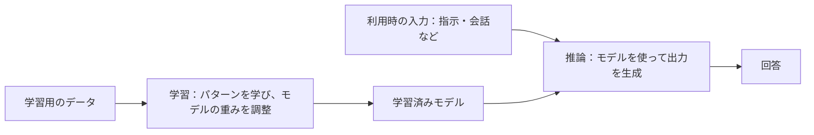
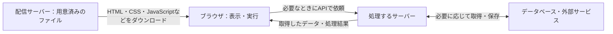
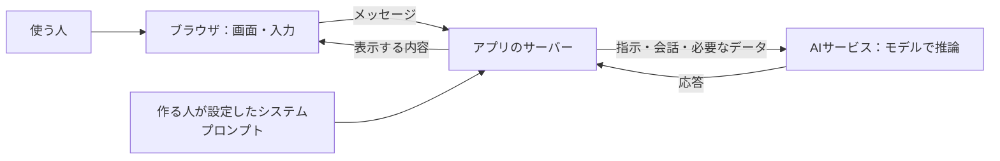
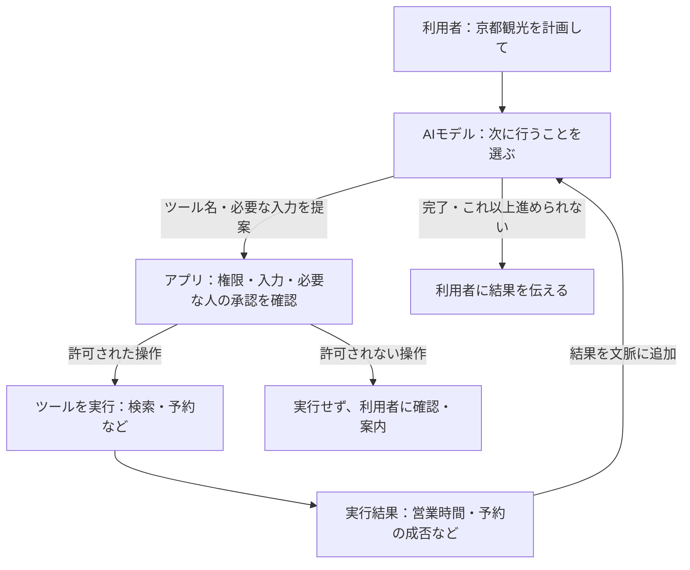

# AI の活用と倫理

| 回数     | 1<br />(9/25) |  2<br />(10/2)  |       3<br />(10/9)        |      4<br />(10/16)       |      5<br />(10/23)       | 6<br />(11/6) | 7<br />(11/13) |
| -------- | :-----------: | :-------------: | :------------------------: | :-----------------------: | :-----------------------: | :-----------: | :------------: |
| テーマ   |    AI 基礎    | プロンプトエンジニアリング | AI の活用と倫理 | AI を活用したアプリ生成 ① | AI を活用したアプリ生成 ② |   総合演習    |    総合演習    |
| 担当講師 |  伊藤、髙田   |            髙田            |      伊藤       |           伊藤            |           髙田            |  髙田、伊藤   |   伊藤、髙田   |

2026年度・第3回。第1回の「AI基礎」、第2回の「プロンプトエンジニアリング」を踏まえ、Google AI Studio、そこで作ったアプリ、普段使うアプリのAI機能を題材に、使う側・作る側の懸念や責任を考えます。

> **前回作ったチャットアプリを、大学や企業で他の人に使ってもらうとしたら、どんな懸念点がある？**

今日は、予想する → 仕組みや事例を知る → 自分で考える → 近くの人と共有する、を繰り返します。AIを使う人、作る・提供する人、影響を受ける人（相談内容をAIに入力された友人、作品をAIに読み込まれた作者など）の立場を行き来しながら考えましょう。

[TOC]

## 今日の目標と流れ

- 規約を根拠に、入力してよい情報と利用条件を確かめる。
- AIの学習と回答生成、アプリの中での情報の流れを図で理解する。
- 社会・企業での活用と実際の問題から、AI倫理と社会的責任を考える。
- 自分のアプリのリスクについて考察し、Google AI Studioで発表スライド1枚にまとめる。

| 限 | 内容 | 時間 |
| --- | --- | ---: |
| 1限 | 1. アイスブレイク | 3分 |
|  | 2. 前回の振り返り | 12分 |
|  | 3. AI Studioの規約を予想して読む | 20分 |
|  | 4. AIの学習・回答生成とアプリの仕組み | 45分 |
|  | 5. 仕組みと規約をつなげて整理する | 5分 |
|  | 6. 質問・予備時間 | 15分 |
| | **1限合計** | **100分** |
| 2限 | 7. 世界・企業とAI | 15分 |
|  | 8. 実際の出来事から倫理を考える | 20分 |
|  | 9. 自分のアプリのリスクを考え、スライド1枚にまとめる | 30分 |
|  | 10. 近くの人と共有する | 10分 |
|  | 11. 個人発表 | 15分 |
|  | 12. 個人の振り返り | 5分 |
|  | 13. 質問・予備時間 | 5分 |
| | **2限合計** | **100分** |

限間の休憩は別枠です。個人で考え、近くの人と共有し、数名が全体に発表します。予備時間は質問や説明・生成の遅れに使い、内容を追加して埋める必要はありません。

## 1限：AIの仕組みと利用条件を知る（100分）

### 1. アイスブレイク（3分）

> **おすすめの京都の観光地は？**

Slackに場所とおすすめの理由を投稿しましょう。有名な観光地でも、散歩や休憩におすすめの場所でも構いません。

```text
おすすめの場所：〇〇
おすすめの理由：〇〇
```

近くの人の投稿も読んでみましょう。

### 2. 前回の振り返り（12分）

#### 作ったチャットアプリを1文で紹介する（3分）

前回は、指示を工夫してチャットアプリを作り、システムプロンプトでAIの役割・出力・語り口を調整しました。次の型を使い、自分が作ったアプリをSlackに投稿しましょう。

```text
私は、【誰】が【何をしたいとき】に、【どんな手助け】をするチャットアプリを作りました。
```

例：「私は、献立に迷う人が冷蔵庫の食材で料理を考えたいときに、メニューの候補を提案するチャットアプリを作りました。」

#### これまでに出た期待・不安・疑問（2分）

最初の授業の意見を、個別の発言を引用せずテーマとしてまとめています。前回アプリを作ったときに気になったことも思い出してみましょう。

| テーマ | 期待・不安・疑問の要約 |
| --- | --- |
| 制作・学習への期待 | アイデアを形にしたい。理解や制作を助けてほしい。 |
| 情報への不安 | 正しさや根拠を、どう確かめればよいか。 |
| 自分の力との関係 | 頼りすぎず、自分で考える力や制作する力を保ちたい。 |
| 人との関係 | 相談相手として便利だが、信頼や依存の境界が気になる。 |
| 社会・仕組みへの疑問 | 情報の扱い、仕事への影響、AIの能力や限界を知りたい。 |

#### こんな使い方をしたら、何が気になる？（7分）

まず、次の短いストーリーから1つ選んで考えてみましょう。Google AI Studioで作るときも、そこで作ったアプリや普段使うAIアプリを利用するときも含めて考えます。いずれも、授業で考えるための架空の場面です。

**ストーリー1：友人の相談をAIに入力しました**

友人から、家族との悩みについて相談されました。うまく返事をしたくて、名前や事情が書かれたメッセージを、そのままAIに貼り付けました。AIの返答を参考に、友人へ返信しました。

**ストーリー2：画期的なアイデアを思いつきました**

まだ誰にも話していない、新しいサービスのアイデアを思いつきました。AIに詳しい仕組みや事業計画を入力し、一緒に考えながらアプリの試作品を作りました。動くものができたので、共有リンクをSNSに投稿しました。

**ストーリー3：AIでポスターを作って公開しました**

学内イベントのポスターを作ることになりました。好きな作家の作品をAIに読み込ませ、「この雰囲気で作って」と頼みました。気に入った画像ができたので、AIを使ったことは特に説明せず、イベントの公式SNSに掲載しました。

**ストーリー4：AIの案内だけを見て行動しました**

課題の提出期限が分からず、AIアプリに質問しました。日付をはっきり答えてくれたので、その案内を信じて提出の予定を立てました。大学の公式サイトや授業のお知らせなど、元の情報は確認していません。

> **この使い方には、どんな懸念点がある？ 誰が、どんなことで困りそう？**

最初の授業で出た「情報の正しさ」「個人情報」「AIへの依存」などの不安も思い出してみましょう。対策や正解まで決める必要はありません。「何を知らないと判断できないか」も書いて構いません。

```text
選んだストーリー：
気になること：
誰が、どんなことで困りそうか：
まだ分からないこと：
```

1. 個人でストーリーを1つ選び、懸念点を1〜2つ書く（2分）。
2. 近くの人と共有する。違うストーリーを選んだ人の話も聞く（3分）。
3. 数名の意見を聞き、「使う側」「作る・提供する側」に整理する（2分）。

最後に、自分のアプリにも当てはめてみましょう。

> **前回作ったチャットアプリを、大学や企業で他の人に使ってもらうとしたら、どんな懸念点がある？**

この最初の回答は、最後にもう一度見直します。

### 3. AI Studioの規約を予想して読む（20分）

#### まずは予想（4分）

「そう思う／そう思わない／条件による／分からない」で回答しましょう。

- 入力した文章やファイル、AIの回答は、Googleのサービス改善に使われる？
- Googleの担当者が、入力や回答を読むことはある？
- 無料・課金設定のある利用・学校のアカウントで、情報の扱いは同じ？
- 作ったコードや回答を他の人に使ってもらい、問題が起きたら、Googleがすべて責任を持つ？

#### 規約を調べる（8分）

[Gemini API追加利用規約](https://ai.google.dev/gemini-api/terms)を開き、次の項目から気になるものを1つ選んで、個人で調べます。

| 選択肢 | 探す項目 | 確かめること |
| --- | --- | --- |
| A | Unpaid Services / How Google Uses Your Data | 改善への利用、人による確認、送ってはいけない情報 |
| B | Paid Services / How Google Uses Your Data | 無償サービスとの違い、保存やログの扱い |
| C | Use of Generated Content | 生成物の扱い、利用・共有する人の責任 |
| D | Age Requirements / Use Restrictions | 利用者・用途の条件、アプリを提供する際の条件 |

AIに翻訳や要約を手伝わせてもよいですが、根拠にした原文の見出しと記述も確認してください。

```text
予想：
確認した見出し・記述：
適用される条件：
自分の使い方への影響：
出典URL・確認日：
```

#### 共有して判断を見直す（8分）

近くの人と調べた内容を共有し、講師の補足を聞いて、最初の予想を見直します。

> 未公開作品、友人の相談、クライアントの資料。そのまま入力してよい？
> 「無料で使える画面」なら、必ず同じデータ利用条件？

**確認のポイント（2026年10月5日確認、規約の発効日：2026年3月23日）**

- 無償サービスの入力・出力は改善等に使われ、人による確認もあり得ます。機密・個人情報を送らないよう記載されています。
- 有償扱いでは改善に使わないとされていますが、安全対策等のログまで一切残らないという意味ではありません。
- AI Studioは、利用アカウントの課金プロジェクトへのアクセスやWorkspace enterpriseアカウントなどで扱いが変わります。学校アカウントというだけでは判定できません。
- 生成内容の利用・共有には利用者の責任があります。年齢・用途の条件も確認します。

出典：[Googleの公式規約](https://ai.google.dev/gemini-api/terms)。個別アカウントの適用条件は授業時に確認します。

### 4. AIの学習・回答生成とアプリの仕組み（45分）

仕組みを聞く前に予想し、説明の後に自分の言葉で確かめます。昨年のLLM・学習・トークン・トランスフォーマーの内容を使います。

#### まず予想する（4分）

> AIは、どこかにある答えを探して、そのまま返している？
> チャットで教えたことは、その場でAI全体の知識になる？
> 同じ質問でも回答が変わるのはなぜ？

個人で予想を書き、近くの人と比べます。

#### 学習と回答生成を分けて考える（6分）

講師はホワイトボードに2つの流れを描きます。



- **LLM（大規模言語モデル）**は、多くのデータから言葉のパターンや関係を学んだモデルです。
- **トークン**は、文章を処理する単位です。前回のTokenizerの体験を思い出しましょう。
- **学習**では、データを使ってモデルの重みを調整します。
- **推論**では、指示や会話を入力し、学習済みモデルを使って出力を生成します。会話を送るたびに、その場でモデルの重みが更新されるとは限りません。
- **トランスフォーマー**は、文脈の中の情報の関係を扱う仕組みです。文のどの部分に着目するか、短い例を図にして説明します。

「この会話の文脈として使う」「サービスが履歴を保存する」「後で改善・学習に使う」は、分けて考えましょう。後の利用条件は、先ほど調べた規約にも関係します。

#### 次のトークンを予測して、文章をつなぐ（5分）

> 「今日は」の続きには、どんな言葉が入りそう？ 前に「天気について答えて」と指示があったら？

文章を順に生成する多くのLLMでは、指示や会話、そこまでに生成した文章をもとに、**次に続くトークンの確率を予測し、その中から選んで出力する**ことを繰り返します。

```text
入力・文脈 → 次のトークンを予測・選択 → 文章に追加
                    ↑                       ↓
                    └── 追加後の文脈で繰り返す ──┘
```

説明用に大きなまとまりで示すと、「今日は」→「今日は晴れ」→「今日は晴れです」のように文章が伸びていくイメージです。実際のトークンは単語と一致するとは限らず、この例は実際の分割結果ではありません。

候補の選び方によって、同じ入力でも回答が変わることがあります。文章として自然につながることと、書かれた内容が事実として正しいことは別です。

参考：[Google：LLMの仕組み](https://developers.google.com/machine-learning/crash-course/llm/transformers)。

#### なぜ間違う？ 指示で何が変わる？（5分）

**ハルシネーション**は、もっともらしいが誤った内容が生成されることです。生成した説明や出典が正しいかは、別途確認が必要です。検索機能を使うサービスでも、参照先と回答が一致するかを確かめます。

前回扱った**システムプロンプト**は、AIの役割・出力形式・語り口などを調整する指示です。指示によって回答を変えられても、事実の正しさや安全性を保証できるとは限りません。

> 丁寧な語り口の回答と、正しい回答は同じ？
> 「専門家として答えて」と指示すれば、専門家の確認は不要？
> 調べ物を頼むとき、何を確認すればよい？

参考：[Google：テキスト生成](https://ai.google.dev/gemini-api/docs/text-generation)、[Attention Is All You Need](https://arxiv.org/abs/1706.03762)。

ここまでのモデルの仕組みを、前回作ったアプリの図に組み込みます。

#### ホワイトボードで、情報の通り道を描く（8分）

まず、「ページのファイルを受け取ること」と「使っている途中でサーバーに処理を頼むこと」を分けて描きます。

| 構成 | ざっくりした仕組み | 例 |
| --- | --- | --- |
| 静的（static）サイト | 用意済みのHTML・CSS・JavaScriptや画像などをブラウザがダウンロードし、表示・実行する。 | この授業のスライド、ブラウザ内だけで動く計算ツール |
| 動的（dynamic）なサイト・アプリ | 利用者の入力などに応じ、サーバーがデータを取得したり処理したりして結果を返す。API経由でデータを受け取る構成もある。 | 自分の履歴を表示するアプリ、AIに質問して回答を受け取るアプリ |

HTMLは内容・構造、CSSは見た目、JavaScriptはブラウザ内の処理や操作を担当します。「ダウンロード」は、ページを開くときにブラウザがファイルを受け取ることです。手動で保存する必要はありません。



静的サイトでも、JavaScriptで画面を動かしたり、外部APIを呼んだりできます。動的なサイトでもHTML・CSS・JavaScriptは使います。**ファイルを配る部分と、利用時にデータや処理を返す部分を組み合わせられる**と捉えましょう。サーバーがページ自体を生成して返す構成もあります。

> スライドのページを切り替えるときと、AIに新しい質問を送るとき。ブラウザの中だけでできるのはどちら？

参考：[MDN：サーバー側の処理と静的・動的サイト](https://developer.mozilla.org/en-US/docs/Learn_web_development/Extensions/Server-side/First_steps/Introduction)。

次に、AIアプリの例を描きます。「送信を押したら？」と聞き、学生の予想を受けて、箱と矢印を足していきます。



- 自分の文章は、どの会社のどの場所まで届く？
- システムプロンプトは、誰が決める？誰に送られる？
- 会話を保存する機能を付けるなら、どこに置く？
- 入力に友人の情報が含まれていたら、その友人は情報の送信を知っている？

これは代表的な構成です。自分のアプリの実装が同じとは限らないので、コードや公式説明も確かめます。

#### AIサービス・APIの役割を整理する（5分）

| 用語 | アプリの中での役割 |
| --- | --- |
| AIモデル | 入力に応じて出力を生成する部分。 |
| AIサービス・アプリ | モデルに加え、画面、履歴、検索などを組み合わせて提供するもの。 |
| API | アプリから別のサービスへ処理を依頼するための窓口。 |
| APIキー | APIの利用を識別・認証するために使う情報。利用枠や料金にも関係する。 |

現行のAI Studio Buildは、Gemini APIキーをサーバー側の秘密情報として設定する構成が公式に説明されています。図のどこに保管する情報なのかを確認します。

参考：[AI Studio Build](https://ai.google.dev/gemini-api/docs/aistudio-build-mode)、[Gemini APIキーの保護](https://ai.google.dev/gemini-api/docs/api-key#security_and_secret_management)。

#### AIエージェント：ツールを使い、結果を見て次の行動を決める（7分）

> 「京都観光のプランを考えて」と「営業時間を調べて、予約までして」では、何が増える？

AIエージェントは、目標に向けて、AIモデルによる判断とツールの実行を組み合わせる構成です。回答の文章を作ることに加え、検索や予約などのツールを選び、その結果を次の判断に使います。すべてのチャットアプリに、この機能が付いているわけではありません。

講師は先ほどのアプリの図に「ツール」と「結果を戻す矢印」を加えます。次の図は、アプリ側でツールを実行する代表的な構成です。



- **AIモデル**は、使うツールと入力を提案します。独自の関数を呼ぶ構成では、実際に実行するのはアプリ側です。
- **作る・提供する側**は、使えるツール、アクセスできる情報、承認が必要な操作、繰り返しの上限などを設定します。
- **ツールの結果**を受けて、モデルは追加の検索や回答などを選びます。失敗する場合もあり、成功したかの確認が必要です。

モデルがツール名や入力を出力するときも、文脈に応じた生成を使います。検索や予約の実行は、その出力を受け取ったアプリやサービスが担います。組み込みツールをAIサービス側で実行する構成もあります。

例：「営業時間を検索する → 結果から候補を選ぶ → 予約内容を利用者に確認する → 承認後に予約する → 成否を伝える」。検索して答えるだけなら、予約の権限は必要ありません。

> 予約やメール送信の前に人の確認を入れるなら、図のどこ？
> AIに「予約しました」と言われたら、何を見て本当に完了したと確かめる？
> 読むだけの権限と、送信・購入する権限は、同じでよい？

学生の答えを受けて、ホワイトボードの「確認」の箱に、必要な承認や制限を書き足します。今日は仕組みと権限を図で考え、実際の予約や外部サービスへの接続は行いません。

参考：[Google：Function calling](https://ai.google.dev/gemini-api/docs/function-calling)、[Google：ツールの利用](https://ai.google.dev/gemini-api/docs/tools)。

#### 自分のアプリに当てはめ、説明する（5分）

自分のアプリについて、情報の通り道を簡単に描き、近くの人に説明します。「どこで回答を生成するか」「会話が届くことと学習に使われることは同じか」も説明してみましょう。確認できていない部分には「？」を付けます。ツールを使うアプリなら、実行する操作と、人の確認が必要な場所も描きましょう。

> 使う人、作る・提供する人、モデルを開発する会社。それぞれ何を確認でき、何を担当する？

### 5. 仕組みと規約をつなげて整理する（5分）

先ほど描いた図を使い、規約で調べた「情報の保存」「改善・学習への利用」が、どの部分の話か整理します。仕組みの図だけでは分からない点にも「？」を付けましょう。

> AIに会話が届くこと、履歴が残ること、モデルの学習に使われること。それぞれ、何を根拠に確かめられる？

使う側・作る側の責任は、2限の事例と自分のアプリの考察でまとめて扱います。

### 6. 質問・予備時間（15分）

規約や仕組みについて、まだ分からない点を質問します。図を描く時間や説明が延びた場合も、この時間で調整します。

## 2限：AI倫理と社会的責任を考える（100分）

### 7. 世界・企業とAI（15分）

短い説明と問いを交互に扱います。すべてのニュースを覚える必要はありません。

#### 世界：AIは何に支えられている？（5分）

Stanfordの2026年版AI Indexは、米中のモデル開発競争、先端AIチップを支える台湾の製造企業、各国が自国のAI基盤を持とうとする動きを取り上げています。

> 普段使うAIが、海外の企業や限られた半導体供給に依存していたら？
> 無料で使えるサービスが、値上げ・停止したら何を変える？

また、IEAの2025年報告は、2030年のデータセンター電力消費が約945TWhへ増えるという見通しを示しています。これは**全データセンターの将来推計**で、AIだけの実測値ではありません。

> 制作を速くする便利さと、電力・資源の負担をどう考える？

出典：[AI Index 2026](https://hai.stanford.edu/ai-index/2026-ai-index-report)、[IEA：Energy and AI（2025年4月10日公開）](https://www.iea.org/reports/energy-and-ai/executive-summary)。

#### 企業：作れることと、導入できること（5分）

01では、DeNAでのプロトタイプ活用と、みずほの現場社員によるアプリ制作を紹介しました。みずほの取り組みは2026年3月に実施され、4月22日に記事が公開されています。

> 現場で作れた試作品を、そのまま全社員やお客さんに使ってもらえる？
> 「動く」以外に、誰が何を確認する？

出典：[みずほ：DXカフェ BUILD](https://www.mizuho-fg.co.jp/dx/articles/dxcafebuild-2603/index.html)。国内の導入状況を調べる際は、[IPA：DX動向2026](https://www.ipa.go.jp/digital/chousa/dx-trend/dx-trend-2026.html)も参照します。導入率と成果、調査対象・時期を分けて読みましょう。

#### 仕事：補完する？ 置き換える？（5分）

昨年の「労働補完／労働置換」の考え方を、職業名ではなく仕事の工程に当てはめます。ポスター制作など、身近な仕事を1つ選びましょう。

| 工程の例 | AIに任せる？ 人と組み合わせる？ 人が担う？ | その理由 |
| --- | --- | --- |
| 依頼の意図を聞く | | |
| アイデア・下書きを作る | | |
| 正確さ・権利・品質を確認する | | |
| 公開を決め、相手に説明する | | |

> 制作時間が半分になったら、料金、学び方、求められる力はどう変わる？

### 8. 実際の出来事から倫理を考える（20分）

事例ごとに、状況を読む → 個人で判断 → 近くの人と相談 → 調査結果を知って再考、の順で進めます。「条件付きで使う」「追加で調べる」も選べます。

#### 事例A：生成AIが示した出典を、そのまま使ったら？（8分）

**まず状況を読む（授業用の架空の場面）：** AIにレポートの下書きを頼むと、説得力のある説明と出典が返ってきました。出典のタイトルや著者名が詳しく書かれていたので、元の資料を開かずに提出しました。

- 出典が書かれていれば、根拠があると言える？
- 「AIを使いました」と書けば、内容を確認する責任はなくなる？
- 作成した人、提出を認めた人、読んで判断する人。それぞれ何に困りそう？

**話し合ってから実例を確認：** 英国高等法院の2025年6月6日の判決では、Al-Harounの事件で、実在しない判例や誤った引用が裁判資料に含まれたことが問題になりました。依頼人は公開AIツール等を使って引用を作ったと説明し、弁護士は依頼人の調査を独立に確認せず使ったことを認めています。裁判所は、権威ある元の資料で正確さを確認する専門職の責任を指摘しました。

出典：[英国高等法院の判決（Al-Haroun事件、段落73〜77ほか）](https://www.judiciary.uk/wp-content/uploads/2025/06/Ayinde-v-London-Borough-of-Haringey-and-Al-Haroun-v-Qatar-National-Bank.pdf)。

> 自分のアプリが、もっともらしい説明や存在しない出典を返したら、利用者が判断できるように何を伝える？

1限の仕組みの説明を繰り返すのではなく、生成された情報を使う側・提供する側の責任を考えます。

#### 事例B：動くAIアプリのAPIキーが悪用されたら？（8分）

**まず状況を読む：** AIで作った管理アプリを公開しました。認証の不具合があり、第三者がエージェントに接触できる状態になりました。

- 自分が提供する立場なら、公開前にどこを確認する？
- キーを画面から隠すだけで防げる？
- 無料の利用枠だったら、被害はないと言える？

**話し合ってから実例を確認：** METRは2026年8月31日の報告で、同年3月に認証の不具合があるアプリを通じてAPIキーを盗まれ、約3週間で約60万ドル相当の利用枠を不正利用されたと説明しました。利用枠は無償提供されたもので、60万ドルが実際に請求されたという意味ではありません。これは、認証やAIに与える権限も含めて考える必要がある事例です。

出典：[METR：Update on Security（当事者による報告）](https://metr.org/blog/2026-08-31-security-update/)。

> 作る人、組織、サービス提供者は、それぞれ何を担当すべき？

#### 判断するための観点を整理する（4分）

昨年の「信頼できるAIの特性」「リスク分類」を、事例を考える言葉として使います。

| 観点 | 自分のアプリへの問い |
| --- | --- |
| 正確さ・堅牢性 | 間違いや想定外の操作を、どう見つけて対応する？ |
| 公平性 | 特定の人が不利になる扱いをしていない？ |
| 透明性・説明可能性 | AIを使うこと、限界、判断の根拠をどう伝える？ |
| プライバシー・権利 | 誰の情報・作品を、どこまで使ってよい？ |
| 自律性・責任 | 利用者が自分で判断できる？ 問題が起きたら誰に連絡できる？ |

技術的な対策と、使い方・運用のルールを両方考えます。

> 「規約に同意した」「AIがそう言った」「人が確認した」。それだけで十分？

### 9. 自分のアプリのリスクを考え、スライド1枚にまとめる（30分）

#### 個人で考察をまとめる（15分）

前回作ったチャットアプリを題材に、**AI倫理と社会的責任の観点から、誰にどんなリスクがあるか**を個人で考えます。アプリの修正・実装は求めません。

1. 用途、利用者、影響を受ける人を整理する（3分）。
2. 重要だと思うリスクを1つ選び、起こる条件・根拠・影響を考える（7分）。
3. 使う側・作る側の責任と、まだ判断できない点を書く（5分）。

```text
アプリの用途・利用者：
影響を受ける人（相談内容をAIに入力された友人、作品をAIに読み込まれた作者など）：
起こり得る問題・リスク：
誰に、どんな影響があるか：
根拠（規約／事例／仕組み）：
使う側として考えること：
作る・提供する側の責任：
まだ判断できないこと・追加で確認したいこと：
出典URL・確認日：
```

正確さ、公平性、プライバシー、作品の権利、依存、説明や責任などから考えます。リスクが起こる条件や、立場による意見の違いも書いてみましょう。

> 自分には便利でも、他の人には不利益がない？
> 誰の意見を聞かなければ、判断できない？

#### Google AI Studioで発表スライド1枚を作る（15分）

個人の考察を短いレポートにまとめ、AI StudioのBuildで**発表用の1枚のWeb画面**にします。学生の写真や個別の相談内容は入力せず、一般化した内容でまとめます。

##### 指示例

```text
以下のレポートを、授業で発表するスライド1枚のWebページにしてください。

タイトル：私のAIアプリのリスクと社会的責任
16:9、白い背景、大きく読みやすい文字で、1画面に収めてください。
項目は「用途」「影響を受ける人」「考えたリスク」
「使う側・作る側の責任」「まだ判断できないこと」です。
出典URLと確認日は、小さくても読める形で添えてください。
複数ページ、AIとのチャット、外部API、追加のログイン機能は不要です。
書いていない事実や出典を足さず、不明な点は不明のまま残してください。

【自分のレポート】
ここに、前の演習でまとめた内容を貼り付ける。
```

- レポート整理・生成（7分）。
- 表示と内容を確認し、修正（5分）。
- 自分の言葉で説明する練習（3分）。

> AIが付け足した主張はない？ 出典は合っている？ 自分で説明できる？

生成に時間がかかる場合は、レポートをそのまま発表画面にして構いません。

### 10. 近くの人と共有する（10分）

互いのスライドを見せながら、考えたリスクを説明します（1人3分ずつ、計6分）。相手の話から、自分にはなかった視点や質問を1つ伝えましょう。残り4分で、自分の考察を追記・修正します。

> 自分には便利でも、別の人には不利益がない？
> リスクが起きる条件や、責任を担う人は明確になっている？

### 11. 個人発表（15分）

3名 × 3分で9分、質問・コメントに6分を使います。発表者は希望者を募り、異なる用途や観点が聞けるよう講師が調整します。

発表では、用途、影響を受ける人（相談内容をAIに入力された友人、作品をAIに読み込まれた作者など）、重要なリスク、責任、まだ判断できない点を説明します。聞く側は、自分の考察にも関係する視点を1つ記録しましょう。

> どんな条件で、その問題が起こる？ 別の立場から見るとどう感じる？

### 12. 個人の振り返り（5分）

冒頭の問いに、もう一度答えます。Slackに投稿しましょう。

```text
アプリを大学や企業で他の人に使ってもらうときの懸念点：
最初の回答から変わった点・その理由：
自分が使う側として変えたいこと：
作る側として考えたい責任：
まだ残っている疑問：
```

### 13. 質問・予備時間（5分）

発表や生成が延びた場合の調整、残った質問に使います。時間が余れば、振り返りで挙げた疑問を共有しましょう。

## 補足：仕組みをもう少し知りたい人へ

授業では必要な範囲を説明し、詳細は以下を参照します。

- [昨年の授業資料](../../2025/2_ai_ethics/readme.md)：用語、労働補完・置換、サービスの構造、関係者とリスクの整理。
- [Attention Is All You Need（2017年）](https://arxiv.org/abs/1706.03762)：トランスフォーマーの原論文。
- [Scaling Laws for Neural Language Models（2020年）](https://arxiv.org/abs/2001.08361)：モデル規模・データ・計算量と性能の関係。規模だけで安全性が保証されるわけではありません。
- [昨年からのトランスフォーマーの図](images/transformer.png)、[AIサービスの構造図](images/ai_component.png)、[AIリスクの概念図](images/ai_risk_two.png)。現行サービスの実装そのものを表す図ではありません。

## 講師向け：授業前の準備と進行

- 内容・出典の確認日：**2026年10月5日**。規約・サービスの機能は当日までに再確認する。
- 01の意見はテーマに抽象化する。元写真、筆跡、個別の発言、個人名はこの公開リポジトリに保存しない。
- アイスブレイクはおすすめの京都の観光地を投稿してもらう。前回作ったアプリの紹介は、別の投稿の型を示して振り返りで行う。
- 導入は4つの架空のストーリーから1つ選んで考えてもらう。懸念点を先に説明せず、どんな場面で誰が困るかを共有した後、自分のアプリに当てはめる。
- ホワイトボードでは「学習と推論」を描いた後、その推論が「アプリの情報の通り道」のどこに入るかを示す。さらにエージェントのツール実行・結果の戻り・権限や人の承認を足す。学生の予想を聞きながら、箱と矢印を足す。
- 1限は規約と仕組み、2限は社会・事例と責任の考察を中心にする。同じ懸念点を毎回書き直させず、最後の個人作業でまとめる。
- 質問・予備時間は1限15分、2限5分。説明や生成の遅れに使い、追加の講義で埋めない。
- 天気アプリのAPIキー発見と、システムプロンプトの取り出し実験は、今後の授業の候補とする。今回の時間配分には含めない。
- 規約調査のために学生へ課金設定を求めない。
- 実例の結果は、先に予想・相談してから読む。必要なら「実例を確認」の部分を投影せずに進める。
- 個人作業と近くの人との共有を基本とする。全体発表は3名を想定し、発表しない学生も自分の考察を作成する。
- AI Studioの利用制限・生成失敗時はテキストのレポートで発表する。
- 昨年の技術説明・職業一覧・リスク一覧は、今回の理解や判断に必要な箇所を活用する。仕組みの説明でも、予想・自分の言葉での説明を挟む。

<!-- 今回はMarkdownの構成・内容を相談用に改訂。index.htmlのスライド反映は別途行う。 -->
