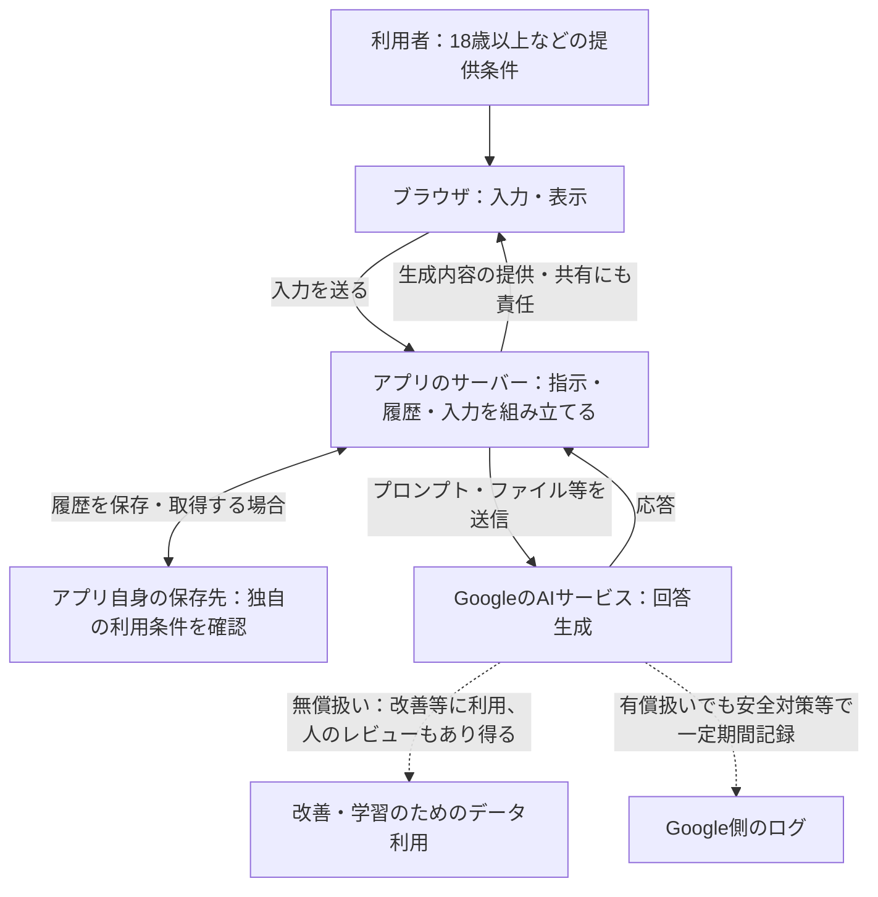

# AIの活用と倫理：サンプル回答・仕組みと規約の対応図

[授業資料へ戻る](readme.md)

講師の補足や、考えた後の参照に使う資料です。学生の実際の回答ではなく、授業用に作った架空の例です。倫理や仕事の分担には一つの正解があるとは限りません。規約の条件は原文で確認し、自分の用途に当てはめて考えましょう。

## 1. アイスブレイクとアプリ紹介

```text
おすすめの場所：鴨川
```

```text
私は、献立に迷う人が冷蔵庫の食材で料理を考えたいときに、メニューの候補を提案するチャットアプリを作りました。
```

## 2. 前回の振り返り

2〜3人で話すときの例です。下の内容をすべて挙げる必要はありません。

| ストーリー | 気になること | 誰がどう困る？ | 判断に必要な情報 |
| --- | --- | --- | --- |
| 1. 友人の相談 | 本人が知らないところで名前や私生活を外部へ送っている。 | 相談した友人が、秘密を守ってもらえなかったと感じる。 | 送信先、データ利用条件、本人への説明・同意、入力の必要性。 |
| 2. 未公開のアイデア | 計画を外部へ送った後、共有リンクでどこまで見えるか分からない。 | 制作者や共同開発者が、公開したくない情報を公開してしまう。 | 規約、共有範囲、公開されるファイルや情報。入力だけで直ちに他人に公開されるとは決めつけない。 |
| 3. AIのポスター | 作品の利用権限、出力の類似性、公式発信での説明が不明。 | 作者や主催者、見る人が、権利や制作経緯について困る。 | 元作品の利用条件、実際の生成物、公開用途、主催者の方針。特定の作風を参考にしただけで一律に違法と断定しない。 |
| 4. AIの案内 | 元の情報を確認せず、提出期限を信じた。 | 学生が期限に間に合わない。教員にも問い合わせや対応が増える。 | 大学の公式のお知らせ、対象授業、情報の更新日。 |

自分のアプリについては、この時点では「同じような問題がありそう」と気づくだけでも十分です。詳しい考察は後半に行います。

## 3. AI Studioの規約

確認日：2026年10月5日。規約発効日：2026年3月23日。

出典：[Gemini API追加利用規約](https://ai.google.dev/gemini-api/terms)。以下は日本での利用を想定したこの規約の説明であり、他社サービスの条件を示すものではありません。

### 4つの予想への回答

| 番号 | 確認用の回答 | 根拠の見出し |
| --- | --- | --- |
| 1. 改善に使う？ | 無償扱いでは入力・生成応答を改善等に使う。有償扱いではプロンプト・応答を製品改善に使わない。 | Unpaid Services / Paid Services → How Google Uses Your Data |
| 2. 人が読む？ | 無償扱いでは、人のレビューがあり得る。有償扱いでも安全対策等のログがあるため、「改善に使わない」と「誰も一切扱わない」は同じではない。 | How Google Uses Your Data |
| 3. 課金設定で同じ？ | 同じではない。AI Studioは、利用アカウントが有効なCloud Billingに紐づくプロジェクトにアクセスできる場合などに有償扱い。Gemini APIは、アクセスするプロジェクトの課金設定が基準。 | Paid Services |
| 4. Googleが全責任？ | 生成内容を使う人と、共有して他の人に使わせる人にも責任がある。 | Use of Generated Content |

### 調査メモの例

```text
予想：無料なら、入力は自分だけが読めると思っていた。
確認した見出し・記述：Unpaid Services / How Google Uses Your Data。
入力・応答を改善に使い、人がレビューする場合もあると書かれていた。
適用される条件：課金設定等を確認し、無償扱いとなる利用の場合。
自分の使い方への影響：友人の相談や未公開の顧客資料をそのまま入力しない。
出典URL：https://ai.google.dev/gemini-api/terms
確認日：2026年10月5日
```

### 年齢条件

**18歳以上**が条件です。さらに、18歳未満を対象とする、または18歳未満がアクセスする可能性が高いWebサイト・アプリ等でサービスを使うことも認められていません。単にアプリの作者が18歳以上ならよい、という条件ではありません。根拠は **Age Requirements** です。

今回、学校アカウントは利用できないため、授業では個人アカウントの課金設定の有無を比較します。学生が実際に課金設定する必要はありません。

## 4. 用語を理解して共有する

### 聞き方の例

```text
トランスフォーマーを理解したいです。
まず、ニューラルネットワークを知らない人にも分かる説明をしてください。
私が分からないところを質問するので、一度に全部説明せず進めてください。
たとえ話を使う場合は、実際の仕組みと異なる点も教えてください。
```

追加の問い：「関係に着目するってどういうこと？」「『それ』が何を指すか判断する例で説明して」「学習と使うときでは何が違う？」。

### 約100文字の説明例

**ディープラーニング：** 多層のニューラルネットワークを使い、データからパターンを学ぶ方法。入力から出力までの計算で使う重みを、学習中に調整する。画像認識や言語モデルなどに使われ、学習した傾向がいつも正しいとは限らない。

**トランスフォーマー：** 文章などの情報の関係をAttentionで扱うモデルの構造。文脈のどの部分が関係するかを計算し、多くのLLMで次のトークンの予測などに使われる。人と同じ方法で意味を理解したり、事実を保証したりする仕組みではない。

参考：[Google：ニューラルネットワーク](https://developers.google.com/machine-learning/crash-course/neural-networks)、[Google：LLMとトランスフォーマー](https://developers.google.com/machine-learning/crash-course/llm/transformers)。この説明例をコピーせず、自分が説明できる粒度にしましょう。

## 5. 仕組みと規約の対応図

規約の記述を図へ対応させた、確認用の回答です。代表的なサーバー経由の構成を示し、個別アプリの実装を断定するものではありません。



**有償扱いでは、プロンプト・応答を製品改善に使わない**とされています。このため「改善・学習」の点線は有償扱いには適用しません。無償・有償どちらでも、すべての入力が即座に学習データになると図から断定することはできません。

| 図の場所・矢印 | 対応する規約の項目 | 確認する内容 |
| --- | --- | --- |
| 利用者・提供対象 | Age Requirements | 18歳以上。18歳未満を対象とする、またはアクセスの可能性が高いアプリで利用しない。 |
| Googleへ送る入力 | Unpaid Services → How Google Uses Your Data | 無償扱いへ機密・個人情報等を送らない。システム指示やファイルもデータ利用の対象。 |
| Googleから返る応答 | Use of Generated Content | 生成内容の利用・共有には利用者の責任。 |
| 改善・学習への点線 | Unpaid / Paid Services → How Google Uses Your Data | 無償扱いでは改善等への利用やレビューがあり得る。有償扱いはプロンプト・応答を改善に使わない。 |
| Google側のログ | Paid Services → How Google Uses Your Data | 有償扱いでも安全対策等のため一定期間ログが残る。 |
| アプリ自身の保存先 | アプリ独自の説明・設定・実装 | Googleの規約だけでは保存の有無・期間・閲覧者は決まらない。 |
| ツールへのアクセス・実行（4のエージェント図） | Agentic Services | アクセスの許可や監督などは利用者側の責任。人の確認要求を自動で回避しない。 |

出典：[Googleの公式規約](https://ai.google.dev/gemini-api/terms)。検索機能などには追加条件があるため、この図だけで全条件を網羅しているわけではありません。

## 7. 仕事の分担を予想する

題材：学内イベントのポスター制作。これは2026年10月時点の予想例で、将来の正解ではありません。

| 工程 | 予想する分担 | 理由 |
| --- | --- | --- |
| 依頼の意図を聞く | 人が担う | 主催者の希望や、言葉になっていない事情を相談する。AIは質問の準備や記録を補助できる。 |
| アイデア・下書きを作る | AIに任せる部分を増やす | 複数案を比較しやすい。方向性の選択は人も行う。 |
| 正確さ・権利・品質を確認する | 人と組み合わせる | AIで確認候補を出し、人が日時や場所を公式情報で確認する。 |
| 公開を決め、相手に説明する | 人が担う | 主催者と合意し、公開後の問い合わせにも対応する。 |

```text
予想の日付：2026年10月9日（授業日）
将来確かめたい点：下書き以外の工程もAIに任せられるようになるか。
半年後・1年後の答え合わせ：実際に任せた工程と、難しかった理由を追記する。
```

## 8. 事例から考える

**キノコの事例：** 食べるという身体に関わる判断を、AIの返答だけで決めてはいけない。生成された説明の誤りと画像の誤識別は区別する。検索を付ければ食用判定が安全になるとは考えない。

**事例A・心理的安全：** 話しやすい相手としての価値はあるが、利用時間を伸ばすことだけを目標にしたくない。利用者が現実の人や支援につながる機会や、利用を中断できる設計も考えたい。「120万人」を自殺者数や、AIが原因であることの証拠と読まない。

**事例B・著作権：** 読む人の便利さと、記事を作る人の権利・収益の両方を考えたい。出典リンクだけで利用許諾の確認を省略しない。訴訟で争われていることと、侵害が確定したことは区別する。

**アプリの公開：** 動作確認だけでなく、誰がアクセスできるか、どんな情報やツールを扱えるかを確認したい。無償の利用枠でも、不正利用で他の仕事が止まることがある。

### ルールとリスクを自分のアプリに当てはめる例

| 題材 | 法律・指針から確認すること | 倫理の観点から残る問い |
| --- | --- | --- |
| 友人の相談 | 個人情報の入力・利用目的・学習への利用、適用される利用条件。 | 本人が望まない情報の送信や、AIへの依存を増やしていないか。 |
| AIのポスター | 元作品の利用権限、出力の表現の類似、公開方法。 | 作者や見る人に、制作経緯をどう説明するか。 |
| 京都観光の案内 | 個人情報の扱い、正確さや安全性、利用者への説明・事故対応。 | 誤った案内で、利用者だけでなく施設側も困らないか。 |

AI法はAI利用を推進しリスクに対応する枠組み、AI事業者ガイドラインは実践を助ける指針です。それだけで個別の利用が合法・安全だと決まるわけではありません。

出典・一次資料は[授業資料の事例とルール](readme.md#8-実際の出来事から倫理を考える20分)を参照します。追加部分の確認日：2026年10月6日。

## 9. 個人レポートとスライド

以下は、一つのリスクを選んだ例です。対策を実装する課題ではありません。

```text
アプリの用途・利用者：京都観光を計画する人に、観光地の候補を提案する。
影響を受ける人：利用者、一緒に出かける友人、訪問先の施設。
起こり得る問題・リスク：古い営業時間や、存在しないイベントを案内する。
誰に、どんな影響があるか：閉館中に訪問し、利用者や友人が時間や交通費を無駄にする。
根拠：LLMには誤った内容を生成する場合がある。営業時間の更新も必要。
使う側として考えること：訪問前に施設の公式情報を確認する。
作る・提供する側の責任：検索や公式情報の参照先を付け、確認日や回答の限界を伝える。
まだ判断できないこと：最新情報をどの範囲まで確認してから案内できるか。
出典URL：https://ai.google.dev/gemini-api/docs/google-search
確認日：2026年10月5日
```

スライドは「用途・影響を受ける人」「一つのリスクと根拠」「使う側・作る側の責任」「未解決の問い」の順にまとめると、3分で説明しやすくなります。考察を変えず、見せ方をAIに手伝ってもらいましょう。

## 10. 共有するときのコメント

「観光の案内でも、アプリを使う人だけでなく、一緒に出かける人や訪問先に影響があると気づいた。営業時間をいつ確認したかも伝えるとよさそう。」

## 12. 振り返り

```text
アプリを大学や企業で他の人に使ってもらうときの懸念点：入力の扱い、誤った回答、利用者への説明。
授業を通して気づいたこと・その理由：チャットの入力以外に、システム指示や履歴も送る構成だと知った。
自分が使う側として変えたいこと：外部へ送る情報を選び、重要な回答は元の資料を確認する。
作る側として考えたい責任：利用条件と限界を説明し、問い合わせ先を考える。
まだ残っている疑問：利用者がどのくらい注意書きを理解してくれるか。
```
