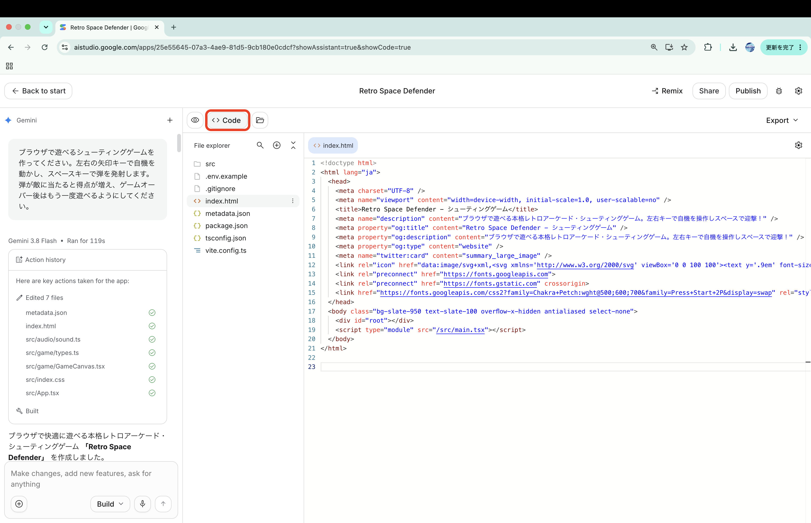
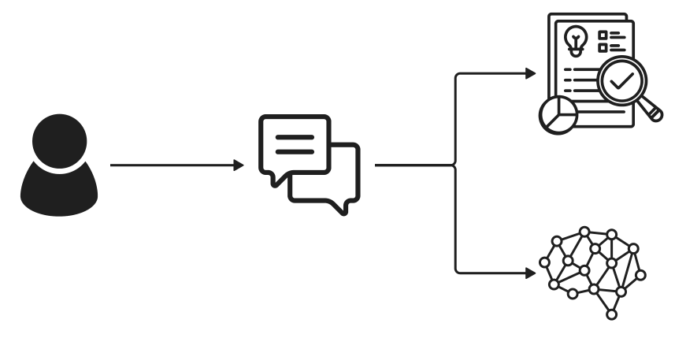
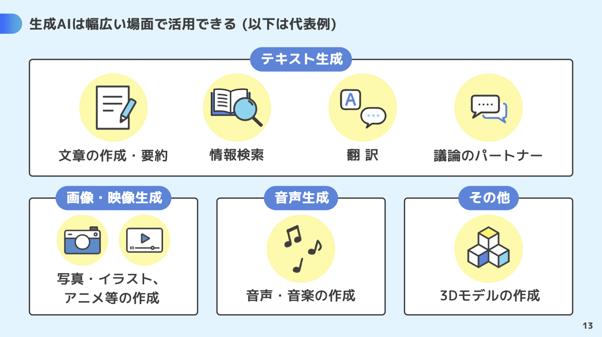

# プロンプトエンジニアリング


| 回数     | 1<br />(9/25) |  2<br />(10/2)  |       3<br />(10/9)        |      4<br />(10/16)       |      5<br />(10/23)       | 6<br />(11/6) | 7<br />(11/13) |
| -------- | :-----------: | :-------------: | :------------------------: | :-----------------------: | :-----------------------: | :-----------: | :------------: |
| テーマ   |    AI 基礎    | プロンプトエンジニアリング | AI の活用と倫理 | AI を活用したアプリ生成 ① | AI を活用したアプリ生成 ② |   総合演習    |    総合演習    |
| 担当講師 |  伊藤、髙田   |            髙田            |      伊藤       |           伊藤            |           髙田            |  髙田、伊藤   |   伊藤、髙田   |

### 目次

[TOC]

## 1限目（前半）：プロンプトと生成AIの仕組みを知る (13:40-14:25, 45分)

<!-- 出席コード：当日案内 -->

## 1. 導入 (25分)

### 1-1. アイスブレイク (5分)

```
今日はどの生成AIを相棒として使う予定?
:one: ChatGPT
:two: Claude
:three: Gemini
:four: その他 (スレッドでサービス名を投稿)
```

```
「Mythos（ミトス）」と「Fable（ファーブル）」って知ってる？
:one: ニュースで見て震えた（セキュリティヤバいよね）
:two: クロードの新しいやつでしょ？名前だけ！
:three: ギリシャ神話とイソップ童話の話……？
```
<!--
Mythos（ミトス）
・概要: 危険すぎるため一般非公開となった、超高性能セキュリティ特化AI。
・凄さ: 未知のシステムの穴（脆弱性）を自律的に大量発見・攻撃検証できる。
・現状: 悪用防止のため一般公開は見送り、政府や一部の重要インフラ企業だけに限定提供。

Fable（ファーブル）
・概要: Mythosの凄さをベースに、危険機能を削いで一般公開した実務用AI。
・凄さ: 複雑な業務フローの自動化やコード解読など、高度なエージェント能力を持つ。
・安全対策: サイバー攻撃に繋がる出力はガードレールでしっかりブロック。

一言まとめ
・「非公開の超危険・超高性能モデル（Mythos）」と、「安全に業務で使える商用モデル（Fable）」の兄弟関係。
 -->
 [Claude Mythosとは？Project Glasswing・3メガバンク・日本政府の動きを整理【2026年5月版】](https://blog.cloudnative.co.jp/articles/what-is-claude-mythos-news/)

```
OpenAIのdotsって知ってる？
:one: 知ってる！どんなものか説明できる
:two: 名前だけ聞いたことある！
:three: 初耳！ドット絵の話……？
```
[Introducing dots](https://openai.com/index/introducing-dots/)

```
HTML/CSS触ったことある？
:one: ある
:two: ちょっとだけ
:three: なにそれおいしいの？
```

### 1-2. 前回の振り返り (5分)

1. **AIへの期待**
- 作業や学習の時間を短縮したい
- 情報整理や文章・画像作成を手伝ってほしい
- 自分では思いつかないアイデアを得たい
- 面倒な作業を効率化したい

2. **困ったこと・不安**
- AIの情報が正しいのかわからない
- 間違った情報や嘘をもっともらしく回答することがある
- 情報源がわからず、自分で確認する必要がある
- AIに依存し、自分で考える力が低下しそう
- 個人情報の扱いが不安

3. **AIでやってみたいこと**
- 画像やWebサイトなどを作る
- 調べ物や勉強、文章作成に活用する
- 献立など、日常生活のサポートに使う
- 自分だけでは難しいことをAIを使って実現する

4. **AIへの疑問**
- AIに自我や感情はあるのか
- AIに好き嫌いはあるのか
- AIはどこから情報を得ているのか
- AIの限界はどこにあるのか
- AIと人間は何が違うのか

**全体的な傾向**

生徒たちは、AIによる**「効率化・できることの拡大」への期待**を持つ一方で、**「情報をどこまで信頼できるのか」「AIに頼りすぎることで自分で考える力が低下しないか」**という不安も感じていた。

また、AIを単なる便利なツールとしてだけでなく、**「AIは考えているのか」「感情や自我はあるのか」「人間と何が違うのか」**という、AIそのものへの関心も多く見られた。

全体として、

**「AIを使ってできることを広げたい」という期待と、「AIをどこまで信頼し、どのような距離感で使うべきか」という問いが共存している**

### 1-3. 宿題の確認と解説 (10分)

#### 生成AIが作成したファイルの確認
<!--
起動したゲームを見ながら、次の3つを探しましょう。

- **何がある？**：ゲーム名、操作説明、ボタン。
- **どんな見た目？**：暗い背景、文字の色、ゲームらしい書体。
- **どう動く？**：キーを押すと自機が動く、弾が出る、得点が変わる。

どういう仕組みでこれが動いてるか確認しましょう。
-->

生成AIがどのようなファイルを生成したかGoogle AI Studioで確認しましょう。



> [!Note]
> 今日はコードを読めるようになる必要はありません。**画面の構造・見た目・動きに、それぞれ役割がある**と分かればOKです。

コードは、コンピューターに表示や動作を伝えるために書かれたものです。
最終的にブラウザに表示されている画面は、複数のコードファイルの組み合わせでできています。

> [!Note]
> index.htmlからどのようなファイルが紐づいているのか辿ってみよう

#### HTML・CSS・Javascriptとは？

Webページでは、**HTML**・**CSS**・**JavaScript**がそれぞれ異なる役割を担います。

| 名前 | 役割 | このゲームでいうと |
| --- | --- | --- |
| HTML（エイチティーエムエル） | 画面の構造を作る | 見出しやボタンなど、部品の土台 |
| CSS（シーエスエス） | 見た目を整える | 色、文字の形や大きさ、配置 |
| JavaScript（ジャバスクリプト） | 動きを付ける | キー操作への反応、弾の移動、得点の計算 |

このゲームでは、JavaScriptに書き方のルールを加えた **TypeScript（タイプスクリプト）** と、画面を部品に分けて作る **React（リアクト）** も使っています。そのため、ファイル名の末尾に `.ts` や `.tsx` が出てきます。今は「画面や動きを作るコードが入っている」と捉えましょう。

#### 生成AIが作成したファイルの構造と役割の理解

生成AIが作成したファイルの役割を聞いてみよう

```text
生成したファイルの構造と役割を教えてください。
```
```plain text
retro-space-defender/
├── index.html            … ページの土台・表示場所
├── package.json          … 使用ライブラリ・実行コマンド
├── vite.config.ts        … 開発・ビルド環境の設定
├── tsconfig.json         … TypeScriptの設定
├── metadata.json         … AI Studio向けのアプリ情報
├── .env.example          … 環境変数の記入例
├── .gitignore            … Git管理から除外するファイルの指定
├── README.md             … 起動方法の説明
└── src/                  … アプリ本体のソースコード
    ├── main.tsx          … Reactの起動処理
    ├── App.tsx           … ページ全体の構成
    ├── index.css         … 共通の見た目
    ├── game/
    │   ├── GameCanvas.tsx … ゲームの処理・描画・操作
    │   └── types.ts       … ゲームで使うデータの型
    └── audio/
        └── sound.ts       … 効果音の生成・再生
```

<!--
| ファイル | 入っているもの | 見るポイント |
| --- | --- | --- |
| [index.html](game/retro-space-defender/index.html) | Webページの入口 | `<title>` の中にブラウザーのタブに出るタイトルがある |
| [src/App.tsx](game/retro-space-defender/src/App.tsx) | 画面の部品や説明文 | 「RETRO DEFENDER」「操作説明」など、画面と同じ文字がある |
| [src/index.css](game/retro-space-defender/src/index.css) | 見た目の指定の一部 | `font-family` で文字の書体を指定している |
| [src/game/GameCanvas.tsx](game/retro-space-defender/src/game/GameCanvas.tsx) | ゲーム画面の描画や動作 | 自機、弾、得点などの処理がまとまっている |

#####  -->

### 1-4. 授業の目的 (5分)

私たちは普段、授業や生活の中で生成AIと会話し、無意識のうちに「プロンプト」を作っています。

この授業では、**プロンプト設計の4原則（明確性・制約の明示・役割付与・手順分解と例示）**を実践を通して理解し、授業や就職活動、さらにはWebアプリの制作など、**さまざまな場面で生成AIを役立てるための基盤を築く**ことを目指します。

さらに応用として、**Webアプリを作るためのプロンプト**と、**アプリに組み込まれた生成AIの振る舞いを決めるプロンプト**の両方を作成し、**目的に応じてAIへの指示を設計する力**を養います。

## 2. プロンプトとは？ (25分)

### 2-1. 処理の流れ (5分)

**プロンプト**は、生成AIに渡す指示や情報です。「何をしてほしいか」に加えて、背景、条件、参考資料、出力例なども含められます。

文章を生成する言語モデルの処理を、大まかに表すと次のようになります。

```text
1. プロンプト入力：指示・参考情報・会話履歴
        ↓
2. トークン化：文章をトークンに分ける
        ↓
3. モデルによる単語予測：入力と、それまでに生成した内容をもとに、次のトークンの候補を計算し、選ぶ
        ↓
4. 文章を生成：回答として表示する
```

自然な文章でも、内容が正しいとは限りません。指示を具体化することと、出力を確かめることをセットで行いましょう。

<!--
『おはよう』を英語にして
「Good」→「morning」→「!」

Good   ← 選ぶ
  Morning
  Hello

Good ...
  ├ morning
  ├ evening
  └ luck
 -->

### 2-2. トークンの理解 (5分)

**トークン**は、モデルが文章を扱うための単位です。単語の一部や記号なども単位になるため、「1文字＝1トークン」「1単語＝1トークン」とは限りません。

- **トークン数とコスト**: 多くのサービスでは、入力と出力の合計トークン数に応じて料金が決まります。長文を扱う際はコストと応答時間が増えるため、重要な情報に絞って入力するのが基本です。
- **トークン上限**: モデルには一度に扱える最大トークン数（コンテキスト長）があり、上限を超えると入力が途中で切れたり、会話の前半が忘れられたりします。利用するモデルごとに上限が異なるため、公式ドキュメントを事前に確認しましょう。
- **実務でのチェック方法**: OpenAI の `tiktoken` や Anthropic のトークンカウンターなど、各社が提供するツールで事前に文字数とトークン数を確認できます。ドキュメント作成やコードレビューなど長文を扱う際は、これらのツールで見積もりを行うと効率的です。

代表的な商用モデルのコンテキスト長は以下の通りです。最新情報は各社の公式アナウンスを参照してください。

| プラットフォーム | モデル | 最大トークン数 (目安) | 備考 |
| --- | --- | --- | --- |
| ChatGPT | [GPT-6 Astra](https://developers.openai.com/api/docs/models/gpt-6-astra) | 約 1,050,000 トークン | OpenAIの最上位モデル。複雑な推論・プログラミング・調査・文書作成に対応。 |
| ChatGPT | [GPT-6.1 Sol](https://developers.openai.com/api/docs/models/gpt-6.1-sol) | 約 1,050,000 トークン | Astraに近い性能を低コストで提供。複雑なプログラミングやコンピューター操作、実務に対応。 |
| Gemini | [Gemini 3.1 Pro](https://ai.google.dev/gemini-api/docs/models/gemini-3.1-pro-preview) | 約 1,000,000 トークン | プレビュー版。高度な推論やプログラミング、ツールを使った複数ステップの処理に対応。 |
| Gemini | [Gemini 3.8 Flash](https://ai.google.dev/gemini-api/docs/models/gemini-3.8-flash) | 約 1,000,000 トークン | 安定版。速度とコスト効率を保ちつつ、長時間のソフトウェア開発や自律型エージェント、複雑な業務処理に対応。 |
| Claude | [Claude Opus 5.5](https://platform.claude.com/docs/ja/models/overview) | 約 1,000,000 トークン | 長時間にわたるエージェント型のプログラミングや知識を扱う業務に対応。幅広い用途で推奨されるモデル。 |
| Claude | [Claude Sonnet 5.5](https://platform.claude.com/docs/ja/models/overview) | 約 1,000,000 トークン | 応答速度と高い知能を両立したモデル。Opusより低コストで、推論・プログラミング・ツール使用に対応。 |

参考：[Google：トークンの理解とカウント](https://ai.google.dev/gemini-api/docs/tokens)
[OpenAI Developers Models](https://developers.openai.com/api/docs/models)
[Gemini API 長いコンテキスト](https://ai.google.dev/gemini-api/docs/long-context?hl=ja)
[Gemini モデル](https://ai.google.dev/gemini-api/docs/models?hl=ja)
[Claude コンテキストウィンドウ](https://platform.claude.com/docs/ja/build-with-claude/context-windows)
[Claude モデル](https://platform.claude.com/docs/ja/models/overview)

#### 演習 A：Tokenizerを試してみる (5分)

[Tokenizer](https://platform.openai.com/tokenizer)に次の文章を貼り付け、区切られ方とトークン数を観察しましょう。ここでの数値が、別のモデルにもそのまま当てはまるわけではありません。

```text
生成AIと一緒に作品を作りたい。
I want to create art with generative AI.
こんにちは！ 🎨 1234567890
```

1. 日本語、英語、記号で区切られ方を比べる。
2. 自分のプロンプトを貼り付け、トークン数を記録する。
3. 意味を保ちながら短く書き直し、数の変化を確認する。

短くするだけで、よいプロンプトになるとは限りません。必要な条件まで消えていないか確認しましょう。

#### Google AI Studioの利用制限

>[!Note]
>[Gemini API Rate Limit ダッシュボード](https://aistudio.google.com/rate-limit?timeRange=last-28-days&project=gen-lang-client-0506929984)を開いてみましょう

1. ダッシュボードの主要指標

- **RPM (Requests Per Minute):** 1分間のリクエスト上限（直近60秒で計算）
- **TPM (Tokens Per Minute):** 1分間の処理トークン量（文字・データ量）の上限
- **RPD (Requests Per Day):** 1日（24時間）のリクエスト合計上限

2. 無料枠の重要ルール

- **制限の共有:** Web画面（チャット）とAPI利用の回数は、同一プロジェクト内で**合算**されます。
- **自動切替なし:** 上限に達しても、他のモデルへ自動的に切り替わることはありません。
- **データの取り扱い:** 無料枠に入力したデータは、Googleのモデル改善・学習に利用される場合があります。
- **表示の更新:** ダッシュボードの数値は自動更新されないため、最新状態を確認するにはページの再読み込みが必要です。

3. エラー時の対処法

- **RPM制限時:** 直近60秒の枠が空くまで、**1分程度待つ**。
- **RPD制限時:** 手動で**別のモデルに切り替える**か、翌日まで待つ。


### 2-3. RAG (Retrieval-Augmented Generation：検索拡張生成) (5分)

最近のAIサービスは、検索機能と生成 AI（LLM）を組み合わせて RAG (Retrieval-Augmented Generation) と呼ばれる方法で実現しています。

> 生成系 AI／LLM（大規模言語モデル）の RAG（Retrieval-Augmented Generation：検索拡張生成）とは、ChatGPT や Gemini に代表されるチャット AI に独自の情報源を付与する仕組みのことで、具体的には言語モデルによるテキスト生成に特定の知識や情報源（例えばナレッジベースなど）への検索を組み合わせることである。



- [RAG（Retrieval-Augmented Generation：検索拡張生成）とは？：AI・機械学習の用語辞典 - ＠IT](https://atmarkit.itmedia.co.jp/ait/articles/2403/13/news035.html)
- [RAG とは何ですか? - 検索拡張生成の説明 - AWS](https://aws.amazon.com/jp/what-is/retrieval-augmented-generation/)
- [RAG（検索拡張生成）とは | IBM](
https://www.ibm.com/jp-ja/think/topics/retrieval-augmented-generation)

<!-- ### 2-4. 温度（temperature）の理解 (5分)

**温度**は、出力するトークンの選び方に関わる設定です。一般に低い値では選ばれやすい候補に集中し、高い値では候補の選択に幅が出ます。

| 設定の方向 | 観察できる傾向 |
| --- | --- |
| 低くする | 表現や候補が似通いやすくなる |
| 高くする | 表現や候補のばらつきが増えやすくなる |

温度は「正確さ」や「創造性」を保証する数値ではありません。低くしても誤りは出ますし、同じ結果になるとも限りません。設定可能な範囲や推奨値はモデルによって異なります。

参考：[Google：文章生成と生成設定](https://ai.google.dev/gemini-api/docs/text-generation)

#### 演習：温度（temperature）を変えてみる (5分)

講師が案内する、温度を変更できる実行環境を使います。設定項目がない場合は、講師の比較デモを観察しましょう。

```text
「記憶」をテーマにした学生作品展のタイトルを5つ提案してください。
各タイトルは15文字以内にしてください。
```

1. 同じモデルで、会話履歴を揃え、同じプロンプトを入力する。
2. 対応範囲内の低めの値と高めの値で、それぞれ2回生成する。
3. タイトルの重複、表現の違い、文字数の条件を守っているかを比較する。

「温度を高くして」とチャットに書くだけでは、実際の設定値を変えたことにはなりません。比較には設定欄を使い、少数の結果だけで傾向を断定しないようにしましょう。 -->

## 1限目 後半：伝え方を工夫して、アプリを作る (14:25-15:20, 55分)

## 3. プロンプトを書く時のテクニック (35分)

### 3-1. 様々なユースケース (5分)



- 参考: [生成 AI はじめの一歩～生成 AI の入門的な使い方と注意点～ | 安心・安全なインターネット利用ガイド | 総務省](https://www.soumu.go.jp/use_the_internet_wisely/special/generativeai/)

- 参考: [生成 AI はじめの一歩](https://www.soumu.go.jp/use_the_internet_wisely/special/generativeai/data/file01.pdf)

参考: [生成AIのユースケース](https://www.ibm.com/jp-ja/think/topics/generative-ai-use-cases)

### 3-2. プロンプトを書く時のコツ (5分)

以下の 4 原則を意識すると AI から得られる提案の質が高まります。

1. **明確性 (Clarity)**: 目的や期待する出力を曖昧にせず、具体的に伝えることでモデルが誤解する余地を減らします。「卒業制作のアイデアを考えて」よりも「記憶をテーマとしたアイデアを考えて」と依頼すると、方向性が揃いやすくなります。
2. **制約の明示 (Constraints)**: フォーマットや条件を明示すると、用途に合った出力を得やすくなります。例:「箇条書きで」「学生でも実現可能なもの」「展示会場の制約を考慮して」など。
3. **役割付与 (Role)**: モデルに役割や視点を与えることで、回答のトーンや専門性をコントロールできます。例:「あなたは現代アートに詳しいキュレーターです。作品への講評をお願いします。」
4. **手順分解と例示 (Step-by-step & Examples)**: 複雑なタスクは手順を分けて依頼し、期待する形式のサンプルを示すことで、推論の質を高められます。例:「① テーマ整理、② 作品構造の提案、③ 必要なリソースの提案の順に回答してください。以下のサンプル形式にならってください。」

これらを踏まえ、以下の演習では状況に合わせて原則を組み合わせてみましょう。

参考：[Google：プロンプト設計の戦略](https://ai.google.dev/gemini-api/docs/prompting-strategies)

#### 演習 B：明確性 (5分)

まずは、次のプロンプトを試しましょう。

```text
卒業制作のアイデアを考えて。
```

1. 作品のテーマ・表現方法を考えましょう。
2. 自分の言葉でプロンプトを書き換え、試しましょう。
3. 回答を比べ、作品のイメージが具体的になったか確認しましょう。

ヒント：テーマは「記憶」「日常」、表現方法は「映像」「参加型の展示」など、興味のあるものを選べます。

<!-- 例
芸術大学の卒業制作で、「記憶」をテーマにした
来場者が参加できるインタラクティブアートを作りたいです。
参加者が何をする作品なのか分かるように、アイデアを提案してください。
 -->

#### 演習 C：制約の明示 (5分)

1. 演習Bのプロンプトに、条件を2〜3個追加しましょう。
2. 回答の形式も指定して、試しましょう。
3. 回答を比べ、実現できそうか確認して条件を調整しましょう。

ヒント：回答の件数・文字数・表や箇条書き、予算・制作期間・使える機材・展示場所など。

<!-- 例
条件：
- アイデアは3つ。
- 作品名、体験内容、必要な材料の項目。
- 箇条書き。
- 各アイデア300文字以内。
- 制作期間は1週間。
- 使える機材は自分のパソコン1台。
- 教室の机1台分のスペースに展示する。
-->

#### 演習 D：役割付与 (5分)

作品案を1つ選び、次のプロンプトを試しましょう。

```text
あなたは現代アートの展示を企画するキュレーターです。
次の作品案について、良い点と改善案を1つずつ挙げてください。

作品案：［選んだアイデアをここに貼り付ける］
```

1. 別の役割を自分で考えましょう。
2. 作品案と質問は同じまま、役割だけ変えて試しましょう。
3. 回答を比べ、注目する点の違いを確認しましょう。

ヒント：展示の企画者、初めて見る来場者、制作を手伝う人など。どんな意見が制作に役立つかを考えます。

#### 演習 E：手順分解 (5分)

1. 演習Bのプロンプトにアイデア創出の手順を加えて、試しましょう。
2. 演習Bの回答と比べ、アイデアの違いを確認しましょう。

**追加する手順の例**

```text
アイデアは、次の順番で検討してください。

1. テーマから連想する場面や感情を3つ挙げる。
2. その中から1つ選び、作品にする方法を2つ考える。
3. 2つの方法を、テーマの伝わりやすさと実現しやすさで比較する。
4. 1つ選び、具体的な作品案を提案する。
```

#### 演習 F：例示 (5分)

1. 卒業制作の作品案を1つ選びましょう。
2. 同じ作品案で、下の2つのプロンプトを試しましょう。
3. キャプションの言葉遣いや雰囲気を比べましょう。

**見本なし**

```text
次の卒業制作の作品案に、短いキャプション（展示用の紹介文）を付けてください。

作品案：［タイトルを含む作品案をここに貼り付ける］
```

**見本あり**

```text
次の卒業制作の作品案に、短いキャプション（展示用の紹介文）を付けてください。
見本の形式と雰囲気に合わせ、内容は作品案に合わせてください。

見本：
キャプション：消えていく言葉の向こうに、あなたの記憶は何を残すでしょう。

作品案：［同じタイトル・作品案をここに貼り付ける］
```

## 4. チャットアプリを作ってみよう (20分)

### 4-1. なぜチャットアプリ？ (2分)

ここからは、次の2種類の「AIへの指示」が登場します。

| 指示の種類 | 何を決める？ | 例 |
| --- | --- | --- |
| **アプリを作るAIへの指示** | 作るアプリの目的・画面・機能 | 「休日のお出かけを相談できるチャットアプリを作って」 |
| **アプリ内のAIへの指示** | 利用者に返す回答の内容・口調・長さ | 「親しみやすい口調で、プランを3つ提案して」 |

まずは**アプリを作るAIへの指示**を工夫して、できあがるアプリの違いを観察します。アプリ内のAIの答え方は、後半で詳しく扱います。


### 4-2. チャットアプリを形にする

#### ひとことの指示で、何ができる？ (3分)

```text
日本語で会話できるチャットWebアプリを作ってください。
```
[!Note]
画面と回答を見て、**指示していないのにAIが決めたこと**を探しましょう。

短い指示でもアプリは作れますが、誰向けか、どんな画面にするかなどはAIに任せることになります。

#### 演習 G：プロンプトを工夫して、自分のチャットアプリを作る (15分)

1. ヒントを参考に、チャットアプリを生成するためのプロンプトを考えましょう。
3. [Google AI Studio](https://aistudio.google.com/)のBuildモードで試し、画面と会話を確認しましょう。指定した条件が反映されているか確かめ、必要に応じて指示を追加しましょう。

ヒント：明確性と制約の明示を使い、チャットアプリの用途を具体化しましょう。

- **使う人**：どんな人向け？ 初めて学ぶ人、制作中の人、旅行中の人など。
- **使う場面**：いつ、どこで使う？ 通学中、作業の合間、寝る前など。
- **目的**：何ができると嬉しい？ アイデアを広げる、選択肢を比べる、練習する、振り返るなど。
- **見た目**：どんな雰囲気にする？ ノート風、ゲーム風、落ち着いた配色など。
- **機能**：何があると便利？ 相談テーマを選ぶボタン、会話のリセット、返信待ちの表示など。

<!-- 例
制作のアイデアに行き詰まった美大生が、身近なものを意外な作品に変える相談ができる、日本語のチャットWebアプリを作ってください。
「もしも傘が楽器だったら？」のように、ものと意外な使い方を組み合わせて、発想を広げるために使います。
Geminiを使って、入力した相談に回答するようにしてください。

条件：
- タイトルは「もしも発明相談室」。方眼ノートをイメージした背景に、手書きのメモのような吹き出しを配置する。
- 入力欄の上に「傘 × 楽器」「椅子 × ペット」「時計 × 植物」のボタンを置き、押すと「もしも傘が楽器だったら？」のような相談文が入力欄に入るようにする。送信前に自分で書き換えられるようにする。
-->

## 2限目 前半：AIの応答をデザインする (15:40-16:30, 50分)
<!-- 出席コード：当日案内 -->

## 5. 生成AIが作成したコードの確認 (10分)

### 5-1. 振り返りクイズ：HTML・CSS・JavaScriptの役割 (5分)

前半で紹介した3つの役割を覚えていますか？ 最初のアイスブレイクと同じように、番号のリアクションで答えましょう。

```
見出しやボタンなど、画面の構造を作るのは？
:one: HTML
:two: CSS
:three: JavaScript
```

```
文字の色や大きさなど、見た目を整えるのは？
:one: HTML
:two: CSS
:three: JavaScript
```

```
キー操作への反応や得点の計算など、動きを付けるのは？
:one: HTML
:two: CSS
:three: JavaScript
```

### 5-2. 実際にチャットアプリのコードを変えてみよう (5分)

> [!Note]
> コードを書けるようになる必要はありませんが、生成AIが作成しているコードの理解を深めるために次の演習を実施してみましょう！皆さんは生成AIを武器にどんどんこのようなプログラムを生成し、自分自身の表現の幅をぜひ広げていってください。

#### 演習 H：背景色を変えて、戻してみる

1. プレビューモードからコードモードに切り替える。
2. 背景色が指定されているコードを探す。（AIで聞いてください！）
3. 背景色を一時的に黒```#000000```に変更し、保存。（他の色でも大丈夫です！）
4. プレビューモードに戻り、背景色が変わってることを確認。
5. 背景色を元に戻す。

## 6. アプリやサービスに組み込まれているAIの振る舞い (40分)

### 6-1. システムプロンプトとは (5分)

これまでは「アプリを作る指示」を考えてきました。ここからは「アプリ内のAIがどう振る舞うかを決める指示」を考えます。

利用者が短い文章を入力したり、ボタンを押したりするだけで、AIがその機能に合った結果を返すのはなぜでしょう？ **サービスを作る側が、AIの役割や出力の条件をあらかじめ設計している**からです。その方法の一つが、利用者の画面には表示されない「AIへの指示」です。これを**システムプロンプト**と言います。

**システムプロンプト**は、AIの役割や答え方のルールをあらかじめ設定する指示です。チャットアプリでは、利用者が毎回入力するメッセージとは別に、アプリ側で用意します。

```text
利用者のプロンプト＋システムプロンプト（アプリ側で設定）→ 生成AI → アプリに回答を表示
```

### 6-2. 生成AIを組み込んだアプリやサービスの例 (5分)

身近なサービスで、生成AIがどのような役割を担っているか見てみましょう。

| サービス・機能 | 概要 |
| --- | --- |
| [LINE「ムードを分析」](https://guide.line.me/ja/services/agent-i-in-chat.html) | 直近のトークから、二人の関係性や会話の雰囲気を分析し、コミュニケーションのヒントを提示する機能。 |
| [Genmoji](https://www.apple.com/jp/newsroom/2024/06/introducing-apple-intelligence-for-iphone-ipad-and-mac/) | 作りたい絵文字を言葉で説明すると、メッセージで使えるオリジナルの絵文字を生成する機能。 |
| [Asana AI Teammates（AI チームメイト）](https://asana.com/ja/product/ai/ai-teammates) | 仕事の管理サービスAsanaで、人と協力して働くAI。プロジェクトの計画づくりや進捗の整理、文章の作成などを支援する。 |
| [ええやん.ai](https://note.com/techls/n/n73d1702e4920) | 作品の画像に複数のキャラクターがコメントし、チャットで作品についての言葉を整えられるアプリ。作者や周囲の人との会話のきっかけを作る。 |

<!-- Genmojiの紹介動画：[Apple Support：Genmojiの作り方](https://www.youtube.com/shorts/TkFFD2whcBk) -->

> [!Note]
> 生成AIが組み込まれたサービス、他に知ってる？

自分のチャットアプリでも、この「利用者には見えない指示」を設定できます。次は、アプリ内のAIのキャラクターや答え方を考えてみましょう。

### 6-3. チャットアプリ内のAIの振る舞いを調整してみよう（30分）

1限目に作ったアプリで、システムプロンプトを変更してみましょう。各演習では、変更する項目以外はそのままにして、同じ質問への回答を比べます。比較するときは会話履歴をリセットするなど、新しい会話で試しましょう。

#### 演習 I：チャットアプリのシステムプロンプト（5分）

1. コードの表示を開き、アプリ内のAIの役割や答え方を設定している箇所を探しましょう。
2. どんな指示が書かれているか読み、元に戻せるようにコピーしておきましょう。
3. 自分のアプリに合う質問を1つ送り、質問と回答を記録しましょう。次の演習でも同じ質問を使います。

ヒント：場所が分からなければ、アプリを作るAIに次のように聞いてみましょう。

```text
このアプリ内のAIに渡しているシステムプロンプトは、コードのどこにありますか？
ファイル名と該当箇所、指示の内容を教えてください。まだ編集はしないでください。
```

#### 演習 J：生成AIの役割を変更する (5分)

1. アプリ内のAIに、どんな立場で相談に乗ってほしいか考えましょう。
2. システムプロンプトの役割の部分を書き換え、同じ質問を送ってみましょう。
3. 回答を比べ、注目する点や提案の違いを確認しましょう。

ヒント：アイデアを広げる発明家、実現方法を考える職人、初めて作品を見る来場者など。自分のアプリに合う役割を選びましょう。

#### 演習 K：生成AIの出力形式を変更する（5分）

1. 回答をどんな形で受け取りたいか考えましょう。
2. システムプロンプトに出力形式を指定し、同じ質問を送ってみましょう。すでに形式の指定があれば書き換えます。
3. 回答を比べ、読みやすさや使いやすさがどう変わったか確認しましょう。

ヒント：「箇条書きで3つ」「結論→理由→次の一歩の順」「各案をタイトルと説明に分ける」など。文字数も指定できます。

#### 演習 L：生成AIの語り口（トーンやマナー）を変更する (5分)

1. 利用者にどんな話し方で接してほしいか考えましょう。
2. システムプロンプトの語り口の指示を追加・変更し、同じ質問を送ってみましょう。
3. 回答を比べ、言葉遣いや相談のしやすさがどう変わったか確認しましょう。

ヒント：「友人のように親しみやすく」「落ち着いた丁寧な言葉で」「関西弁で明るく」など。「否定から入らない」「絵文字は使わない」といった接し方も指定できます。

#### 演習 M：理想のシステムプロンプトを書く（10分）

1. これまで試した役割・出力形式・語り口、または例示・手順分解の手法を適用しながら、自分のアプリに合うシステムプロンプトを書き直しましょう。
2. 別の質問でも試し、期待した答え方になるよう調整しましょう。

ヒント：誰が何のために使うアプリかを振り返り、その人にとって相談しやすく、役立つ回答を考えましょう。

## 2限目 後半：試して、直して、共有する (16:30-17:20, 50分)

## 7. 作成したチャットアプリの共有 (20分)
### 7-1. お互いのアプリ使ってみよう (10分)
2人1組でお互いに作成したチャットアプリを紹介し、実際に使ってもらいましょう。

以下の項目を中心に共有しましょう。
1. 誰のための、どんなチャットアプリか。
2. アプリ作成時に工夫した点。
3. プロンプト調整時に工夫した点。
4. 改善のアイデアやもらったフィードバック。

### 7-3. 発表 (10分)
数名が、1人2分程度で紹介します。

1. 誰のための、どんなチャットアプリか。
2. アプリ作成時に工夫した点。
3. プロンプト調整時に工夫した点。
4. 改善のアイデアやもらったフィードバック。

## 8. 文章以外の生成 (10分)

### 8-1. 画像や音の生成

#### 演習 N：チャットアプリのAIを画像で表現しよう (5分)

1. 演習MのシステムプロンプトをChatGPTなどの生成AIに渡し、画像生成用のプロンプトを考えてもらいましょう。
2. 提案を読み、自分のイメージに合わせて書き換えます。
3. 完成したプロンプトで画像を生成しましょう。

ヒント：次のように依頼できます。色・表情・画風など、希望があれば加えてみましょう。

```text
以下は、私が作ったチャットアプリのシステムプロンプトです。
AIの役割や性格、語り口に合うキャラクターを考え、
画像生成用のプロンプトを作ってください。
アプリのアイコンとして使います。

［システムプロンプトを貼り付ける］
```

#### 演習 O：チャットアプリのBGMや効果音を考えよう (5分)

1. 自分のアプリに合うBGMや効果音を考えましょう。
2. BGMなら[Suno](https://suno.com/)、効果音なら[ElevenLabs](https://elevenlabs.io/docs/eleven-creative/playground/sound-effects)で生成して、聞いてみましょう。

ヒント：サービスによってプロンプトの書き方や設定が違うので、使うサービスの説明や入力欄を確認しましょう。

生成サービスを利用できない場合は、プロンプトを考えるところまでで大丈夫です。アプリへの画像・音の組み込みは、時間があれば挑戦しましょう。

### 8-2. 参考：3Dモデルや動画も生成できる

- **3Dモデル：[Meshy](https://www.meshy.ai/)** — 文章や画像から立体モデルを生成できます。演習Nのキャラクターを立体にする、といった使い方が考えられます。[画像から3Dモデルを生成する方法](https://docs.meshy.ai/en/webapp/image-to-3d)
- **動画：[Adobe Firefly](https://firefly.adobe.com/)** — 文章で場面や動きを指定して動画を生成できます。アプリの紹介映像や、キャラクターが登場する短い映像などに使えます。[テキストから動画を生成する方法](https://helpx.adobe.com/jp/firefly/web/work-with-audio-and-video/work-with-video/generate-videos-using-text-prompts.html)

## 9. クロージング (15分)

### 9-1. 本日の授業のポイント (5分)

- **伝え方で、生成されるものが変わる。** 明確性・制約の明示・役割付与・手順分解と例示を使って、目的に合う指示を考えました。
- **生成AIが作るアプリも、コードでできている。** コードを少し変更し、画面とのつながりを確かめました。生成AIが普及する前は、こうした画面や動作を作るコードを、人が自分で書いたり、既存のコードを組み合わせたりしていました。
- **「アプリを作る指示」と「アプリ内のAIへの指示」は違う。** システムプロンプトで、AIの役割・出力形式・語り口を調整しました。画面や機能だけでなく、AIへの指示も、相談のしやすさや回答の使いやすさなど、ユーザー体験を大きく左右します。
- **作って終わりではなく、試して改善する。** 回答を比べたり、他の人に使ってもらったりして、意図どおりか確かめました。
- **プロンプトの工夫は、文章以外にも使える。** AIの役割や雰囲気をもとに、画像や音による表現も考えました。

> [!Note]
> 何を作りたいかを考え、生成AIに伝え、結果を確かめて直す。この繰り返しを、自分の制作にも活かしましょう。

### 9-2. 振り返り (5分)

今日の授業を振り返り、それぞれ一言ずつ書いてみましょう。

```text
今日、印象に残ったこと：
感想・質問など：
```

### 9-3. 次回予告と宿題 (5分)

[授業一覧](../readme.md)で次に予定されているテーマは、[AI の活用と倫理](../2_ai_ethics/readme.md)です。生成AIは便利ですが、利用時の倫理的な観点での注意点を考えます。

宿題：
- 演習O
- 作ったアプリを誰か1人に見せて、感想を聞く
